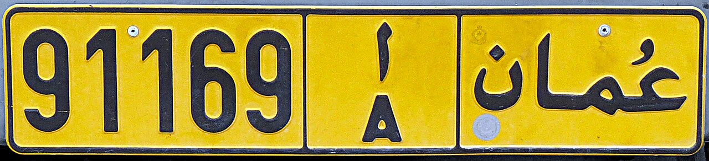
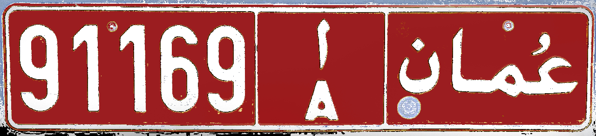
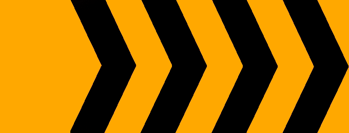
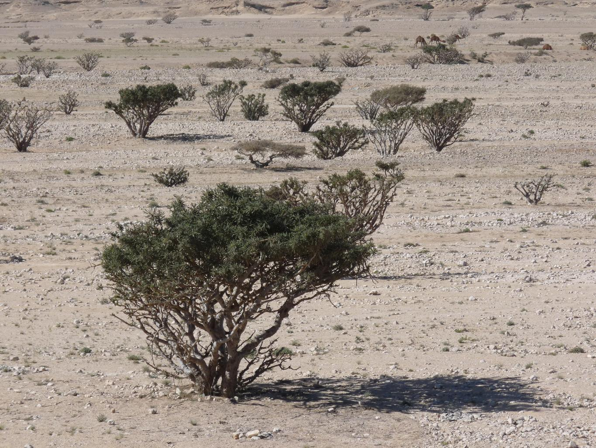
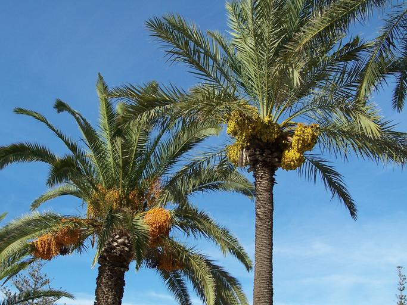
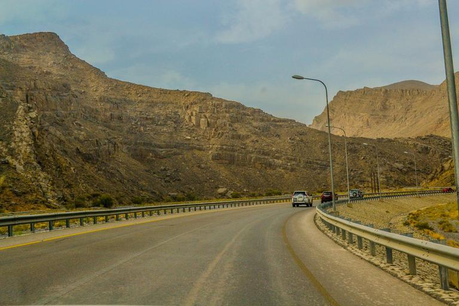
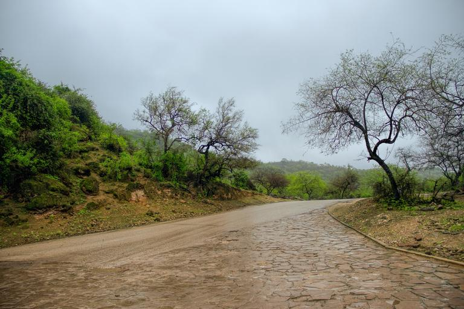
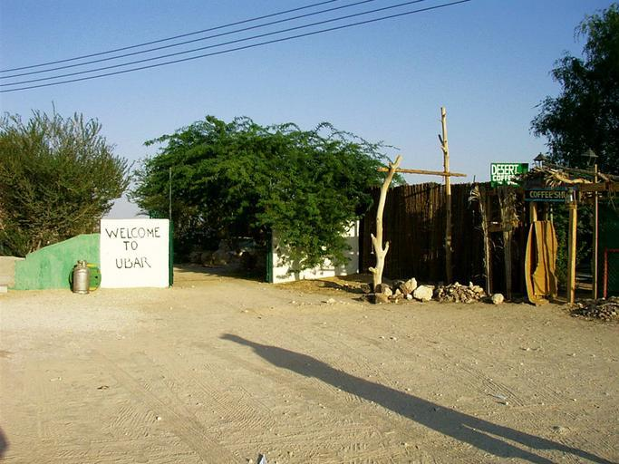

    <h2 class="section-title">{}</h2>
    <ul class="rule-list">
        <li>ドメインは.om</li>
        <li>右側通行</li>
        <li>ナンバープレートは黄色か赤色</li>
        <li>標識の棒白黒のストライプがある</li>
    </ul>

{}
{}
{}
町中は黄色ナンバーが特に多い{}。タクシーは赤色。
{}

{}

By <a href="//commons.wikimedia.org/wiki/User:Ji-Elle" title="User:Ji-Elle">Ji-Elle</a> - Own work, <a href="https://creativecommons.org/licenses/by-sa/3.0" title="Creative Commons Attribution-Share Alike 3.0">CC BY-SA 3.0</a>, <a href="https://commons.wikimedia.org/w/index.php?curid=12980300">Link</a>

上に同じ
{}

{}
オレンジと黒のシェブロン{}。町名や次の町への距離を書いた看板などは青色。標識の棒に白黒のストライプが多い{}のはオマーンか{}。
{}

{}
砂漠ではまったく木が生えていない{}か、こんな感じの木がまばらに生えている{}。
{}

{}
ナツメヤシが植えられており{}ナツメヤシ農園もある{}。The Million Date Palm Plantation Project(意訳：ナツメ​​ヤシ100万本プロジェクト)により全国的にナツメヤシの栽培が進められた{{% ref "http://nakheel.om/?page_id=841#:~:text=The%20Million%20Date%20Palm%20Plantation,social%20development%20and%20environmental%20awareness." "Million Date Palm Plantation Project" %}}。
{}

{}
{}

{}
ミッドストリーム系企業の看板にパイプラインの行先が書いてある{}。WADIからMIRIBATへのパイプラインだと分かるので、その間くらいに場所があるはず{}。日本が輸入する天然ガスの３％以上はオマーン産{}。
{}

<iframe src="https://www.google.com/maps/embed?pb=!4v1730263748039!6m8!1m7!1sacvB8dsMLohBDvl9W6aGmw!2m2!1d17.09723893563516!2d54.25963292406851!3f20.52854003730814!4f-7.045283378135764!5f2.852286653669389" width="600" height="450" style="border:0;" allowfullscreen="" loading="lazy" referrerpolicy="no-referrer-when-downgrade"></iframe>

{}
{}

    <h2 class="section-title">{}</h2>
    <ul class="rule-list">
        <li>北部と南部に山岳地帯があり、間には平坦な砂漠が広がっている
            <ul>
                <li>北部 アル・ハジャル山脈があり険しい岩山が多い{}</li>
                <li>中央部 {} {}ほど完全な平坦ではない</li>
                <li>南部 {} ドファール山脈周りは雨が降りやすく緑も多い。細かいがれきのような岩が転がっている。</li>
            </ul>
        </li>
        <li>ドファール山脈周辺はモンスーン（Khareef）により雨が降りやすく緑に覆われている</li>
    </ul>

{}
{}

<a href="//commons.wikimedia.org/wiki/User:Dr_Brains" title="User:Dr Brains">Dr Brains</a> - 投稿者自身による著作物 by <a href="//commons.wikimedia.org/wiki/User:NordNordWest" title="User:NordNordWest">NordNordWest</a>, <a href="http://www.gnu.org/licenses/old-licenses/fdl-1.2.html" title="GNU Free Documentation License 1.2">GFDL 1.2</a>, <a href="https://commons.wikimedia.org/w/index.php?curid=19957804">リンク</a>による

{}
{}

{}
ムサンダム半島（オマーンの飛び地）にもストリートビューがあるので注意{}。地中海性気候の場所もありザクロなどの農園も見られる。南部のドファール山脈と違い木や草で覆われた山はほとんどない。
{}

{}
{}

{}
南部のSalalah周辺に広がる山脈。モンスーンが発生する場所で他の地域より雨が多い。辺り一面が緑に覆われている場所もある{}。
{}

{}
乾燥している地域もある。北のような切り立った断崖は少なく、小さい岩が転がっていることが多い{}。牧畜が盛んなので牛{}・ラクダ{}・ヤギなどが歩いていたり、飼うための囲いもあるっぽい{}{}。
{}

{}
{}

    <h2 class="section-title">{}</h2>
    <ul class="rule-list">
        <li>マシーラ島という離島がある{}{}</li>
    </ul>

{}
{}

By <a href="//commons.wikimedia.org/w/index.php?title=User:ELSIRIDERMOTO&amp;action=edit&amp;redlink=1" class="new" title="User:ELSIRIDERMOTO (page does not exist)">ELSIRIDERMOTO</a> - Own work, <a href="https://creativecommons.org/licenses/by-sa/4.0" title="Creative Commons Attribution-Share Alike 4.0">CC BY-SA 4.0</a>, <a href="https://commons.wikimedia.org/w/index.php?curid=94647403">Link</a>

{}
{}