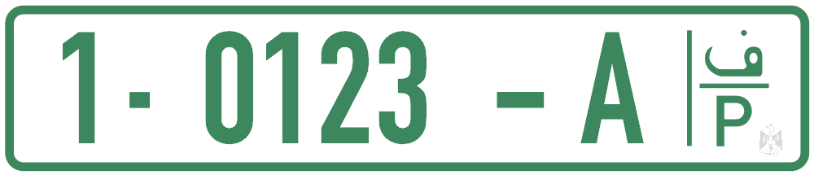

    <h2 class="section-title">{}</h2>
    <ul class="rule-list">
        <li>The domain is .ps.</li>
        <li>Look for Arabic (العربية‎) and Hebrew (עברית) signage.</li>
        <li>License plates often show a white background with green accents.</li>
    </ul>

{}
{}

{}
Plates with a white base and green strip are common, although many Israeli yellow plates also appear.
{}

<iframe src="https://www.google.com/maps/embed?pb=!4v1683474785152!6m8!1m7!1sqlv44ygxflBLfq7Jea_p8g!2m2!1d31.91934158590803!2d35.20715477458318!3f49.20218612057827!4f-12.96017591840446!5f2.8721873220127905" width="500" height="250" style="border:0;" allowfullscreen="" loading="lazy" referrerpolicy="no-referrer-when-downgrade"></iframe>

{}

By BasilLeaf - Own work, CC0, <a href="https://commons.wikimedia.org/w/index.php?curid=113341446">Wikimedia Commons</a>
{}
{}
{}
