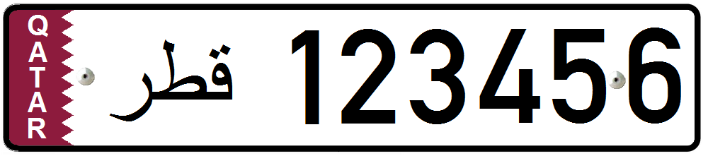

    <h2 class="section-title">{}</h2>
    <ul class="rule-list">
        <li>ドメインは.qa</li>
        <li>ナンバープレートの左側があずき色</li>
        <li>Google Carが特徴的</li>
    </ul>
    {}

{}
{}

{}Google Carが特徴的で標識も特有のものが多い。
{}

<iframe src="https://www.google.com/maps/embed?pb=!4v1683473947966!6m8!1m7!1sm_0E-7kek0LrHoCF3cdgww!2m2!1d25.32439776170388!2d51.35162769639718!3f234.98201383858378!4f-9.45521832245636!5f0.7820865974627469" width="295" height="295" style="border:0;" allowfullscreen="" loading="lazy" referrerpolicy="no-referrer-when-downgrade"></iframe>
<iframe src="https://www.google.com/maps/embed?pb=!4v1685200338918!6m8!1m7!1sRUR7NrV2wGzYwmNEMC5aMQ!2m2!1d25.41543557909392!2d51.50803227455112!3f210.98658042921878!4f-0.18875807084305052!5f3.325193203789971" width="295" height="295" style="border:0;" allowfullscreen="" loading="lazy" referrerpolicy="no-referrer-when-downgrade"></iframe>

{}ナンバープレートの左側があずき色なので{}と間違えないようにする。Lusail Plaza Towersも印象的{}。
{}

<iframe src="https://www.google.com/maps/embed?pb=!4v1685200534374!6m8!1m7!1so-V07vgVc9N7QpLkDFXcAg!2m2!1d25.41502305704504!2d51.50814735950356!3f305.4887920526608!4f-16.92112620295663!5f3.325193203789971" width="295" height="295" style="border:0;" allowfullscreen="" loading="lazy" referrerpolicy="no-referrer-when-downgrade"></iframe>
<iframe src="https://www.google.com/maps/embed?pb=!4v1685200514014!6m8!1m7!1sVWq3tkW-fxJbARxKS_8B7A!2m2!1d25.41513889224264!2d51.50811864839562!3f320.33465016896014!4f35.835096867739935!5f0.6017016004183252" width="295" height="295" style="border:0;" allowfullscreen="" loading="lazy" referrerpolicy="no-referrer-when-downgrade"></iframe>

{}

By <a href="//commons.wikimedia.org/wiki/User:Nima_Farid" class="mw-redirect" title="User:Nima Farid">Nima Farid</a> - Own work, <a href="https://creativecommons.org/licenses/by-sa/4.0" title="Creative Commons Attribution-Share Alike 4.0">CC BY-SA 4.0</a>, <a href="https://commons.wikimedia.org/w/index.php?curid=49414523">Link</a>
{}
{}
{}