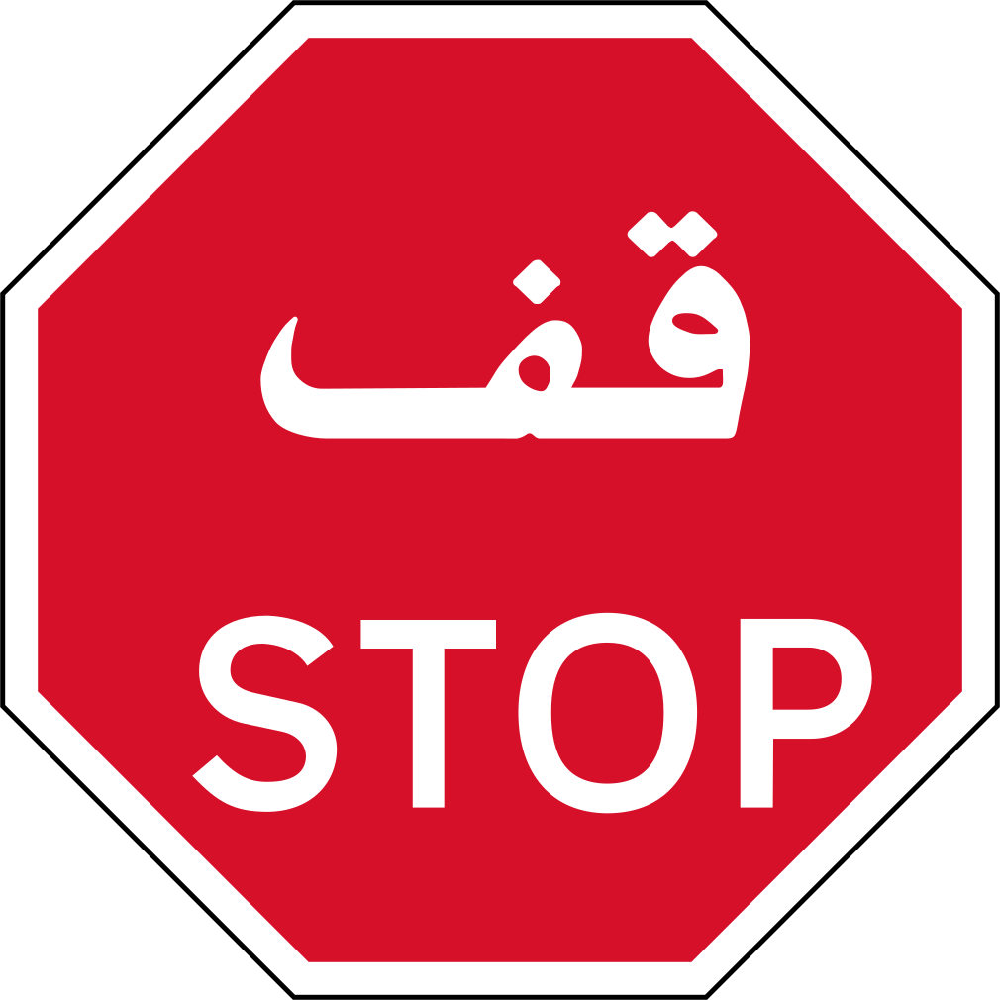
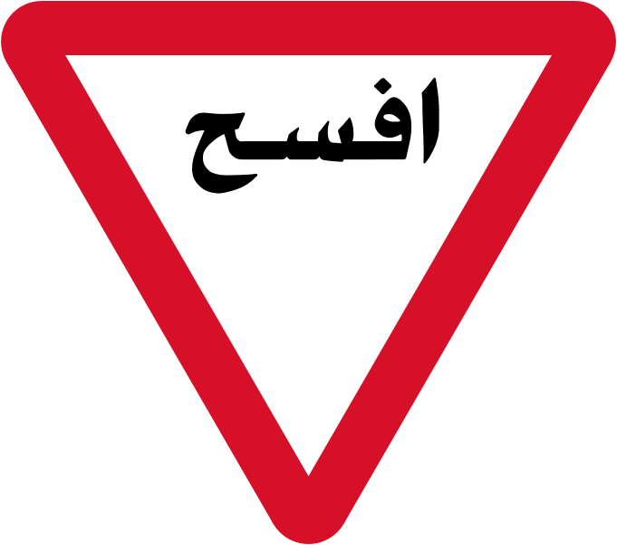
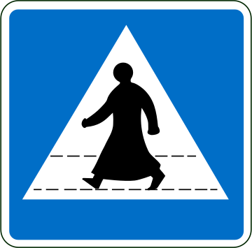

    <h2 class="section-title">{}</h2>
    <ul class="rule-list">
        <li>ドメインは.qa</li>
        <li>ナンバープレートの左側があずき色</li>
        <li>Google Carが特徴的</li>
    </ul>
    {}

{}
{}

{}標識に特徴的なものが多い。
{}

{}ナンバープレートの左側があずき色なので{}と間違えないようにする。Lusail Plaza Towersも印象的{}。
{}

{}

By <a href="//commons.wikimedia.org/wiki/User:Nima_Farid" class="mw-redirect" title="User:Nima Farid">Nima Farid</a> - Own work, <a href="https://creativecommons.org/licenses/by-sa/4.0" title="Creative Commons Attribution-Share Alike 4.0">CC BY-SA 4.0</a>, <a href="https://commons.wikimedia.org/w/index.php?curid=49414523">Link</a>
{}

{}Google Carが特徴的で標識も特有のものが多い。{}も似た見た目なので注意。右がアラブ首長国連邦。
{}

<iframe src="https://www.google.com/maps/embed?pb=!4v1687827551792!6m8!1m7!1sm_0E-7kek0LrHoCF3cdgww!2m2!1d25.32439721993444!2d51.35161953558839!3f226.8670241269839!4f-32.44312003721448!5f0.4000000000000002" width="295" height="295" style="border:0;" allowfullscreen="" loading="lazy" referrerpolicy="no-referrer-when-downgrade"></iframe>
<iframe src="https://www.google.com/maps/embed?pb=!4v1687827520671!6m8!1m7!1sxSvV8BnLUB3MuV2kl9Rc8A!2m2!1d25.40734473322975!2d55.51560890219447!3f224.367490569436!4f-48.1502334285031!5f0.4000000000000002" width="295" height="295" style="border:0;" allowfullscreen="" loading="lazy" referrerpolicy="no-referrer-when-downgrade"></iframe>

{}
{}