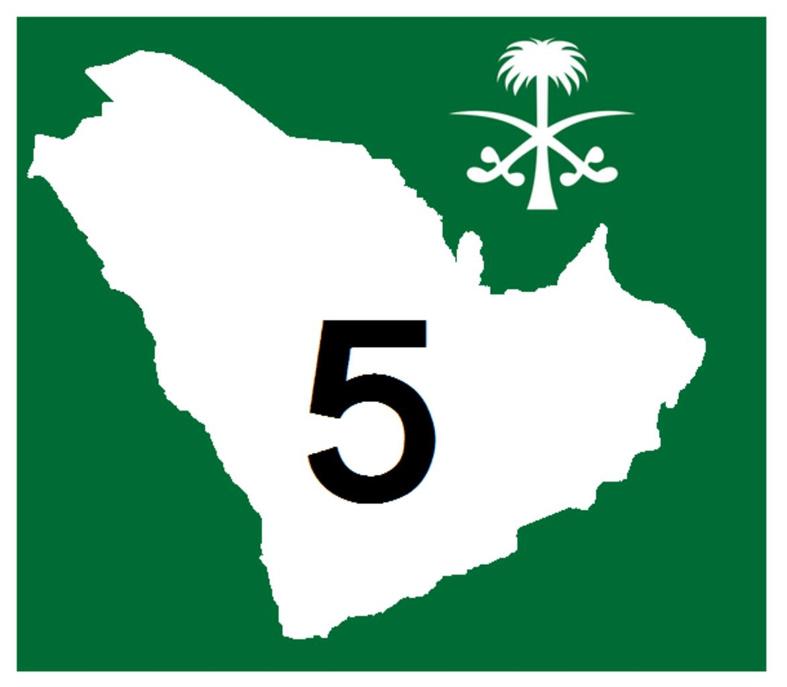

    <h2 class="section-title">{}</h2>
    <ul class="rule-list">
        <li>ドメインは.sa</li>
    </ul>
    {}
    {}

{}
{}

{}
道路番号の看板が独特で、サウジアラビアの国章が見つかる{{% ref "https://ja.wikipedia.org/wiki/%E3%82%B5%E3%82%A6%E3%82%B8%E3%82%A2%E3%83%A9%E3%83%93%E3%82%A2%E3%81%AE%E5%9B%BD%E7%AB%A0" "サウジアラビアの国章" %}}。
{}

{}
{}

    <h4 class="mb-4">代表的な企業の説明</h4>
    <table class="table table-striped table-bordered">
        <thead class="table-light">
            <tr>
                <th scope="col" class="col-width-2">企業名</th>
                <th scope="col" class="col-width-1">コード</th>
                <th scope="col" class="col-width-7">説明</th>
                <th scope="col" class="col-width-05">決算</th>
                <th scope="col" class="col-width-05">配当履歴</th>
            </tr>
        </thead>
        <tbody class="corp-desc">
            <tr>
                <td>サウジアラムコ</td>
                <td>-</td>
                <td>世界最大の原油輸出量・保有原油埋蔵量・原油生産量を誇るサウジアラビア王国の国有石油および天然ガス会社。</td>
                <td>-</td>
                <td>-</td>
            </tr>
        </tbody>
    </table>

