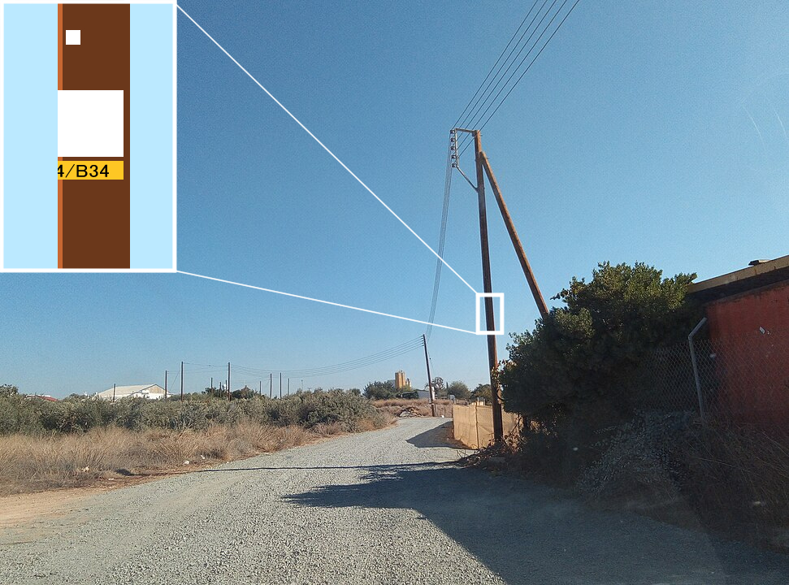

    <h2 class="section-title">{}</h2>
    <ul class="rule-list">
        <li>Domain-nya adalah .cy</li>
        <li>Dapat ditemukan bollard putih yang khas</li>
        <li>Lalu lintas di sebelah kiri</li>
    </ul>
    {}

{}
{}

{}
Bollard putih yang khas dapat ditemukan{}. Karena lalu lintas di sebelah kiri, rambu-rambu pun berada di sisi kiri.
{}

{}
Terdapat tulisan dalam bahasa Inggris, Yunani, dan Turki{}. Siprus sendiri berada dalam situasi konflik dan telah terbagi menjadi bagian utara dan selatan sejak tahun 1974{}.
{}

{}
Ada label kuning pada tiang listrik{}
{}

{}
Ada kendaraan dengan plat nomor belakang berwarna kuning{}. Rambu lalu lintas dan marka jalan terkadang juga menggunakan yang berasal dari {}.
{}

{}

[Do What the Fxxk You Want to Public License](http://www.wtfpl.net/about/)

Public Domain
{}

{}
{}
