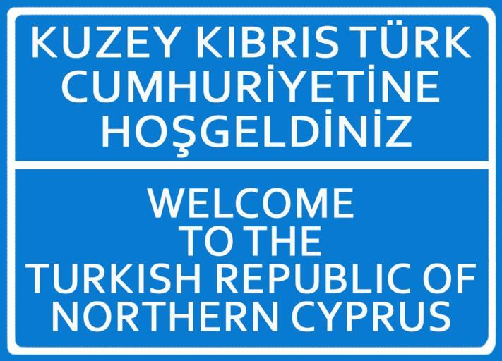

    <h2 class="section-title">{}</h2>
    <ul class="rule-list">
        <li>ドメインは.cy</li>
        <li>白色の独特なボラードが見つかる</li>
    </ul>
    {}

{}
{}

{}
白色の独特なボラードが見つかる{}
{}

{}
英語・ギリシャ語・トルコ語の表記がある{}。キプロス自体は紛争状態であり、1974年から南北に分断された状態になっている{}。
{}

{}
ナンバープレートは黄色のナンバーを付けている可能性もある{}。
{}

{}

[Do What the Fxxk You Want to Public License](http://www.wtfpl.net/about/)

Public Domain
{}

{}
{}
