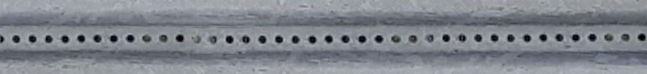
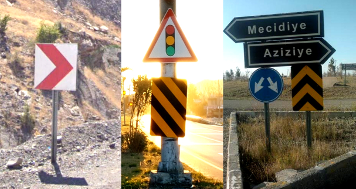
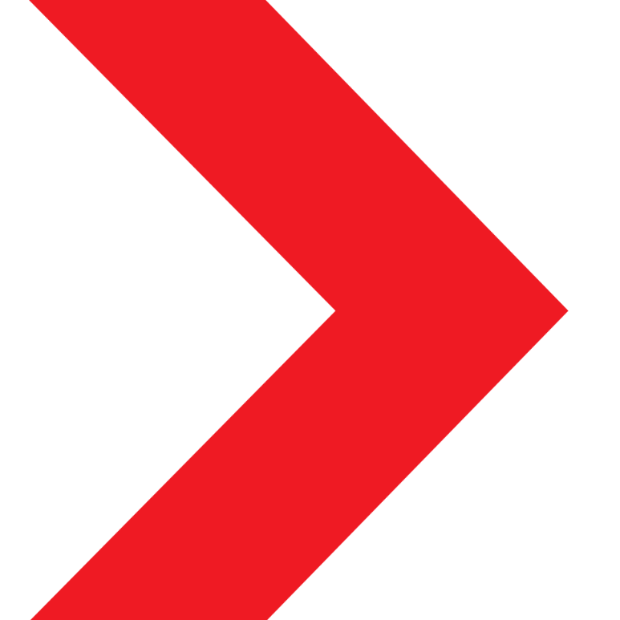
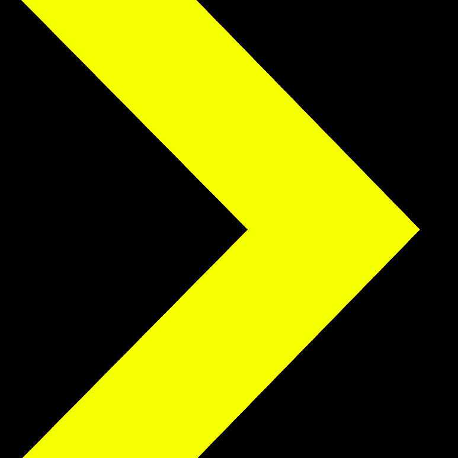
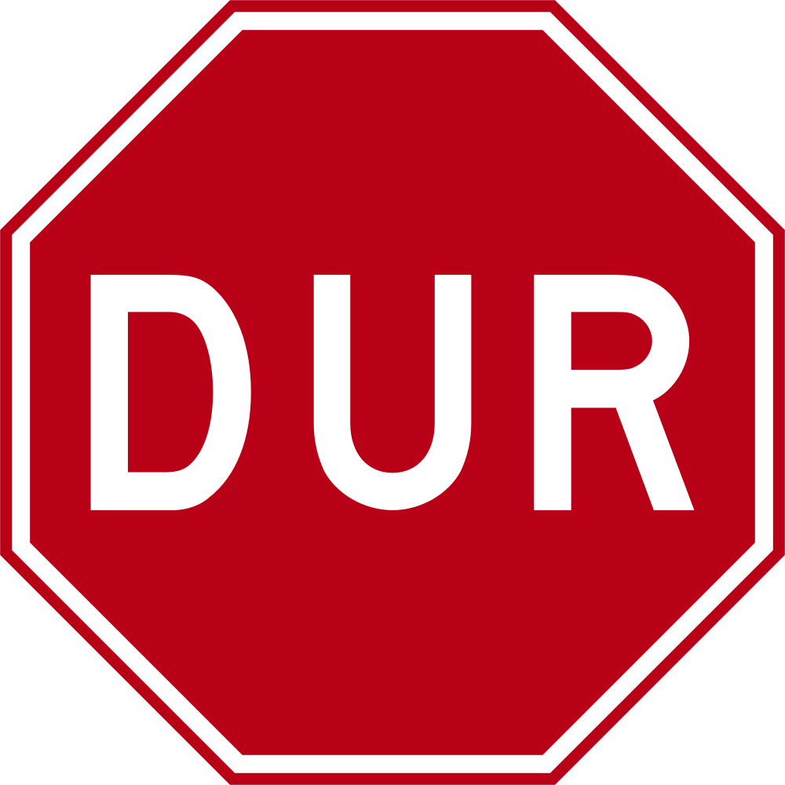
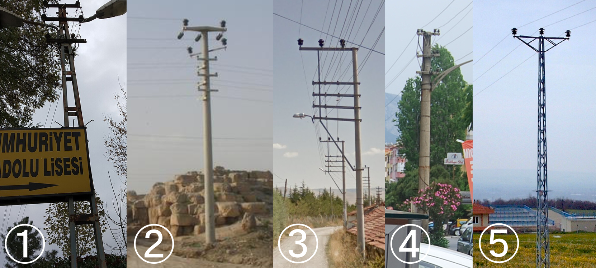

---

title: "Turquía"
title_suffix: "(República de Turquía)"
date: 2023-02-26
lastmod: 2023-07-01
weight: 2
draft: false
keywords: [""]
sections: [""]
bg: "bg/city.jpg"
flag: "TR.svg"
jetro_detail: true
jogmec_detail: true
dont_show_usda: true
is_has_distinctive_googlecar: true
sc_title: "Áreas que son fáciles de confundir"
sc: [
    ["../../europe/macedonia/", "macedonia del norte"],
    ["../../europe/greece/", "Grecia"],
    ]
---

    <h2 class="section-title">{}</h2>
    <ul class="rule-list">
        <li>El dominio es .tr</li>
        <li>La señal de alto es DUR</li>
        <li>El bolardo es Pedazo Delgada con una placa reflectante en la superficie.</li>
        <li>"sokak"significa calle en turco</li>
        <li class="no-evidence">Hay muchos agujeros pequeños en el letrero.</li>
        <li class="no-evidence">Hay un espacio al final de la flecha en forma de galón roja y blanca.</li>
        <li>🧵 Las baldosas con formas son habituales en las aceras, etc.</li>
    </ul>
    {}
    

        
Señal unidireccional: Por <a href="//commons.wikimedia.org/w/index.php?title=User:Gigillo83&amp;amp;action=edit&amp;amp;redlink=1" class="new" title="User:Gigillo83 (page does not exist)">gigillo83</a> - propio trabajo, <a href="https://creativecommons.org/licenses/by-sa/4.0" title="Creative Commons Attribution-Share Alike 4.0">CC BY-SA 4.0</a>, <a href="https://commons.wikimedia.org/w/index.php?curid=38084412">Enlace</a>

    

{}
{}

{}
Letreros y letreros turcos.Los caracteres Ç, Ş, Ğ, İ, Ö, Ü y el "・" encima de las letras Ü son distintivos.{}."Ü" también se utiliza en el nombre del país "Türkiye"{}.{}

{}
Hay muchos pequeños agujeros en el cartel, por lo que a menudo se puede ver el otro lado.{}.
{}

{}
Los chevrones se utilizan principalmente en rojo y blanco, pero su característica distintiva es que hay un espacio en blanco al final de la flecha.{}.Algunos de ellos no son rojos y blancos, pero deberías poder distinguir el país por el espacio entre el palo y la punta del cartel.{}.A menudo hay señales naranjas y negras en la franja mediana.{}.
{}

{}
La señal de alto es DUR, el tráfico en un solo sentido es TEK YON.
{}

{}
El bolardo es Pedazo Delgada con una placa reflectante roja en la superficie.{}.El que se parece más{}bolardo de{}.
{}

{}
Los azulejos con forma de 🧵 son comunes en las aceras, etc.{}.
{}

{}
Poste telefónico que personalmente creo que se parece a Türkiye{}.Diferentes formas similares a estas.{}También los hay con forma de gancho que se parecen a los de{}.
{}

<table style="width:80%">
<tr>
    <td style="width:2em;">①</td><td>{}</td>
    <td style="width:2em;">②</td><td>{}({})</td>
</tr><tr>
    <td style="width:2em;">③</td><td>{}</td>
    <td style="width:2em;">④</td><td>{}</td>
</tr><tr>
    <td style="width:2em;">⑤</td><td>{}</td>
    <td style="width:2em;"></td><td></td>
</tr>
</table>

{}
{}
{}
varios postes telefónicos
{}

<iframe src="https://www.google.com/maps/embed?pb=!4v1686317290862!6m8!1m7!1sG5mJ6cnsSX6U8x8XMwKd5w!2m2!1d39.73949932417848!2d32.75341222632087!3f95.78482578423227!4f6.296244921273754!5f1.6739744811632447" width="500" height="350" style="border:0;" allowfullscreen="" loading="lazy" referrerpolicy="no-referrer-when-downgrade"></iframe>

{}
{}
{}
Hay muchos caminos como este.{}
{}

{}
En la carretera hay una alcantarilla de Türk Telekom.También existe la notación de telefon (teléfono en turco).
{}

<iframe src="https://www.google.com/maps/embed?pb=!4v1682031441972!6m8!1m7!1sl8NfH2SkeanoXn4kc8KiqA!2m2!1d38.47213789505467!2d27.17431140846952!3f87.45727387421763!4f-32.2151327048122!5f3.325193203789971" width="295" height="295" style="border:0;" allowfullscreen="" loading="lazy" referrerpolicy="no-referrer-when-downgrade"></iframe>
<iframe src="https://www.google.com/maps/embed?pb=!4v1682032248676!6m8!1m7!1srejQsYOMxfcQDH5vYL1uxA!2m2!1d38.74271029142172!2d35.47934290009136!3f344.04125431552984!4f-23.96399488085622!5f3.325193203789971" width="295" height="295" style="border:0;" allowfullscreen="" loading="lazy" referrerpolicy="no-referrer-when-downgrade"></iframe>

{}
{}

<iframe src="https://www.google.com/maps/embed?pb=!4v1686925262715!6m8!1m7!1szVcsZ4Bhw1F5Ijw_LaZQCA!2m2!1d40.30921951700285!2d40.98824819170338!3f69.80166315020313!4f-14.277059747114663!5f3.050611078327584" width="295" height="295" style="border:0;" allowfullscreen="" loading="lazy" referrerpolicy="no-referrer-when-downgrade"></iframe>

{}
{}

    <h2 class="section-title">{}</h2>
    <ul class="rule-list">
        <li>Los números de las carreteras se pueden leer en los marcadores de kilómetros.{}</li>
        <li>El código de área es 02-03-04 de oeste a este.{}
            <ul>
                <li>02 (Estambul, Esmirna, etc.){}</li>
                <li>03 (Ankara, Adana, etc.){}
                <li>04 (Şırnak, Ardahan, etc.){}</li>
            </ul>
        </li>
    </ul>

{}
{}
{}
Los números de las carreteras se pueden leer en los marcadores de kilómetros.{}{}.
{}

{}
{}
{}
212 → Se puede estimar aproximadamente la ubicación, quizás hacia el oeste, incluida Estambul.Sin embargo, hay muchos casos del 05~ y 08~ que no sé dónde están.
{}

<iframe src="https://www.google.com/maps/embed?pb=!4v1682124343498!6m8!1m7!1soavtCUP5-jYYp_V2xA792g!2m2!1d41.04250992296203!2d28.98642515603996!3f289.60900622705896!4f3.2878253103013293!5f3.325193203789971" width="295" height="295" style="border:0;" allowfullscreen="" loading="lazy" referrerpolicy="no-referrer-when-downgrade"></iframe>
<iframe src="https://www.google.com/maps/embed?pb=!4v1682124561524!6m8!1m7!1sKdxQ7eLvYJyjiOcZPrhw6g!2m2!1d41.04363221134001!2d28.98635001306301!3f279.22724503871007!4f-2.0998099344897696!5f3.325193203789971" width="295" height="295" style="border:0;" allowfullscreen="" loading="lazy" referrerpolicy="no-referrer-when-downgrade"></iframe>

{}
{}

Por Beck, H.E., Zimmermann, N. E., McVicar, T. R., Vergopolan, N., Berg, A., Wood, E. F. - "Mapas de clasificación climática de Köppen-Geiger presentes y futuros con una resolución de 1 km". Datos científicos de la naturaleza. <a href="https://en.wikipedia.org/wiki/Digital_object_identifier" class="extiw" title="w:Digital object identifier">DOI</a>:<a rel="nofollow" class="external text" href="https://doi.org/10.1038/sdata.2018.214">10.1038/sdata.2018.214</a>., <a href="https://creativecommons.org/licenses/by/4.0" title="Creative Commons Attribution 4.0">CC POR 4.0</a>, <a href="https://commons.wikimedia.org/w/index.php?curid=74674127">Enlace</a>

{}
{}

    <h4 class="section-title">agricultura</h2>
    <ul class="rule-list">
        <li>Hay muchos invernaderos de vinilo a lo largo de la costa sur.
            <ul>
                <li>Mersin{}</li>
                <li>Antalya{}</li>
            </ul>
        </li>
        <li>La producción de maíz es unas 20 veces mayor en el sur que en el norte.{}</li>
        <li>El algodón crece en el sudeste de Anatolia{}</li>
        <li>Los girasoles abundan en Konya y en el lado griego.{}</li>
    </ul>

{}
{}

{}
A continuación se muestra una carretera en las afueras de Antalya.A ambos lados de la carretera se alinean invernaderos verdes.
{}

<iframe src="https://www.google.com/maps/embed?pb=!4v1724506936040!6m8!1m7!1s853AtEorsBsP1oSf5vQg5A!2m2!1d36.60672209818605!2d31.80335797884336!3f138.4500767154498!4f-6.112518616300875!5f0.7820865974627469" width="95%" height="400" style="border:0;" allowfullscreen="" loading="lazy" referrerpolicy="no-referrer-when-downgrade"></iframe>

{}
{}

{}
{}

{}
{}

{}
Tártaro, Özgür. "El cambio climático impacta en la producción agrícola en Turquía". (2016).
{}

{}
{}

    <h2 class="section-title">{}</h2>
    <ul class="rule-list">
        <li>El nombre de la división administrativa local o de la ciudad puede estar escrito en el bote de basura.●× en “●× BELEDiYESi” es el nombre del lugar.
            <ul>
                <li>Gökçeada{}Hay un distrito insular remoto llamado{{% ref "https://en.wikipedia.org/wiki/G%C3%B6k%C3%A7eada_District" "Distrito de Gökçeada" %}}
                <li>arsuz{}</li>
                <li>Nevşehir{}</li>
                <li>Cizré{}</li>
            </ul>
        </li>
        <li>Los carteles con los nombres de las calles varían según la ciudad.</li>
    </ul>

{}
{}

{}
"Ortahisar" es el nombre de la ciudad{}.
{}

Por <a href="//commons.wikimedia.org/wiki/User:Robot8A" title="User:Robot8A">Robot8A</a> - propio trabajo, <a href="https://creativecommons.org/licenses/by-sa/4.0" title="Creative Commons Attribution-Share Alike 4.0">CC BY-SA 4.0</a>, <a href="https://commons.wikimedia.org/w/index.php?curid=97957044">Enlace</a>

{}
{}
{}
Necesitas ver la diferencia en las marcas circulares de arriba.
{}

{}
{}

{}
<a href="https://commons.wikimedia.org/wiki/Category:Street_signs_in_Ankara"><u>Señales de la calle en Ankara</u></a>Ver. Hay dos tipos: azul y rojo.
{}

{}
{}

{}
- Por MERMERCİ ÖZGÜR1, CC BY 3.0, https://commons.wikimedia.org/w/index.php?curid=52804152
{}