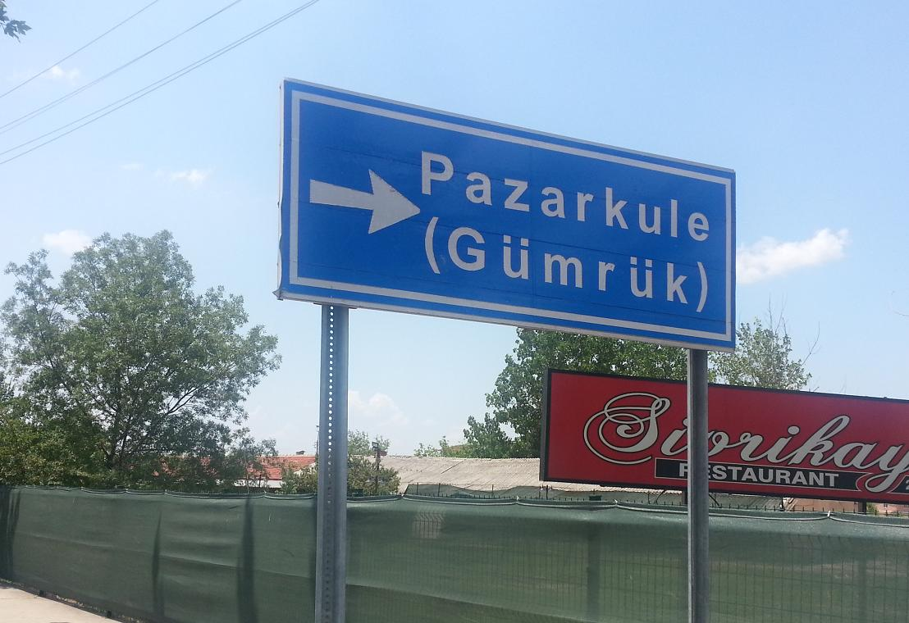
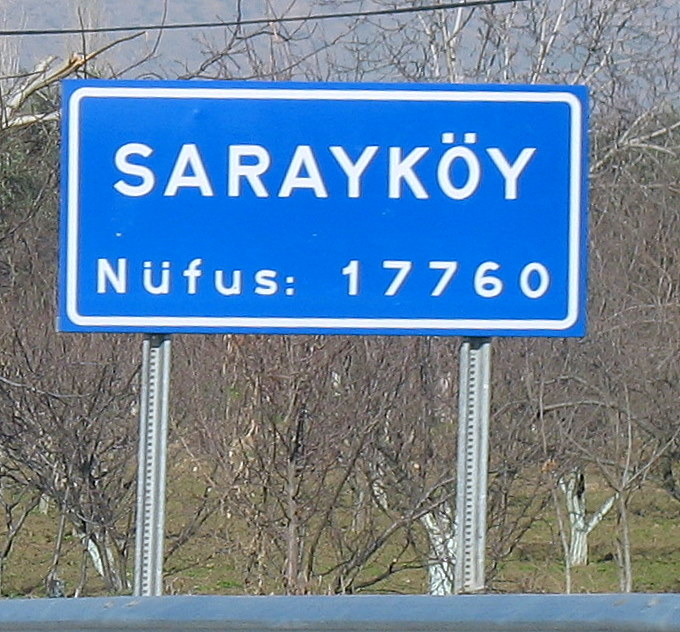
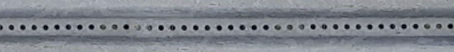
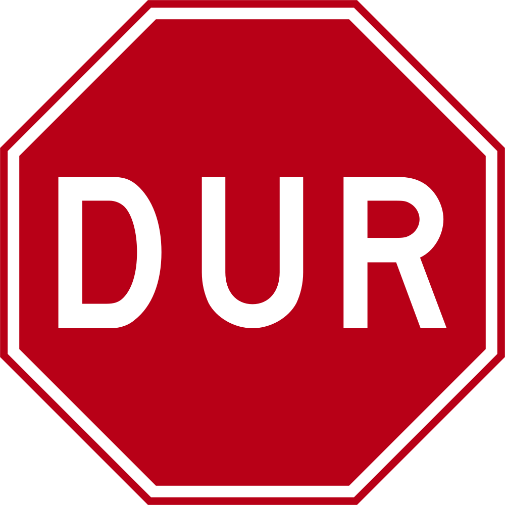
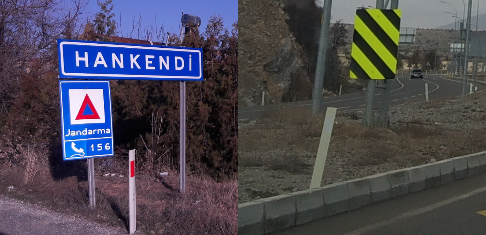
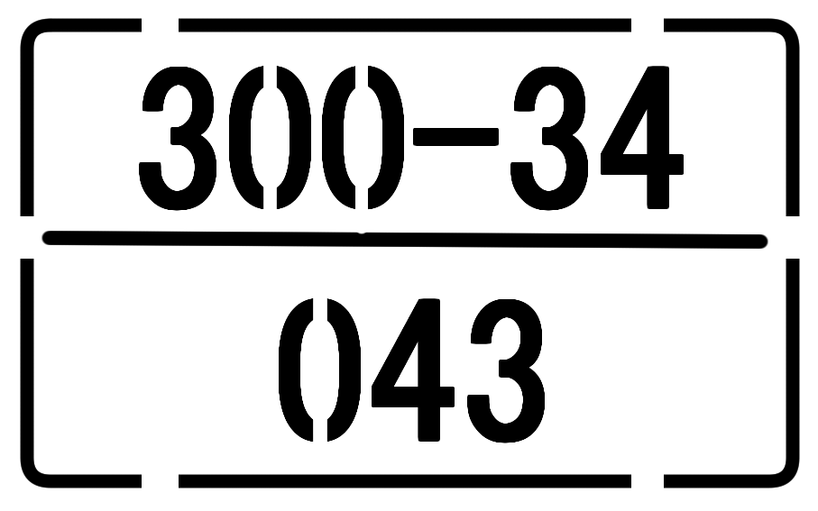

    <h2 class="section-title">{}</h2>
    <ul class="rule-list">
        <li>ドメインは.tr</li>
        <li>止まれの標識はDUR</li>
        <li>ボラードは片面に反射板があり薄い</li>
        <li>「sokak」はトルコ語で通りの意味</li>
        <li class="no-evidence">標識の棒に小さな穴がたくさん空いている</li>
    </ul>
    {}
    

        
一方通行の標識：By <a href="//commons.wikimedia.org/w/index.php?title=User:Gigillo83&amp;amp;action=edit&amp;amp;redlink=1" class="new" title="User:Gigillo83 (page does not exist)">Gigillo83</a> - Own work, <a href="https://creativecommons.org/licenses/by-sa/4.0" title="Creative Commons Attribution-Share Alike 4.0">CC BY-SA 4.0</a>, <a href="https://commons.wikimedia.org/w/index.php?curid=38084412">Link</a>

    

{}
{}
{}
トルコ語の看板や標識。Ç、Ş、Ğ、İ、Ö、Üの文字やÜなどの文字の上の「・」が特徴的{}。また、標識の棒に小さな穴がたくさん空いていて反対側が見えることが多い気がする。
{}

{}
止まれの標識はDUR、一方通行はTEK YÖN。シェブロンは赤白のものを使うが矢印の先に余白があるのが特徴{}。
{}

{}
ボラードは片面に赤い反射板があり薄い{}。一番見た目が似ているのは{}のボラード{}。
{}

{}
{}
{}
いろんな電柱
{}

<iframe src="https://www.google.com/maps/embed?pb=!4v1686317290862!6m8!1m7!1sG5mJ6cnsSX6U8x8XMwKd5w!2m2!1d39.73949932417848!2d32.75341222632087!3f95.78482578423227!4f6.296244921273754!5f1.6739744811632447" width="500" height="350" style="border:0;" allowfullscreen="" loading="lazy" referrerpolicy="no-referrer-when-downgrade"></iframe>

{}
{}
{}
道にトルコテレコム (Türk Telekom)のマンホールがある。telefon（トルコ語でのtelephone）の表記もある。
{}

<iframe src="https://www.google.com/maps/embed?pb=!4v1682031441972!6m8!1m7!1sl8NfH2SkeanoXn4kc8KiqA!2m2!1d38.47213789505467!2d27.17431140846952!3f87.45727387421763!4f-32.2151327048122!5f3.325193203789971" width="295" height="295" style="border:0;" allowfullscreen="" loading="lazy" referrerpolicy="no-referrer-when-downgrade"></iframe>
<iframe src="https://www.google.com/maps/embed?pb=!4v1682032248676!6m8!1m7!1srejQsYOMxfcQDH5vYL1uxA!2m2!1d38.74271029142172!2d35.47934290009136!3f344.04125431552984!4f-23.96399488085622!5f3.325193203789971" width="295" height="295" style="border:0;" allowfullscreen="" loading="lazy" referrerpolicy="no-referrer-when-downgrade"></iframe>

{}
{}

<iframe src="https://www.google.com/maps/embed?pb=!4v1686925262715!6m8!1m7!1szVcsZ4Bhw1F5Ijw_LaZQCA!2m2!1d40.30921951700285!2d40.98824819170338!3f69.80166315020313!4f-14.277059747114663!5f3.050611078327584" width="295" height="295" style="border:0;" allowfullscreen="" loading="lazy" referrerpolicy="no-referrer-when-downgrade"></iframe>

{}
{}

    <h2 class="section-title">{}</h2>
    <ul class="rule-list">
        <li>キロメートルマーカーから道路番号が読み取れる{}。</li>
        <li>市外局番は西から東へ02（Istanbul、Izmir）～03（Ankara）～04（Şırnak、Ardahan）のイメージ？{}</li>
    </ul>

{}
{}
{}
キロメートルマーカーから道路番号が読み取れる{}。
{}

{}
{}
{}
212→イスタンブールを含む西側かもといった感じで大体の位置推定ができる。ただし05~、08～も多くこれらは場所が分からない。
{}

<iframe src="https://www.google.com/maps/embed?pb=!4v1682124343498!6m8!1m7!1soavtCUP5-jYYp_V2xA792g!2m2!1d41.04250992296203!2d28.98642515603996!3f289.60900622705896!4f3.2878253103013293!5f3.325193203789971" width="295" height="295" style="border:0;" allowfullscreen="" loading="lazy" referrerpolicy="no-referrer-when-downgrade"></iframe>
<iframe src="https://www.google.com/maps/embed?pb=!4v1682124561524!6m8!1m7!1sKdxQ7eLvYJyjiOcZPrhw6g!2m2!1d41.04363221134001!2d28.98635001306301!3f279.22724503871007!4f-2.0998099344897696!5f3.325193203789971" width="295" height="295" style="border:0;" allowfullscreen="" loading="lazy" referrerpolicy="no-referrer-when-downgrade"></iframe>

{}
{}

By Beck, H.E., Zimmermann, N. E., McVicar, T. R., Vergopolan, N., Berg, A., Wood, E. F. - "Present and future Köppen-Geiger climate classification maps at 1-km resolution". Nature Scientific Data. <a href="https://en.wikipedia.org/wiki/Digital_object_identifier" class="extiw" title="w:Digital object identifier">DOI</a>:<a rel="nofollow" class="external text" href="https://doi.org/10.1038/sdata.2018.214">10.1038/sdata.2018.214</a>., <a href="https://creativecommons.org/licenses/by/4.0" title="Creative Commons Attribution 4.0">CC BY 4.0</a>, <a href="https://commons.wikimedia.org/w/index.php?curid=74674127">Link</a>

{}
{}

    <h2 class="section-title">{}</h2>
    <ul class="rule-list">
        <li>ゴミ箱に都市名が書いてあることがある{}</li>
        <li>通り名の看板が都市によって異なる</li>
    </ul>

{}
{}

By <a href="//commons.wikimedia.org/wiki/User:Robot8A" title="User:Robot8A">Robot8A</a> - Own work, <a href="https://creativecommons.org/licenses/by-sa/4.0" title="Creative Commons Attribution-Share Alike 4.0">CC BY-SA 4.0</a>, <a href="https://commons.wikimedia.org/w/index.php?curid=97957044">Link</a>

{}
{}
{}
上の円形のマークの違いを見る必要がある
{}

{}
{}

<iframe src="https://www.google.com/maps/embed?pb=!4v1685557386082!6m8!1m7!1sFg5rSs_8ZTRJc7JpNKghBA!2m2!1d36.9557033940079!2d30.72367396314874!3f105.63881546455217!4f0.6160411884917494!5f3.325193203789971" width="295" height="295" style="border:0;" allowfullscreen="" loading="lazy" referrerpolicy="no-referrer-when-downgrade"></iframe>
<iframe src="https://www.google.com/maps/embed?pb=!4v1685557415778!6m8!1m7!1s8fnLobboHQrnzk_eTwCsHg!2m2!1d36.9766508496169!2d30.70234610257211!3f137.77209324666765!4f-0.8109974591268099!5f3.325193203789971" width="295" height="295" style="border:0;" allowfullscreen="" loading="lazy" referrerpolicy="no-referrer-when-downgrade"></iframe>

{}
{}

<iframe src="https://www.google.com/maps/embed?pb=!4v1685557155453!6m8!1m7!1sLfjXwZTZQL1lSd7LpucFVQ!2m2!1d39.94464225500045!2d32.85448713564772!3f213.22166493493947!4f0.035134921699167876!5f2.674553034047748" width="295" height="295" style="border:0;" allowfullscreen="" loading="lazy" referrerpolicy="no-referrer-when-downgrade"></iframe>
<iframe src="https://www.google.com/maps/embed?pb=!4v1685557199306!6m8!1m7!1sE5j4dX6IU_ruh1bW9GpERA!2m2!1d39.97582411991183!2d32.90342327960887!3f198.02468006957434!4f0.349870839121607!5f3.325193203789971" width="295" height="295" style="border:0;" allowfullscreen="" loading="lazy" referrerpolicy="no-referrer-when-downgrade"></iframe>

{}
{}

<iframe src="https://www.google.com/maps/embed?pb=!4v1687076922343!6m8!1m7!1sIz08YzBo99ikRzQd85zDsA!2m2!1d40.42906283036037!2d29.15618602091844!3f137.97625133540433!4f-0.8359732760743412!5f3.325193203789971" width="295" height="295" style="border:0;" allowfullscreen="" loading="lazy" referrerpolicy="no-referrer-when-downgrade"></iframe>

{}
{}