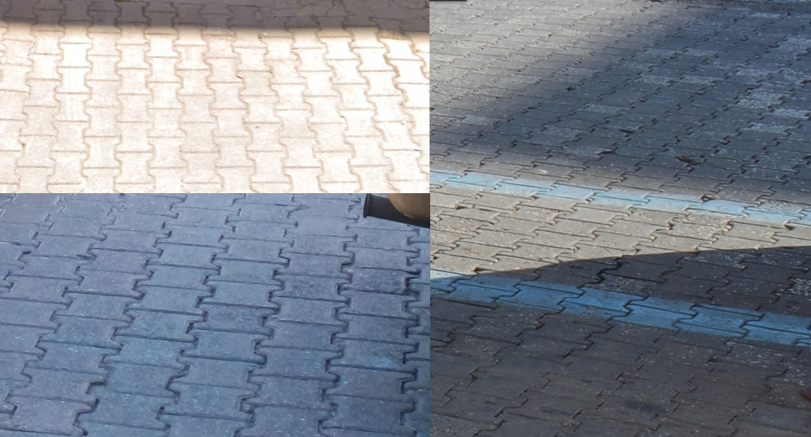
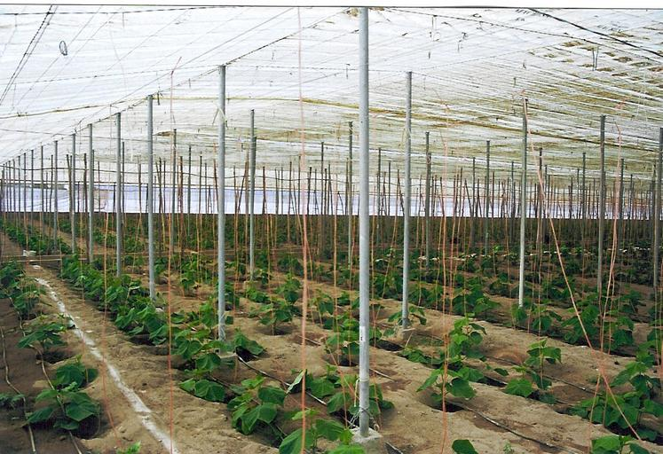
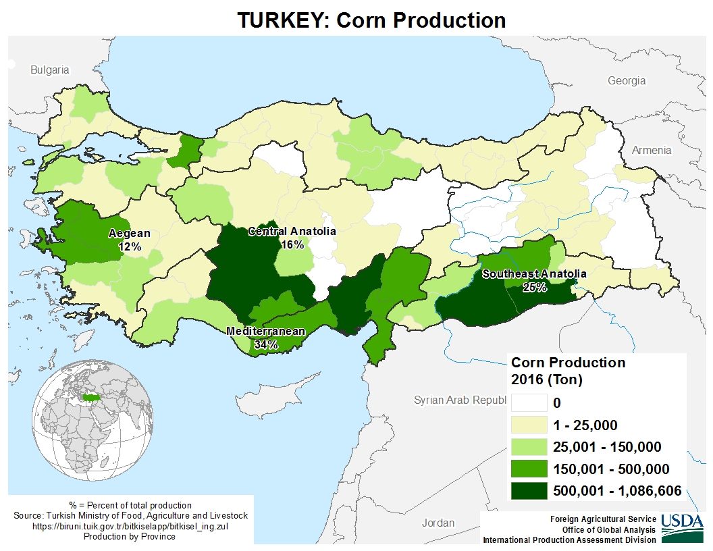
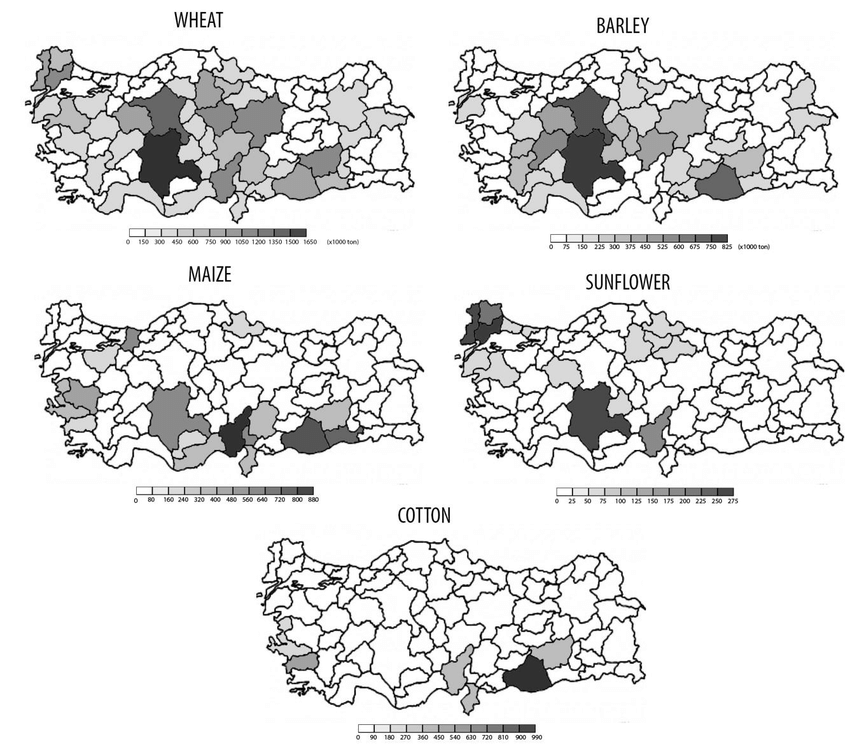

    <h2 class="section-title">{}</h2>
    <ul class="rule-list">
        <li>ドメインは.tr</li>
        <li>止まれの標識はDUR</li>
        <li>ボラードã¯ç‰‡é¢ã«åå°„æ¿ãŒã‚ã‚Šè–„ã„</li>
        <li>「sokak」はトルコ語で通りの意味</li>
        <li class="no-evidence">標識の棒に小さな穴がたくさん空いている</li>
        <li class="no-evidence">赤白シェブロンの矢印の先に隙間がある</li>
        <li>🧵の形のタイルが歩道などにありがち</li>
    </ul>
    {}
    

        
一方通行の標識：By <a href="//commons.wikimedia.org/w/index.php?title=User:Gigillo83&amp;amp;action=edit&amp;amp;redlink=1" class="new" title="User:Gigillo83 (page does not exist)">Gigillo83</a> - Own work, <a href="https://creativecommons.org/licenses/by-sa/4.0" title="Creative Commons Attribution-Share Alike 4.0">CC BY-SA 4.0</a>, <a href="https://commons.wikimedia.org/w/index.php?curid=38084412">Link</a>

    

{}
{}

{}
トルコ語の看板や標識。Ç、Ş、Ğ、İ、Ö、Üの文字やÜなどの文字の上の「・」が特徴的{}。国名の『Türkiye』にも『Ü』が使われている{}。{}

{}
標識の棒に小さな穴がたくさん空いていて反対側が見えることが多い{}。
{}

{}
シェブロンは主に赤白のものを使うが矢印の先に余白があるのが特徴{}。赤白じゃないものもあるが標識の棒や先端の隙間で国がわかるはず{}。中央分離帯にオレンジと黒の看板があることも多い{}。
{}

{}
止まれの標識はDUR、一方通行はTEK YÖN。
{}

{}
ボラードã¯ç‰‡é¢ã«èµ¤ã„åå°„æ¿ãŒã‚ã‚Šè–„ã„{}。一番見た目が似ているのは{}のボラード{}。
{}

{}
🧵の形のタイルが歩道などにありがち{}。
{}

{}
個人的にトルコっぽいと思う電柱{}。これらに似た違う形や{}にありそうなフック型のものもある{}。
{}

<table style="width:80%">
<tr>
    <td style="width:2em;">①</td><td>{}</td>
    <td style="width:2em;">②</td><td>{}({}にありそうな形)</td>
</tr><tr>
    <td style="width:2em;">③</td><td>{}</td>
    <td style="width:2em;">④</td><td>{}</td>
</tr><tr>
    <td style="width:2em;">⑤</td><td>{}</td>
    <td style="width:2em;"></td><td></td>
</tr>
</table>

{}
{}
{}
いろんな電柱
{}

<iframe src="https://www.google.com/maps/embed?pb=!4v1686317290862!6m8!1m7!1sG5mJ6cnsSX6U8x8XMwKd5w!2m2!1d39.73949932417848!2d32.75341222632087!3f95.78482578423227!4f6.296244921273754!5f1.6739744811632447" width="500" height="350" style="border:0;" allowfullscreen="" loading="lazy" referrerpolicy="no-referrer-when-downgrade"></iframe>

{}
{}
{}
こんな感じの路面が多い{}
{}

{}
道にトルコテレコム (Türk Telekom)のマンホールがある。telefon（トルコ語でのtelephone）の表記もある。
{}

<iframe src="https://www.google.com/maps/embed?pb=!4v1682031441972!6m8!1m7!1sl8NfH2SkeanoXn4kc8KiqA!2m2!1d38.47213789505467!2d27.17431140846952!3f87.45727387421763!4f-32.2151327048122!5f3.325193203789971" width="295" height="295" style="border:0;" allowfullscreen="" loading="lazy" referrerpolicy="no-referrer-when-downgrade"></iframe>
<iframe src="https://www.google.com/maps/embed?pb=!4v1682032248676!6m8!1m7!1srejQsYOMxfcQDH5vYL1uxA!2m2!1d38.74271029142172!2d35.47934290009136!3f344.04125431552984!4f-23.96399488085622!5f3.325193203789971" width="295" height="295" style="border:0;" allowfullscreen="" loading="lazy" referrerpolicy="no-referrer-when-downgrade"></iframe>

{}
{}

<iframe src="https://www.google.com/maps/embed?pb=!4v1686925262715!6m8!1m7!1szVcsZ4Bhw1F5Ijw_LaZQCA!2m2!1d40.30921951700285!2d40.98824819170338!3f69.80166315020313!4f-14.277059747114663!5f3.050611078327584" width="295" height="295" style="border:0;" allowfullscreen="" loading="lazy" referrerpolicy="no-referrer-when-downgrade"></iframe>

{}
{}

    <h2 class="section-title">{}</h2>
    <ul class="rule-list">
        <li>キロメートルマーカーから道路番号が読み取れる{}</li>
        <li>市外局番は西から東へ02～03～04のイメージ{}
            <ul>
                <li>02（Istanbul・Izmirなど）{}</li>
                <li>03（Ankara・Adanaなど）{}
                <li>04（Şırnak・Ardahanなど）{}</li>
            </ul>
        </li>
    </ul>

{}
{}
{}
キロメートルマーカーから道路番号が読み取れる{}{}。
{}

{}
{}
{}
212→イスタンブールを含む西側かもといった感じで大体の位置推定ができる。ただし05~、08～も多くこれらは場所が分からない。
{}

<iframe src="https://www.google.com/maps/embed?pb=!4v1682124343498!6m8!1m7!1soavtCUP5-jYYp_V2xA792g!2m2!1d41.04250992296203!2d28.98642515603996!3f289.60900622705896!4f3.2878253103013293!5f3.325193203789971" width="295" height="295" style="border:0;" allowfullscreen="" loading="lazy" referrerpolicy="no-referrer-when-downgrade"></iframe>
<iframe src="https://www.google.com/maps/embed?pb=!4v1682124561524!6m8!1m7!1sKdxQ7eLvYJyjiOcZPrhw6g!2m2!1d41.04363221134001!2d28.98635001306301!3f279.22724503871007!4f-2.0998099344897696!5f3.325193203789971" width="295" height="295" style="border:0;" allowfullscreen="" loading="lazy" referrerpolicy="no-referrer-when-downgrade"></iframe>

{}
{}

By Beck, H.E., Zimmermann, N. E., McVicar, T. R., Vergopolan, N., Berg, A., Wood, E. F. - "Present and future Köppen-Geiger climate classification maps at 1-km resolution". Nature Scientific Data. <a href="https://en.wikipedia.org/wiki/Digital_object_identifier" class="extiw" title="w:Digital object identifier">DOI</a>:<a rel="nofollow" class="external text" href="https://doi.org/10.1038/sdata.2018.214">10.1038/sdata.2018.214</a>., <a href="https://creativecommons.org/licenses/by/4.0" title="Creative Commons Attribution 4.0">CC BY 4.0</a>, <a href="https://commons.wikimedia.org/w/index.php?curid=74674127">Link</a>

{}
{}

    <h4 class="section-title">農業</h2>
    <ul class="rule-list">
        <li>ビニールハウスは南の海沿いに多い
            <ul>
                <li>Mersin{}</li>
                <li>Antalya{}</li>
            </ul>
        </li>
        <li>コーンは南部が北部より20倍ほど生産量がある{}</li>
        <li>綿花は南部のSoutheast Anatolia{}</li>
        <li>ひまわりはKonya周辺とギリシャ側に多め{}</li>
    </ul>

{}
{}

{}
以下はAntalyaの郊外の道。道の両サイドにビニールハウスが並んでいる。
{}

<iframe src="https://www.google.com/maps/embed?pb=!4v1724506936040!6m8!1m7!1s853AtEorsBsP1oSf5vQg5A!2m2!1d36.60672209818605!2d31.80335797884336!3f138.4500767154498!4f-6.112518616300875!5f0.7820865974627469" width="95%" height="400" style="border:0;" allowfullscreen="" loading="lazy" referrerpolicy="no-referrer-when-downgrade"></iframe>

{}
{}

{}
{}

{}
{}

{}
Tatar, Özgür. "Climate change impacts on crop production in Turkey." (2016).
{}

{}
{}

    <h2 class="section-title">{}</h2>
    <ul class="rule-list">
        <li>ゴミ箱に地方行政区画名や都市名が書いてあることがある。『●× BELEDiYESi』の●×が地名。
            <ul>
                <li>Gökçeada{}という離島の地区がある{{% ref "https://en.wikipedia.org/wiki/G%C3%B6k%C3%A7eada_District" "Gökçeada District" %}}
                <li>Arsuz{}</li>
                <li>Nevşehir{}</li>
                <li>Cizre{}</li>
            </ul>
        </li>
        <li>通り名の看板が都市によって異なる</li>
    </ul>

{}
{}

{}
ã€Ortahisar』が町名{}。
{}

By <a href="//commons.wikimedia.org/wiki/User:Robot8A" title="User:Robot8A">Robot8A</a> - Own work, <a href="https://creativecommons.org/licenses/by-sa/4.0" title="Creative Commons Attribution-Share Alike 4.0">CC BY-SA 4.0</a>, <a href="https://commons.wikimedia.org/w/index.php?curid=97957044">Link</a>

{}
{}
{}
上の円形のマークの違いを見る必要がある
{}

{}
{}

{}
<a href="https://commons.wikimedia.org/wiki/Category:Street_signs_in_Ankara"><u>Street signs in Ankara</u></a>を参照。青いものと赤いものの2種類。
{}

{}
{}

{}
- By MERMERCİ ÖZGÜR1, CC BY 3.0, https://commons.wikimedia.org/w/index.php?curid=52804152
{}