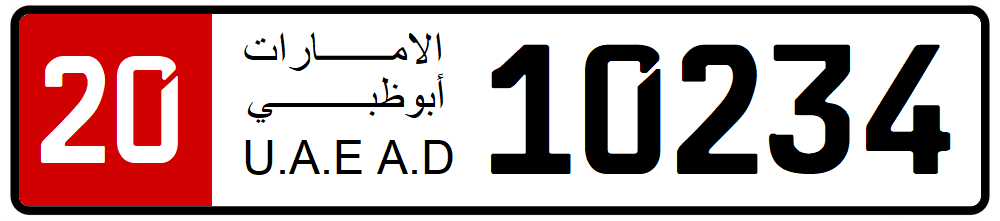

    <h2 class="section-title">{}</h2>
    <ul class="rule-list">
        <li>Domainnya adalah .ae</li>
        <li>Plat nomor umumnya putih, tetapi sisi kiri kadang berwarna merah.</li>
        <li>Di Dubai sering terlihat gedung pencakar langit.</li>
        <li>Atap Google Car bisa terlihat{}.</li>
    </ul>
    {}

{}
{}

{}
Rambu{} dan penomoran jalan{} memiliki desain khas. Di beberapa lokasi Anda bisa melihat atap putih Google Car.
{}

{}
Di pusat kota terlihat banyak gedung tinggi{}, termasuk yang masih dibangun.
{}

{}
Berbeda dengan {}, lanskap UAE memiliki relief dan jarang benar-benar datar{}. Di pinggiran timur dan selatan Anda bisa melihat pegunungan batu{}. Hati-hati agar tidak tertukar dengan {}.
{}

{}
Plat nomor umumnya putih, tetapi sisi kiri atau bagian atas bisa berwarna merah{}. Warna ini mirip dengan {}, jadi periksa ciri lain juga.
{}

<iframe src="https://www.google.com/maps/embed?pb=!4v1711015983636!6m8!1m7!1sXh1RT2SijY-57WiBfaJ4KA!2m2!1d24.96414827476389!2d55.78783248843728!3f232.20798469594868!4f-2.341906137991103!5f2.1918532655725986" width="85%" height="400" style="border:0;" allowfullscreen="" loading="lazy" referrerpolicy="no-referrer-when-downgrade"></iframe>

{}

{}

{}
Tiang rambu dan patok pinggir jalan sering bergaris-garis{}. Namun tiang pipa logam polos juga banyak.
{}

{}
{}

{}
Google Car mudah dikenali; atap putihnya kadang terlihat. Walau tidak terlihat, mobilnya biasanya berwarna putih.
{}

<iframe src="https://www.google.com/maps/embed?pb=!4v1684958803956!6m8!1m7!1sxSvV8BnLUB3MuV2kl9Rc8A!2m2!1d25.40734473322975!2d55.51560890219447!3f220.07052663744926!4f-49.21446602119926!5f0.4000000000000002" width="295" height="295" style="border:0;" allowfullscreen="" loading="lazy" referrerpolicy="no-referrer-when-downgrade"></iframe>

{}
{}

    <h2 class="section-title">{}</h2>
    <ul class="rule-list">
        <li>Di Pulau Sir Bani Yas, Google Car terlihat di hampir setiap lokasi.</li>
    </ul>

{}
{}

{}
Panoramanya unik{} dan Google Car terlihat di banyak titik{}.
{}

By <a href="//commons.wikimedia.org/w/index.php?title=User:Ismail.alghussein&amp;action=edit&amp;redlink=1" class="new" title="User:Ismail.alghussein (page does not exist)">Ismail.alghussein</a> - Own work, <a href="https://creativecommons.org/licenses/by-sa/3.0" title="Creative Commons Attribution-Share Alike 3.0">CC BY-SA 3.0</a>, <a href="https://commons.wikimedia.org/w/index.php?curid=6963767">Link</a>

{}
{}
