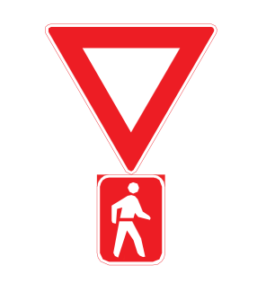
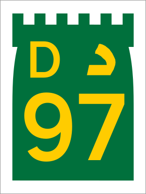
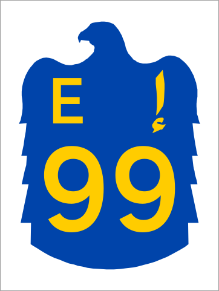
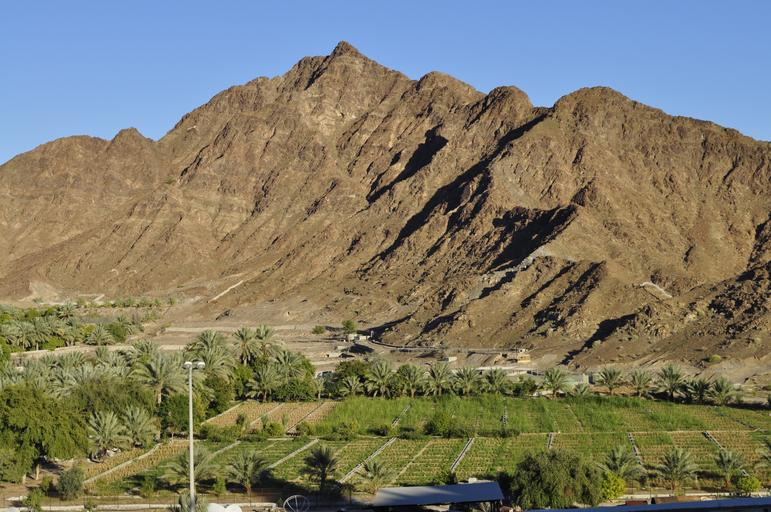

    <h2 class="section-title">{}</h2>
    <ul class="rule-list">
        <li>ドメインは.ae</li>
        <li>ナンバープレートは基本白でドバイのみ後ろの左側が赤色</li>
        <li>ドバイは高層ビルが見えることが多い</li>
    </ul>
    {}

{}
{}

{}
標識や道路番号の記号が独特{}。場所によってはGoogle Carの白い屋根が見えることもある。
{}

{}
都心部に高層ビルが見える{}。建設中のものも多く存在する。
{}

{}
カタールと異なり起伏がある{}。とくに東や南の郊外には岩山が見えることがある{}。
{}

{}
ナンバープレートは基本白でだが左側や上側が赤色のときもある{}。{}も似たような色に見えるので注意。
{}

<iframe src="https://www.google.com/maps/embed?pb=!4v1710993343876!6m8!1m7!1s2P0yxJL4uygBQt6ykHdwrA!2m2!1d25.61581428081098!2d56.26696430156868!3f188.51922458310423!4f-8.333431653141801!5f1.5077664039026089" width="85%" height="400" style="border:0;" allowfullscreen="" loading="lazy" referrerpolicy="no-referrer-when-downgrade"></iframe>

{}

{}

{}
{}

{}
Google Carが特徴的で白い屋根が見えることがある。屋根が見えないとしても基本的に白色の車。
{}

<iframe src="https://www.google.com/maps/embed?pb=!4v1684958803956!6m8!1m7!1sxSvV8BnLUB3MuV2kl9Rc8A!2m2!1d25.40734473322975!2d55.51560890219447!3f220.07052663744926!4f-49.21446602119926!5f0.4000000000000002" width="295" height="295" style="border:0;" allowfullscreen="" loading="lazy" referrerpolicy="no-referrer-when-downgrade"></iframe>

{}
{}