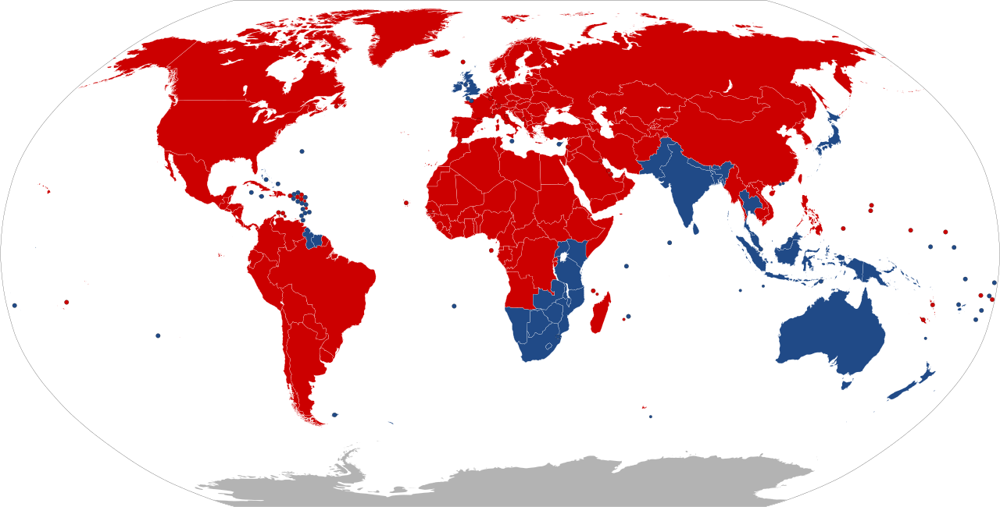

## 車が左側通行のエリア

青い領域は左側通行・赤い領域は右側通行（<a href="https://ja.wikipedia.org/wiki/%E5%B7%A6%E5%81%B4%E9%80%9A%E8%A1%8C%E3%81%AE%E5%9B%BD%E4%B8%80%E8%A6%A7#/media/%E3%83%95%E3%82%A1%E3%82%A4%E3%83%AB:Countries_driving_on_the_left_or_right.svg">パブリックドメインのものより引用</a>）。イギリスがインドやアジアに船で行くときに途中で寄りそうな国は左側通行かも？

## 入門講座

<iframe width="590" height="330" src="https://www.youtube.com/embed/HgPymmvsq8c" title="YouTube video player" frameborder="0" allow="accelerometer; autoplay; clipboard-write; encrypted-media; gyroscope; picture-in-picture; web-share" allowfullscreen></iframe>

<iframe src="https://player.twitch.tv/?video=1621039894&parent=geopinning.space" frameborder="0" allowfullscreen="true" scrolling="no" height="378" width="620"></iframe>

