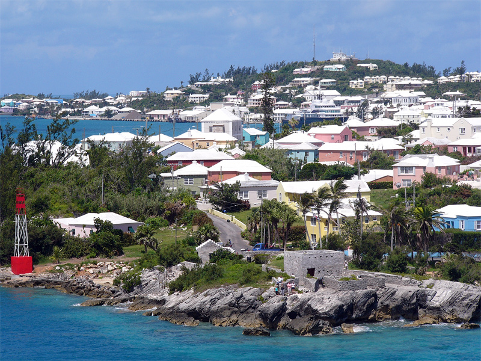
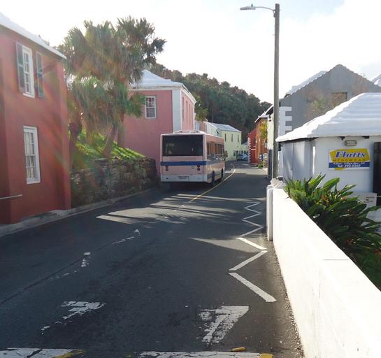
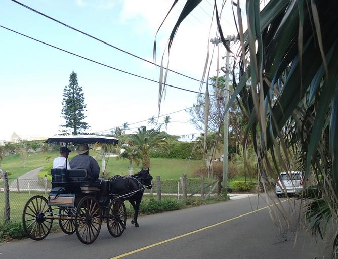

    <h2 class="section-title">{}</h2>
    <ul class="rule-list">
        <li>Domain nasional adalah .bm</li>
        <li>Merupakan wilayah luar negeri dari {}, dengan lalu lintas di sisi kiri</li>
        <li>Atap rumah umumnya berwarna putih</li>
        <li>Google Car memiliki karakteristik unik, dan lokasi yang menggunakan trekker sering memiliki blur dengan bentuk khusus</li>
    </ul>

{}
{}

{}
Semua rumah umumnya memiliki atap putih{}. Hal ini disebabkan oleh kebutuhan untuk mengumpulkan air hujan sebagai sumber air bersih di pulau kecil yang tidak memiliki sumber air tawar alami. Oleh karena itu, bahan atap seperti batu kapur dipilih untuk menghindari kotoran atau jamur{}.
{}

{}
Sebagai wilayah luar negeri dari {}, kendaraan di Bermuda melaju di sisi kiri jalan{}{{% ref "https://ja.wikipedia.org/wiki/%E3%83%90%E3%83%9F%E3%83%A5%E3%83%BC%E3%83%80%E8%AB%B8%E5%B3%B6" "Kepulauan Bermuda" %}}. Namun, plat nomor kendaraan tidak berwarna kuning.
{}

{}
Google Car memiliki ciri khas unik. Banyak foto diambil dari kapal{} atau oleh trekker pejalan kaki{}. Namun, rumah dengan atap khas di Bermuda sering cukup untuk mengidentifikasinya.
{}

<iframe src="https://www.google.com/maps/embed?pb=!4v1683467821168!6m8!1m7!1sc83mWC9O9BNuxBni8eYE4A!2m2!1d32.29257540872071!2d-64.78199819199413!3f257.974943079478!4f-32.12176255062474!5f0.7820865974627469" width="495" height="295" style="border:0;" allowfullscreen="" loading="lazy" referrerpolicy="no-referrer-when-downgrade"></iframe>

{}
