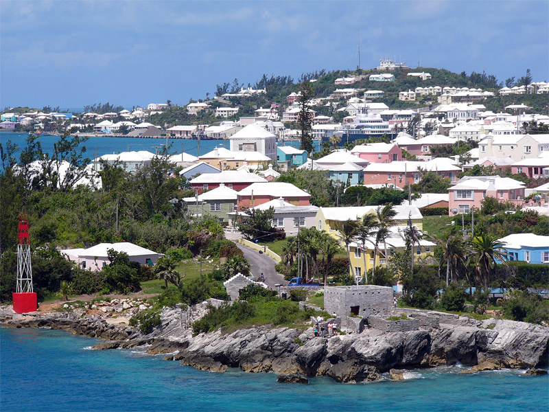

    <h2 class="section-title">{}</h2>
    <ul class="rule-list">
        <li>ドメインは.bm</li>
        <li>{}の海外領土であり車は左側通行</li>
        <li>家の屋根が白色ばかり</li>
        <li>Google Carが特徴的でトレッカーの場所には独特な形のぼかしがある</li>
    </ul>

{}
{}

{}
家の屋根が白色以外ほとんどないことが衛星写真からも分かる{}（{}）
{}

{}
{}の海外領土であり車は左側通行</li>{}{{% ref "https://ja.wikipedia.org/wiki/%E3%83%90%E3%83%9F%E3%83%A5%E3%83%BC%E3%83%80%E8%AB%B8%E5%B3%B6" "バミューダ諸島" %}}。ただしナンバープレートは黄色ではない。
{}

{}
Google Carが特徴的でトレッカーの場所には独特な形のぼかしがある。
{}

<iframe src="https://www.google.com/maps/embed?pb=!4v1683467821168!6m8!1m7!1sc83mWC9O9BNuxBni8eYE4A!2m2!1d32.29257540872071!2d-64.78199819199413!3f257.974943079478!4f-32.12176255062474!5f0.7820865974627469" width="295" height="295" style="border:0;" allowfullscreen="" loading="lazy" referrerpolicy="no-referrer-when-downgrade"></iframe>
<iframe src="https://www.google.com/maps/embed?pb=!4v1683468171159!6m8!1m7!1sTYhAeyghsleQUP9FRDxQGw!2m2!1d32.31266280799785!2d-64.72329466316407!3f241.9666120395585!4f-56.379786090675196!5f0.4000000000000002" width="295" height="295" style="border:0;" allowfullscreen="" loading="lazy" referrerpolicy="no-referrer-when-downgrade"></iframe>

{}