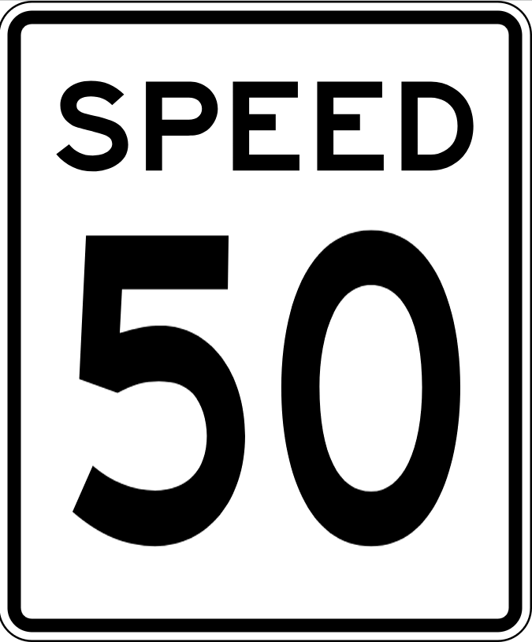
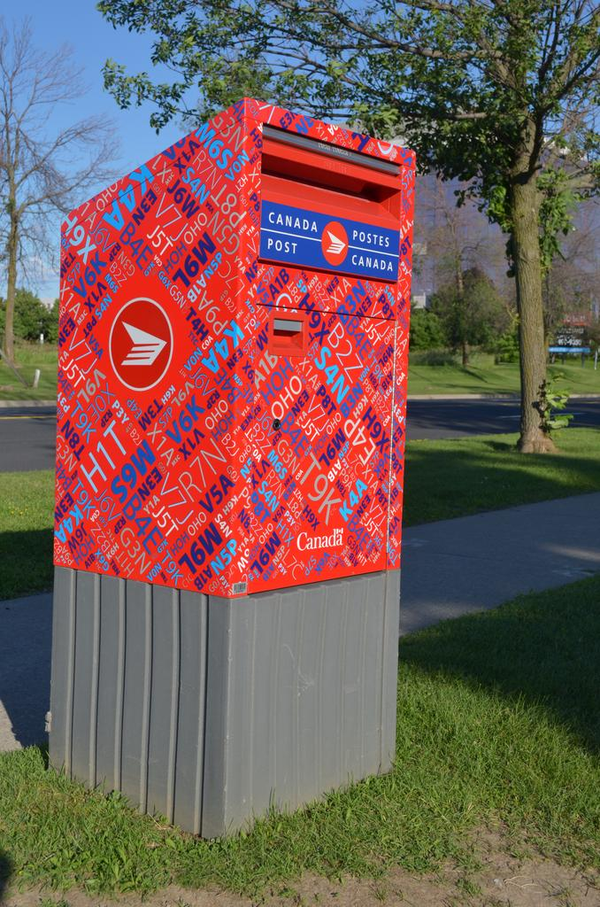
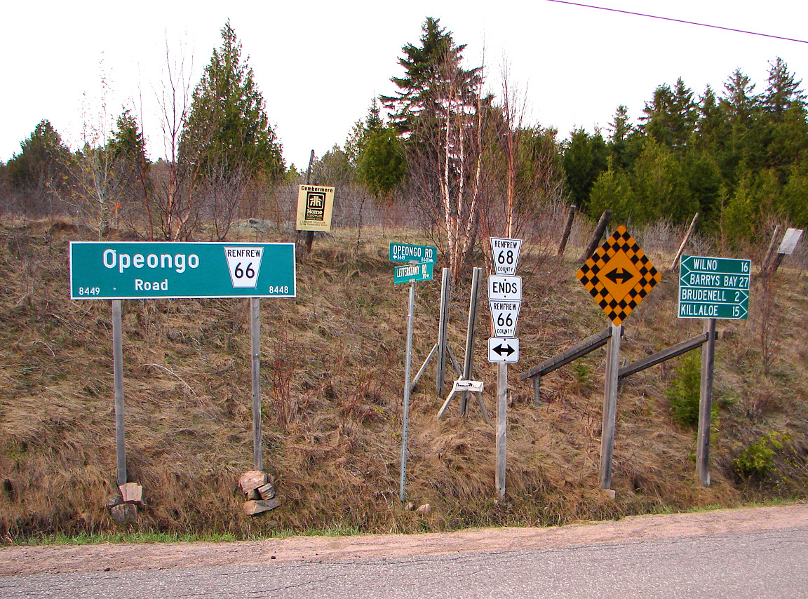
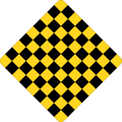
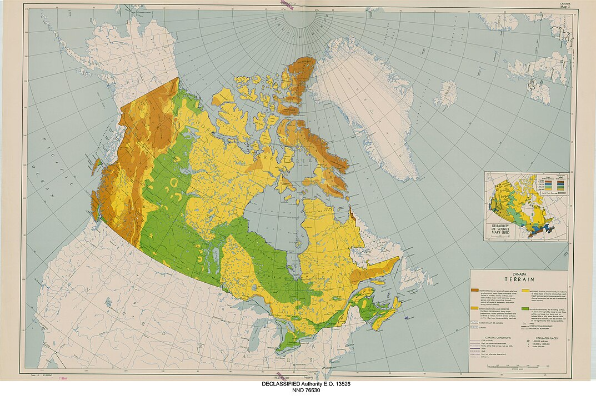
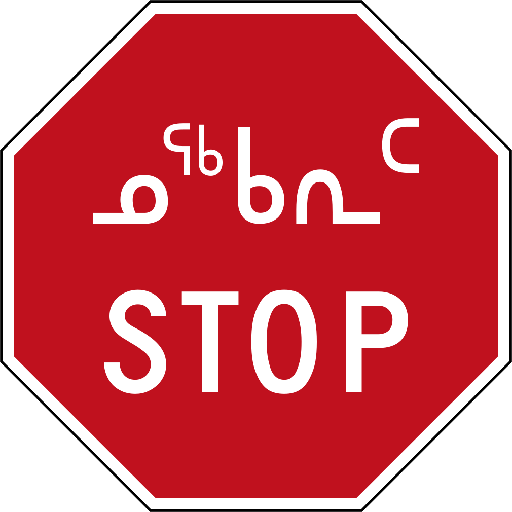
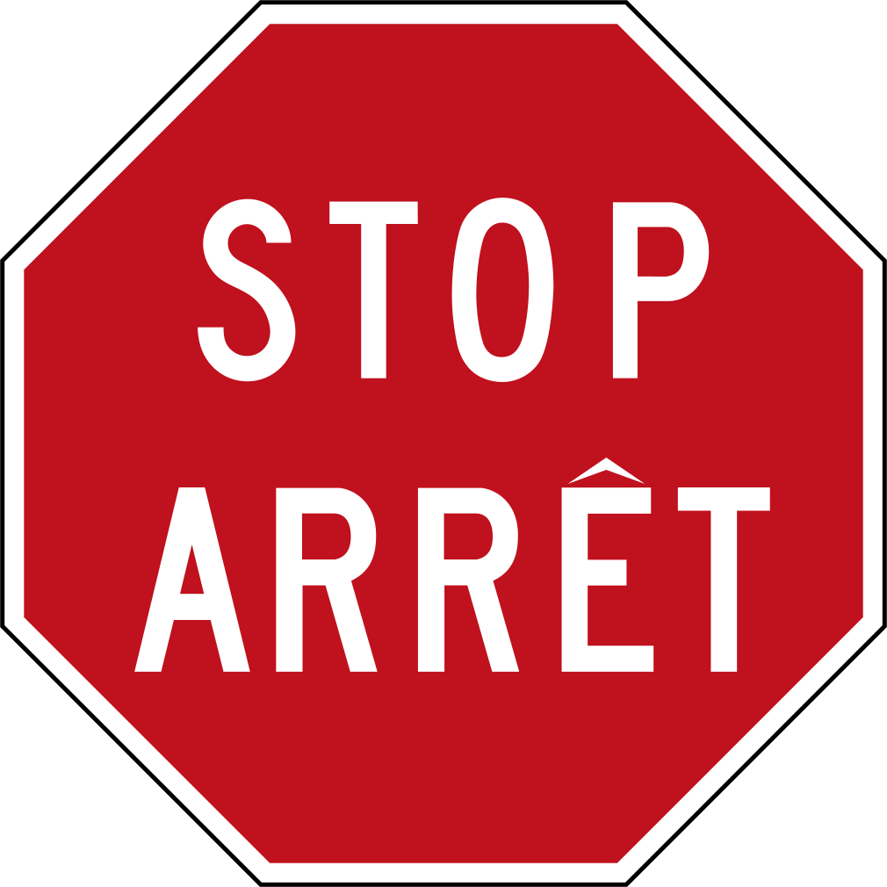

---

title: "Kanada"
date: 2023-02-26
lastmod: 2023-04-29
weight: 2
draft: false
keywords: [""]
sections: [""]
bg: "bg/city.jpg"
flag: "CA.svg"
jetro_detail: true
jogmec_detail: true
plonkit: true
is_has_distinctive_bollard: true
map_title: "peta latihan"
maps: [
    ["https://www.geoguessr.com/maps/61067f9608061c000157a851", "A Balanced Canada"],
    ]
sc_title: "Area yang mudah salah"
sc: [
    ["../usa/", "Amerika"],
    ["../../europe/finland/", "Finlandia"],
    ["../../europe/sweden/", "Swedia"],
    ]
---

    <h2 class="section-title">{}</h2>
    <ul class="rule-list">
        <li>Domainnya adalah .ca</li>
        <li>Notasi batas kecepatan MAKSIMUM</li>
        <li>Jika tanda dengan tanda ▽ terbalik bertuliskan YIELD Amerika, jika tidak tertulis Kanada menjadi</li>
    </ul>
    {}
    {}

{}

{}
{}Notasi batas kecepatan MAKSIMUM{}.Jika rambu tersebut bertuliskan km/jam dengan latar belakang putih columbia inggris, jika Anda punya bahasa Prancis Quebec, notasi km pada latar belakang hitam adalah Ontario Menjadi.{}gigi BATAS KECEPATAN.
{}

{}Di Kanada, tidak ada tulisan pada tanda YEILD atau ONEWAY.Kanada di sebelah kiri, Amerika di sebelah kanan.
{}

{}Ada banyak postingan seperti ini.Seharusnya tertulis CANADA POST di suatu tempat.
{}

{}Ada tanda yang bentuknya seperti papan catur{}.
{}

{}Bank yang ditulis sebagai TD berafiliasi dengan Toronto-Dominion Bank.RBC adalah singkatan dari Royal Bank of Canada.Mereka masing-masing merupakan ukuran aset terbesar ke-2 dan ke-1 di Jepang.
{}

<a data-flickr-embed="true" href="https://www.flickr.com/photos/57156785@N02/44243680621/in/photolist-2apEqPF-2k3u5Vp-2k5nE34-2iy4iAq-zfK741-2b4g1hd-8ofxdx-6pVbre-6pZkMh-2ozianU-2oc7xSn-zyqpEn-LopPat-2oG9Ts8-55vEAe-fDKLZx-LW1i9o-e4oo6a-rv5Mn1-2mWAKXU-2osbwHd-2oHCBFQ-5S6fjC-2i6uvpG-vypsm-GTJfmt-sv4XYe-2nUZ1mo-FonQSJ-6HHYJw-PykKLu-D2W89U-2nb4t6W-2nGHSa8-2o1pQuT-egNVbc-9BfMp3-FZTzNH-2okTm7A-2ntWgkb-2nwCtgd-DfXeo-hpY92-2nwpGeS-2mXGC7H-2nXgvAB-cMyfLJ-2iETZYD-2nFKhBN-2m7gnDm" title="TD Canada Trust Bank (Formerly Dominion Bank) .... 420 Bloor Street East .... Toronto, Ontario"></a>

{}
{}

{}Kanada adalah rumah bagi banyak perusahaan menengah yang mengelola jaringan pipa minyak dan gas alam.Namun, hampir tidak terlihat di Street View (karena letaknya jauh dari jalan raya).Perusahaan perwakilannya termasuk Devon, Pembina pipeline, dan Enbridge.Mungkin juga ada perusahaan yang memproduksi pasir minyak dan gas alam, seperti Sumber Daya Alam Kanada, jika Anda pergi jauh ke pegunungan.
{}

<iframe src="https://www.google.com/maps/embed?pb=!4v1680092473605!6m8!1m7!1shr6aBl_v5nMjleelgqog1Q!2m2!1d56.23560543688179!2d-120.8634784332044!3f203.7384501628231!4f-2.838224894247233!5f3.325193203789971" width="295" height="295" style="border:0;" allowfullscreen="" loading="lazy" referrerpolicy="no-referrer-when-downgrade"></iframe>
<iframe src="https://www.google.com/maps/embed?pb=!4v1681111205084!6m8!1m7!1s-UxEEFPNNm-mUb8tgXtuwQ!2m2!1d45.64246075442041!2d-73.55239018585368!3f244.4341122162465!4f6.070523922723069!5f3.325193203789971" width="295" height="295" style="border:0;" allowfullscreen="" loading="lazy" referrerpolicy="no-referrer-when-downgrade"></iframe>
<iframe src="https://www.google.com/maps/embed?pb=!4v1681111809405!6m8!1m7!1ss1cAilUaSjeVEgdmo6l1Rg!2m2!1d54.39683596741235!2d-113.5005681784792!3f282.61501806102723!4f-6.847783379797136!5f3.325193203789971" width="295" height="295" style="border:0;" allowfullscreen="" loading="lazy" referrerpolicy="no-referrer-when-downgrade"></iframe>
<iframe src="https://www.google.com/maps/embed?pb=!4v1681111872260!6m8!1m7!1shGawvDMwNEclk4vVyom39w!2m2!1d56.05702410940899!2d-118.3839628374677!3f35.51577976866718!4f-3.251675013380435!5f3.325193203789971" width="295" height="295" style="border:0;" allowfullscreen="" loading="lazy" referrerpolicy="no-referrer-when-downgrade"></iframe>

{}
{}

<iframe width="560" height="315" src="https://www.youtube.com/embed/M7pTe8AWvgg" title="YouTube video player" frameborder="0" allow="accelerometer; autoplay; clipboard-write; encrypted-media; gyroscope; picture-in-picture; web-share" allowfullscreen></iframe>

{}
{}

    <h2 class="section-title">{}</h2>
    <ul class="rule-list">
        <li>Beberapa negara bagian mewajibkan pelat nomor di depan dan belakang, sementara negara bagian lainnya tidak.
            <ul>
                <li>Plat nomornya berwarna hijau di kedua sisinya.Manitoba</li>
                <li>Plat nomor keseluruhan berwarna biru ontario ada kemungkinan</li>
                <li>Kiri bawah berwarna kemerahan Pulau Pangeran Edward{}</li>
                <li>{}baru ditambahkan dan terorganisir dengan baik, jadi lihat ini untuk sisanya.</li>
            </ul>
        </li>
        <li>Daerah pegunungan terbatas</li>
    </ul>

{}
{}

{}
Kawasan hijau memerlukan pelat nomor depan dan belakang
{}

<blockquote class="twitter-tweet">
Mari kita mengingat Kanada secara visual <a href="https://t.co/R4nUSLIR7D">pic.twitter.com/R4nUSLIR7D</a>
&mdash; Masuharu.(@Masuharu_fn) <a href="https://twitter.com/masuharu_fn/status/1910957803902279869?ref_src=twsrc%5Etfw">12 April 2025</a></blockquote> 

<blockquote class="reddit-embed-bq" style="height:500px" data-embed-height="723"><a href="https://www.reddit.com/r/geoguessr/comments/xzhxb4/oc_map_of_all_canadian_license_plate_and/">(OC) peta semua pelat nomor Kanada dan pelat belakang/depan wajib</a>  oleh<a href="https://www.reddit.com/user/ehe78/">kamu/ehe78</a> di dalam<a href="https://www.reddit.com/r/geoguessr/">geoguessr</a></blockquote>

{}
{}
{}
Daerah berwarna kuning kehijauan berbentuk datar, dan daerah berwarna coklat merupakan pegunungan terjal.Ternyata British Columbia hampir tidak memiliki wilayah datar di luar wilayah Vancouver.{}.Daerah kuning merupakan daerah yang tersebar luas pegunungan dan bukit-bukit yang tidak terlalu tinggi.{}.
{}

{}
{}

    <h4 class="section-title">hal-hal di jalan</h4>
    <ul class="rule-list">
        <li>Papan nama STOP sedikit berbeda tergantung wilayahnya.
            <ul>
                <li>Inuktitut (Bahasa Inuktitut) dapat ditemukan di Ilkluit, Nunavut.{}</li>
                <li>ARRET adalah Quebec</li>
                <li class="no-evidence">Jika STOP dan ARRET ditulis bersamaan,brunswick baru Dan Ontario</li>
            </ul>
        </li>
        <li>Rambu batas kecepatan sedikit berbeda tergantung wilayah.
            <ul>
                <li>Jika terdapat notasi km/jam dengan latar belakang putih columbia inggris</li>
                <li>Jika Anda berbicara bahasa Prancis Quebec</li>
                <li>Notasi km pada latar belakang hitam adalah Ontario</li>
            </ul>
        </li>
        <li>Ada sesuatu seperti tutup biru pada lampunya.Nova Scotia banyak di{}</li>
        <li>kerucut hitam dan oranye Ontario・Kerucut putih dan oranye Quebec{}</li>
        <li>Apabila tiang-tiang telepon yang dibagi 2:1 diulangi secara bergantian,saskatchewan banyak di{}</li>
    </ul>

{}
{}
{}
{}

{}
{}

{}
Jalan yang menghubungkan Ontario dan Manitoba Ontario Pada tanda samping, bagian `km/jam` berlatar belakang hitam.Terkadang juga ditulis dalam warna oranye dan hitam.
{}

<iframe src="https://www.google.com/maps/embed?pb=!4v1680092550361!6m8!1m7!1sQbi9zOhBSaKoAR4ljsZv_w!2m2!1d49.73933749078834!2d-95.15201809047014!3f145.05850004916792!4f0.1372081059932384!5f3.325193203789971" width="295" height="295" style="border:0;" allowfullscreen="" loading="lazy" referrerpolicy="no-referrer-when-downgrade"></iframe>

{}
Jalan yang menghubungkan Ontario dan Manitoba Manitoba Tanda kecepatan di samping tidak memiliki latar belakang hitam.
{}

<iframe src="https://www.google.com/maps/embed?pb=!4v1680091669251!6m8!1m7!1s4SuXJP7m_ct16ebj318vxQ!2m2!1d49.73906045156971!2d-95.15518707897421!3f298.17287454440634!4f-3.983277349376138!5f3.325193203789971" width="295" height="295" style="border:0;" allowfullscreen="" loading="lazy" referrerpolicy="no-referrer-when-downgrade"></iframe>

{}
{}

<iframe src="https://www.google.com/maps/embed?pb=!4v1688194481220!6m8!1m7!1sE2tMoBGmDU8h-hPklPQtVw!2m2!1d45.04539402267391!2d-63.58207986510813!3f347.98628370681354!4f17.581990047851534!5f3.325193203789971" width="295" height="295" style="border:0;" allowfullscreen="" loading="lazy" referrerpolicy="no-referrer-when-downgrade"></iframe>
<iframe src="https://www.google.com/maps/embed?pb=!4v1688194489780!6m8!1m7!1sk35dR-h_P81v9eFn0IWTOQ!2m2!1d45.28727647879248!2d-66.04170670988759!3f70.67517204626664!4f15.700334599913589!5f3.325193203789971" width="295" height="295" style="border:0;" allowfullscreen="" loading="lazy" referrerpolicy="no-referrer-when-downgrade"></iframe>

{}
{}
{}
Kerucut hitam dan oranye di sebelah kiri adalah Ontario・Kerucut putih dan oranye di sebelah kanan Quebec hal dari
{}

<iframe src="https://www.google.com/maps/embed?pb=!4v1682432065632!6m8!1m7!1s_tnrWo6hZCZxIDQ8K4Mf0A!2m2!1d49.02144291015642!2d-88.2895963216308!3f268.6020266512863!4f-3.2304603493074353!5f3.2229282956142877" width="295" height="295" style="border:0;" allowfullscreen="" loading="lazy" referrerpolicy="no-referrer-when-downgrade"></iframe>
<iframe src="https://www.google.com/maps/embed?pb=!4v1682432492247!6m8!1m7!1sLO_H97dvPqc3aO3fixvorg!2m2!1d45.49181109498912!2d-73.58142739183401!3f134.36495306086366!4f-5.588569419165907!5f3.325193203789971" width="295" height="295" style="border:0;" allowfullscreen="" loading="lazy" referrerpolicy="no-referrer-when-downgrade"></iframe>

{}
{}
{}
Apabila tiang-tiang telepon yang dibagi 2:1 diulangi secara bergantian,saskatchewan banyak di{}.2:1→1:2→2:1→...
{}

<iframe src="https://www.google.com/maps/embed?pb=!4v1683088341064!6m8!1m7!1sHSAkHzAcEW14USPlrlJKRA!2m2!1d52.36115476111625!2d-107.0386419099979!3f255.28033037458422!4f0.9650869034524447!5f3.325193203789971" width="590" height="290" style="border:0;" allowfullscreen="" loading="lazy" referrerpolicy="no-referrer-when-downgrade"></iframe>

{}
{}

    <h4 class="section-title">tonggak penambat kapal</h4>
    <ul class="rule-list">
        <li>Tonggak itu tipis dan memiliki reflektor merah di atasnya.Quebec</li>
        <li>Ada piring dengan ◆Ontario{}</li>
    </ul>

{}
{}
{}
Tonggak dengan reflektor tipis berwarna merah tua Quebec negara{}.{}Ada tonggak serupa di dalamnya{}Perhatikan saja poin-poinnya.
{}

{}
{}
{}
Umum di Ontario.Ada pula yang tidak berwarna.
{}

<iframe src="https://www.google.com/maps/embed?pb=!4v1688194680751!6m8!1m7!1s67cxOWY5jKmWodnleg05sA!2m2!1d49.04608186779922!2d-90.6204380212422!3f117.51831448775125!4f-5.780874631208945!5f3.325193203789971" width="295" height="295" style="border:0;" allowfullscreen="" loading="lazy" referrerpolicy="no-referrer-when-downgrade"></iframe>

{}
{}

    <h4 class="section-title">distribusi pertanian</h4>
    <ul class="rule-list">
        <li>Ladang gandum datar tersebar di Saskatchewan dan Alberta.</li>
        <li>Jagung berlimpah di sekitar Toronto.{}</li>
    </ul>

{}
{}

{}
{}

{}
Kedelai dan jagung melimpah di sekitar Toronto.{}.
{}

<iframe src="https://www.google.com/maps/embed?pb=!4v1682764595902!6m8!1m7!1s-wUG-AnpToNq4Vh74i5-2Q!2m2!1d43.95818152610437!2d-81.57718105212717!3f28.86601260554493!4f-9.820514044298804!5f0.7820865974627469" width="295" height="295" style="border:0;" allowfullscreen="" loading="lazy" referrerpolicy="no-referrer-when-downgrade"></iframe>
<iframe src="https://www.google.com/maps/embed?pb=!4v1682764683187!6m8!1m7!1s8rDXmLHQC7aYjWgsXBpwzQ!2m2!1d45.71301262218953!2d-72.66900302579654!3f264.0231635834412!4f-8.3041599233093!5f3.0765622637983046" width="295" height="295" style="border:0;" allowfullscreen="" loading="lazy" referrerpolicy="no-referrer-when-downgrade"></iframe>

{}
{}

    <h4 class="mb-4">Deskripsi perusahaan perwakilan</h4>
    <table class="table table-striped table-bordered">
        <thead class="table-light">
            <tr>
                <th scope="col" class="col-width-2">Nama perusahaan</th>
                <th scope="col" class="col-width-1">kode</th>
                <th scope="col" class="col-width-7">penjelasan</th>
                <th scope="col" class="col-width-05">penyelesaian rekening</th>
                <th scope="col" class="col-width-05">Sejarah dividen</th>
            </tr>
        </thead>
        <tbody class="corp-desc">
            <tr>
                <td>Pipa Pembina</td>
                <td>{}</td>
                <td>Sebuah perusahaan minyak dan gas alam midstream besar.</td>
                <td>{}</td>
                <td>{}</td>
            </tr>
            <tr>
                <td>Kereta Api Nasional Kanada</td>
                <td>{}</td>
                <td>CNR adalah perusahaan kereta api terbesar di Kanada, dan satu-satunya jalur kereta api di Kanada yang melintasi benua ini adalah CNR.</td>
                <td>{}</td>
                <td>{}</td>
            </tr>
            <tr>
                <td>Sumber Daya Teck</td>
                <td>{}</td>
                <td>Bergerak di bidang logam dan pertambangan.Perusahaan ini terutama menangani batu bara, seng, dan tembaga untuk pembuatan baja (lebih dari 90% pendapatannya), dan juga menangani produk sekunder seperti timah, emas, dan molibdenum.</td>
                <td>{}</td>
                <td>{}</td>
            </tr>
            <tr>
                <td>Nutrisi</td>
                <td>{}</td>
                <td>Produsen pupuk terbesar kedua di dunia. No.1 dalam produksi pupuk kalium, dan No. 2 di dunia dalam produksi pupuk nitrogen.</td>
                <td>{}</td>
                <td>{}</td>
            </tr>
            <tr>
                <td>Cameco</td>
                <td>{}</td>
                <td>Ini adalah perusahaan pertambangan uranium terdaftar terbesar di dunia (diyakini).Kanada merupakan produsen uranium terbesar kedua setelah Kazakhstan.{}.</td>
                <td>{}</td>
                <td>{}</td>
            </tr>
        </tbody>
    </table>

