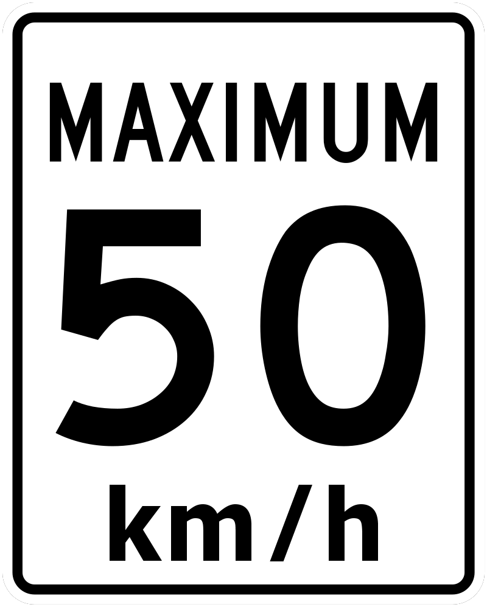
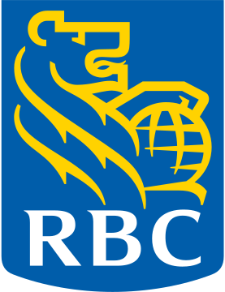
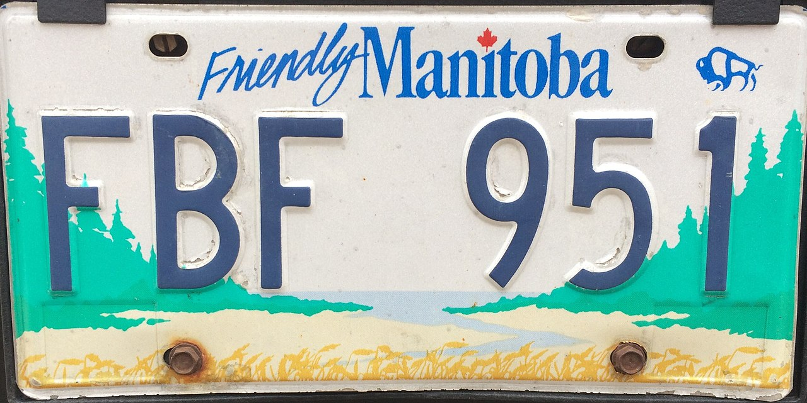
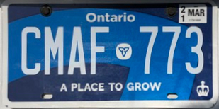
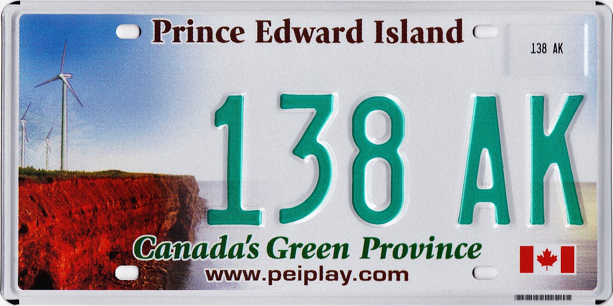
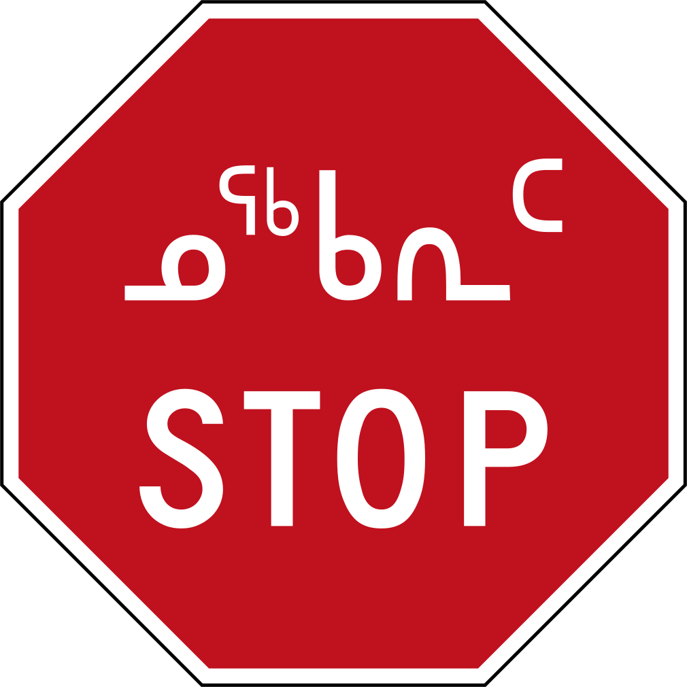
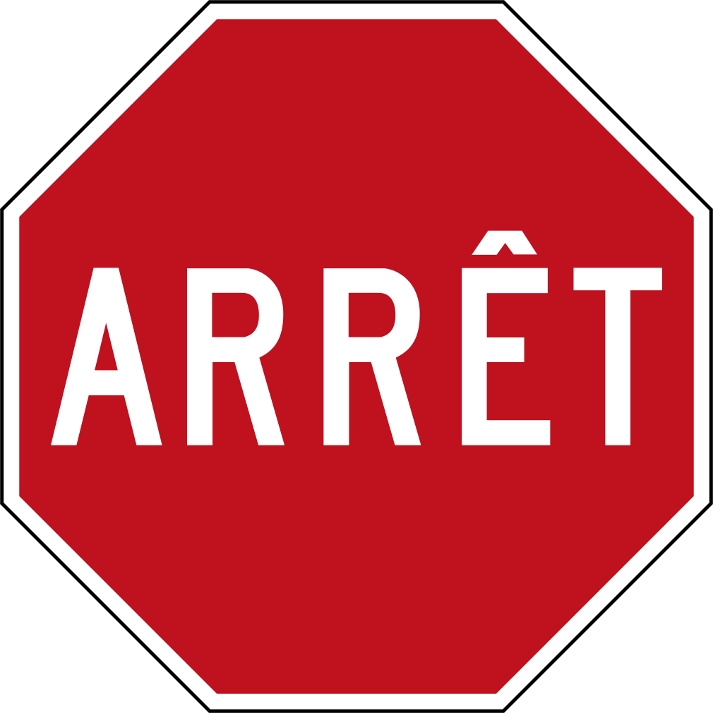
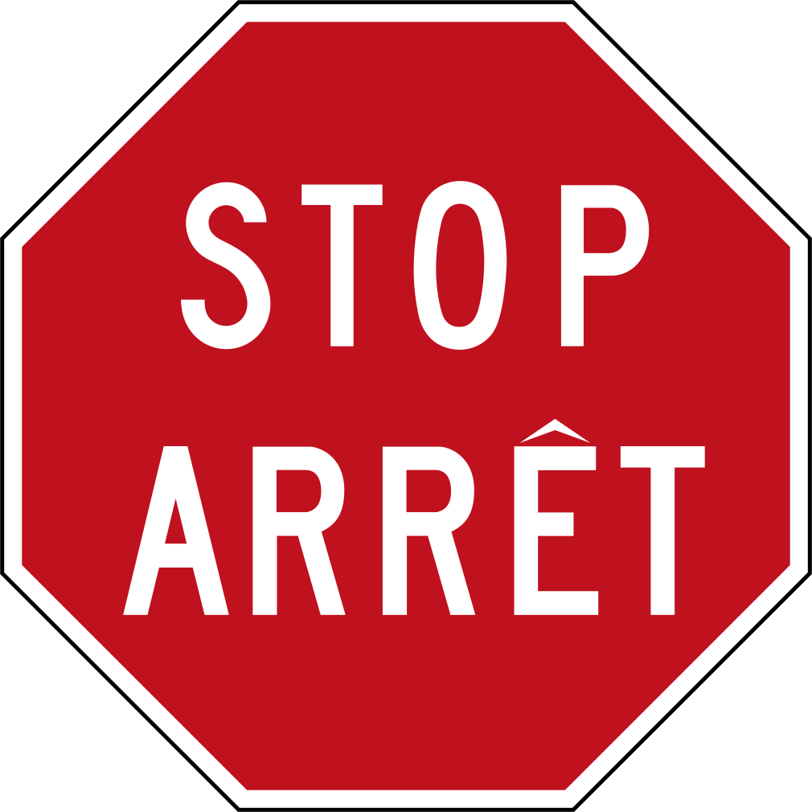
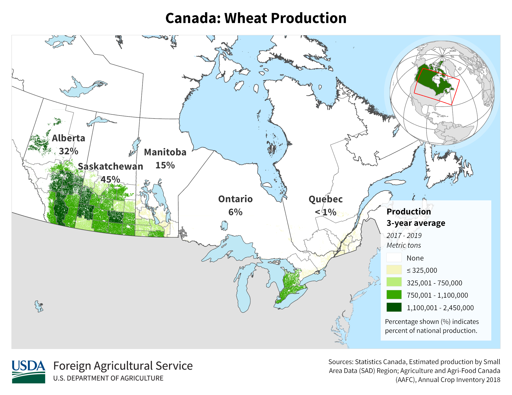
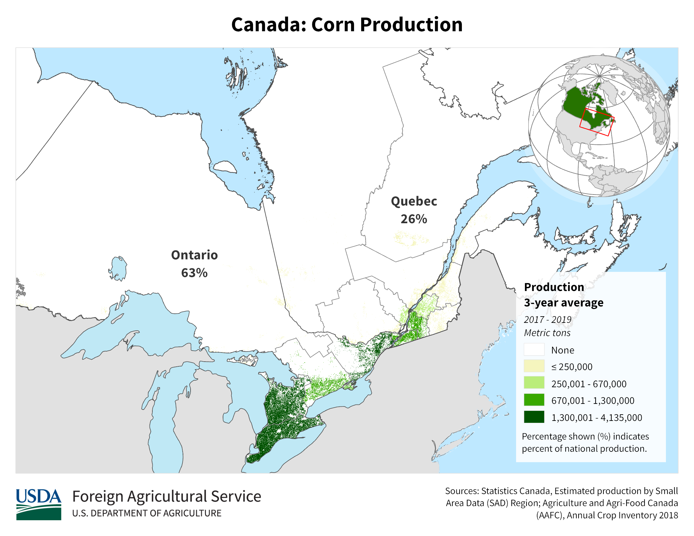

    <h2 class="section-title">{}</h2>
    <ul class="rule-list">
        <li>ドメインは.ca</li>
        <li>速度制限の表記はMAXIMUM</li>
        <li>逆▽の看板標識にYIELDと書いてあればアメリカ、書いてないならばカナダになる</li>
    </ul>
    {}

{}

{}
{}速度制限の表記はMAXIMUM。その標識に白背景のkm/h表記があればブリティッシュコロンビア、フランス語があればケベック、黒い背景のkm表記はオンタリオになる。{}はSPEED LIMIT。
{}

{}カナダはYEILDやONEWAYの看板に文字が無い。左がカナダ・右がアメリカ。
{}

{}こういう感じのポストが多い。右上にCANADA POSTと書いてある。
{}

{}TDと書かれた銀行はトロント・ドミニオン銀行の系列。RBCはRoyal Bank of Canadaの略。それぞれ国内２位と１位の資産規模。
{}

<a data-flickr-embed="true" href="https://www.flickr.com/photos/57156785@N02/44243680621/in/photolist-2apEqPF-2k3u5Vp-2k5nE34-2iy4iAq-zfK741-2b4g1hd-8ofxdx-6pVbre-6pZkMh-2ozianU-2oc7xSn-zyqpEn-LopPat-2oG9Ts8-55vEAe-fDKLZx-LW1i9o-e4oo6a-rv5Mn1-2mWAKXU-2osbwHd-2oHCBFQ-5S6fjC-2i6uvpG-vypsm-GTJfmt-sv4XYe-2nUZ1mo-FonQSJ-6HHYJw-PykKLu-D2W89U-2nb4t6W-2nGHSa8-2o1pQuT-egNVbc-9BfMp3-FZTzNH-2okTm7A-2ntWgkb-2nwCtgd-DfXeo-hpY92-2nwpGeS-2mXGC7H-2nXgvAB-cMyfLJ-2iETZYD-2nFKhBN-2m7gnDm" title="TD Canada Trust Bank (Formerly Dominion Bank) .... 420 Bloor Street East .... Toronto, Ontario"></a>

{}
{}

{}カナダには石油や天然ガスのパイプラインを管理するミッドストリーム企業がたくさんある。ただしストリートビューにはほとんどいない（通りから離れた場所にあるため）。代表的な企業はたとえばDevon・Pembina pipeline・Enbridgeなど。Canadian Natural Resourcesのようなオイルサンド・天然ガスを生産する企業も山奥に行くとあるかも。
{}

<iframe src="https://www.google.com/maps/embed?pb=!4v1680092473605!6m8!1m7!1shr6aBl_v5nMjleelgqog1Q!2m2!1d56.23560543688179!2d-120.8634784332044!3f203.7384501628231!4f-2.838224894247233!5f3.325193203789971" width="295" height="295" style="border:0;" allowfullscreen="" loading="lazy" referrerpolicy="no-referrer-when-downgrade"></iframe>
<iframe src="https://www.google.com/maps/embed?pb=!4v1681111205084!6m8!1m7!1s-UxEEFPNNm-mUb8tgXtuwQ!2m2!1d45.64246075442041!2d-73.55239018585368!3f244.4341122162465!4f6.070523922723069!5f3.325193203789971" width="295" height="295" style="border:0;" allowfullscreen="" loading="lazy" referrerpolicy="no-referrer-when-downgrade"></iframe>
<iframe src="https://www.google.com/maps/embed?pb=!4v1681111809405!6m8!1m7!1ss1cAilUaSjeVEgdmo6l1Rg!2m2!1d54.39683596741235!2d-113.5005681784792!3f282.61501806102723!4f-6.847783379797136!5f3.325193203789971" width="295" height="295" style="border:0;" allowfullscreen="" loading="lazy" referrerpolicy="no-referrer-when-downgrade"></iframe>
<iframe src="https://www.google.com/maps/embed?pb=!4v1681111872260!6m8!1m7!1shGawvDMwNEclk4vVyom39w!2m2!1d56.05702410940899!2d-118.3839628374677!3f35.51577976866718!4f-3.251675013380435!5f3.325193203789971" width="295" height="295" style="border:0;" allowfullscreen="" loading="lazy" referrerpolicy="no-referrer-when-downgrade"></iframe>

{}
{}

    <h2 class="section-title">{}</h2>
    <ul class="rule-list">
        <li>ナンバープレートを前後に付ける州とつけない州がある
            <ul>
                <li>ナンバープレートが両サイド緑なのはマニトバ州</li>
                <li>全体的に青いナンバープレートはオンタリオ州の可能性がある</li>
                <li>左下が赤っぽいのはPrince Edward Island州{}</li>
            </ul>
        </li>
    </ul>

{}
{}

{}
緑色の領域はナンバープレートが前後に必要
{}

<blockquote class="reddit-embed-bq" style="height:500px" data-embed-height="500">      <a href="https://www.reddit.com/r/MapPorn/comments/3txlm0/canadian_provincial_territorial_licence_plate/">Canadian Provincial &amp; Territorial Licence Plate Requirements [1000x858] [OC]</a>  by      <a href="https://www.reddit.com/user/bryan89wr">u/bryan89wr</a> in      <a href="https://www.reddit.com/r/MapPorn/">MapPorn</a>    </blockquote>

{}
{}
{}
マニトバ州はかなり視認しやすく、両サイドが緑で真ん中が白に見える。前後両方にナンバープレートがある。
{}

<iframe src="https://www.google.com/maps/embed?pb=!4v1682211476130!6m8!1m7!1sU8QXnhgFgVzFlQhJjTgJ6g!2m2!1d49.84376723274784!2d-99.94971508209314!3f114.48268402600476!4f-9.244021473449664!5f3.325193203789971" width="295" height="295" style="border:0;" allowfullscreen="" loading="lazy" referrerpolicy="no-referrer-when-downgrade"></iframe>
<iframe src="https://www.google.com/maps/embed?pb=!4v1682211492857!6m8!1m7!1syDWWT4LimNjLzZBqajDsJQ!2m2!1d49.84376664981337!2d-99.94919460431701!3f109.85711351572195!4f-8.023985168899003!5f3.325193203789971" width="295" height="295" style="border:0;" allowfullscreen="" loading="lazy" referrerpolicy="no-referrer-when-downgrade"></iframe>

{}

By <a href="//commons.wikimedia.org/w/index.php?title=User:Midnightcat1&amp;amp;action=edit&amp;amp;redlink=1" class="new" title="User:Midnightcat1 (page does not exist)">Midnightcat1</a> - Own work, <a href="https://creativecommons.org/licenses/by-sa/4.0" title="Creative Commons Attribution-Share Alike 4.0">CC BY-SA 4.0</a>, <a href="https://commons.wikimedia.org/w/index.php?curid=118040953">Link</a>
{}

{}
{}

{}
オンタリオのナンバープレートは複数種類あるもののどれも少し青っぽく見える。Nova Scotiaのものも青っぽく見えるので注意。
{}

<iframe src="https://www.google.com/maps/embed?pb=!4v1682211660961!6m8!1m7!1slplskCHX2xOloVckahncAQ!2m2!1d48.38417111480668!2d-89.2511924178898!3f223.93221130024594!4f-23.099235887454768!5f3.325193203789971" width="295" height="295" style="border:0;" allowfullscreen="" loading="lazy" referrerpolicy="no-referrer-when-downgrade"></iframe>
<iframe src="https://www.google.com/maps/embed?pb=!4v1682211745921!6m8!1m7!1sJaLfm5FwbzWdGMC4pBLG9w!2m2!1d48.38725651386531!2d-89.25514287694057!3f134.58260895913617!4f-12.26239858658549!5f3.325193203789971" width="295" height="295" style="border:0;" allowfullscreen="" loading="lazy" referrerpolicy="no-referrer-when-downgrade"></iframe>

{}

By <a href="//commons.wikimedia.org/wiki/User:Vaselineeeeeeee" title="User:Vaselineeeeeeee">Vaselineeeeeeee</a> - Image taken in a parking lot in Coboconk, <a href="https://creativecommons.org/licenses/by-sa/4.0" title="Creative Commons Attribution-Share Alike 4.0">CC BY-SA 4.0</a>, <a href="https://commons.wikimedia.org/w/index.php?curid=87142994">Link</a>
{}

{}
{}

<iframe src="https://www.google.com/maps/embed?pb=!4v1688211502472!6m8!1m7!1sXIfg_z3j-0O6mtvVLWtOIg!2m2!1d46.43787475338756!2d-63.63769148853987!3f99.97510847573899!4f-5.725019218377454!5f3.325193203789971" width="295" height="295" style="border:0;" allowfullscreen="" loading="lazy" referrerpolicy="no-referrer-when-downgrade"></iframe>

{}

By <a href=&quot;//commons.wikimedia.org/wiki/User:Awmcphee&quot; title=&quot;User:Awmcphee&quot;>Awmcphee</a> - Own work, <a href="http://creativecommons.org/publicdomain/zero/1.0/deed.en" title="Creative Commons Zero, Public Domain Dedication">CC0</a>, <a href="https://commons.wikimedia.org/w/index.php?curid=48413066">Link</a>
{}

{}
{}

    <h4 class="section-title">道路にあるもの</h4>
    <ul class="rule-list">
        <li>STOPの看板が地域ごとに微妙に異なる
            <ul>
                <li>Inuktitut（イヌクティトット語）が見られるのはヌナブト準州のイルカルイト（例<a href="https://goo.gl/maps/gmn7Rgg4ojx2TBCg6">①</a>）</li>
                <li>ARRETはケベック</li>
                <li class="no-evidence">STOPとARRET併記はニューブランズウィックとオンタリオ</li>
            </ul>
        </li>
        <li>速度制限の看板が地域ごとに微妙に異なる
            <ul>
                <li>白背景のkm/h表記があればブリティッシュコロンビア</li>
                <li>フランス語があればケベック</li>
                <li>黒い背景のkm表記はオンタリオ</li>
            </ul>
        </li>
        <li>ランプに青いキャップみたいなものが付いているのはノバスコシアに多い</li>
        <li>左の黒とオレンジのコーンはオンタリオ・右の白とオレンジのコーンはケベックのもの{}</li>
    </ul>

{}
{}
{}
{}

{}
{}

{}
オンタリオ州とマニトバ州をつなぐ道路のオンタリオ側の標識は `km/h` の部分が黒背景になっている。またオレンジと黒のカラーで書かれるときもある。
{}

<iframe src="https://www.google.com/maps/embed?pb=!4v1680092550361!6m8!1m7!1sQbi9zOhBSaKoAR4ljsZv_w!2m2!1d49.73933749078834!2d-95.15201809047014!3f145.05850004916792!4f0.1372081059932384!5f3.325193203789971" width="295" height="295" style="border:0;" allowfullscreen="" loading="lazy" referrerpolicy="no-referrer-when-downgrade"></iframe>

{}
オンタリオ州とマニトバ州をつなぐ道路のマニトバ州側の速度表記の看板には黒背景が無い。
{}

<iframe src="https://www.google.com/maps/embed?pb=!4v1680091669251!6m8!1m7!1s4SuXJP7m_ct16ebj318vxQ!2m2!1d49.73906045156971!2d-95.15518707897421!3f298.17287454440634!4f-3.983277349376138!5f3.325193203789971" width="295" height="295" style="border:0;" allowfullscreen="" loading="lazy" referrerpolicy="no-referrer-when-downgrade"></iframe>

{}
{}

<iframe src="https://www.google.com/maps/embed?pb=!4v1688194481220!6m8!1m7!1sE2tMoBGmDU8h-hPklPQtVw!2m2!1d45.04539402267391!2d-63.58207986510813!3f347.98628370681354!4f17.581990047851534!5f3.325193203789971" width="295" height="295" style="border:0;" allowfullscreen="" loading="lazy" referrerpolicy="no-referrer-when-downgrade"></iframe>
<iframe src="https://www.google.com/maps/embed?pb=!4v1688194489780!6m8!1m7!1sk35dR-h_P81v9eFn0IWTOQ!2m2!1d45.28727647879248!2d-66.04170670988759!3f70.67517204626664!4f15.700334599913589!5f3.325193203789971" width="295" height="295" style="border:0;" allowfullscreen="" loading="lazy" referrerpolicy="no-referrer-when-downgrade"></iframe>

{}
{}
{}
左の黒とオレンジのコーンはオンタリオ・右の白とオレンジのコーンはケベックのもの
{}

<iframe src="https://www.google.com/maps/embed?pb=!4v1682432065632!6m8!1m7!1s_tnrWo6hZCZxIDQ8K4Mf0A!2m2!1d49.02144291015642!2d-88.2895963216308!3f268.6020266512863!4f-3.2304603493074353!5f3.2229282956142877" width="295" height="295" style="border:0;" allowfullscreen="" loading="lazy" referrerpolicy="no-referrer-when-downgrade"></iframe>
<iframe src="https://www.google.com/maps/embed?pb=!4v1682432492247!6m8!1m7!1sLO_H97dvPqc3aO3fixvorg!2m2!1d45.49181109498912!2d-73.58142739183401!3f134.36495306086366!4f-5.588569419165907!5f3.325193203789971" width="295" height="295" style="border:0;" allowfullscreen="" loading="lazy" referrerpolicy="no-referrer-when-downgrade"></iframe>

{}
{}

    <h4 class="section-title">電柱</h4>
    <ul class="rule-list">
        <li>２：１に分かれた電柱が交互に繰り返されている時はサスカチュワンに多い{}</li>
    </ul>

{}
{}
{}
２：１に分かれた電柱が交互に繰り返されている時はサスカチュワンに多い{}。２：１→１：２→２：１→...となっている。
{}

<iframe src="https://www.google.com/maps/embed?pb=!4v1683088341064!6m8!1m7!1sHSAkHzAcEW14USPlrlJKRA!2m2!1d52.36115476111625!2d-107.0386419099979!3f255.28033037458422!4f0.9650869034524447!5f3.325193203789971" width="590" height="290" style="border:0;" allowfullscreen="" loading="lazy" referrerpolicy="no-referrer-when-downgrade"></iframe>

{}
{}

    <h4 class="section-title">ボラード</h4>
    <ul class="rule-list">
        <li>細くて上に赤い反射板があるボラードはケベック</li>
        <li>◆のプレートがあるのはオンタリオ{}</li>
    </ul>

{}
{}
{}
細い、濃い赤色の反射板があるボラードはケベック州。
{}

<iframe src="https://www.google.com/maps/embed?pb=!4v1682431749080!6m8!1m7!1sgSw1a0pgeHS34wFuoDqaPQ!2m2!1d47.23894588616943!2d-71.22878166509145!3f312.502497038676!4f-11.773281361269824!5f3.325193203789971" width="295" height="295" style="border:0;" allowfullscreen="" loading="lazy" referrerpolicy="no-referrer-when-downgrade"></iframe>
<iframe src="https://www.google.com/maps/embed?pb=!4v1682765326307!6m8!1m7!1s7gnwFVatHfMuJ1jFG2mgMw!2m2!1d48.39571830923472!2d-71.25217563290403!3f230.9901753934939!4f-6.749220089069581!5f3.325193203789971" width="295" height="295" style="border:0;" allowfullscreen="" loading="lazy" referrerpolicy="no-referrer-when-downgrade"></iframe>

{}
{}
{}
オンタリオ州に多い。色が付いていないものもある。
{}

<iframe src="https://www.google.com/maps/embed?pb=!4v1688194680751!6m8!1m7!1s67cxOWY5jKmWodnleg05sA!2m2!1d49.04608186779922!2d-90.6204380212422!3f117.51831448775125!4f-5.780874631208945!5f3.325193203789971" width="295" height="295" style="border:0;" allowfullscreen="" loading="lazy" referrerpolicy="no-referrer-when-downgrade"></iframe>

{}
{}

    <h4 class="section-title">農業の分布</h4>
    <ul class="rule-list">
        <li>トウモロコシはトロント周辺に多い</li>
        <li>データ提供元：<a href="https://www.usda.gov/policies-and-links">U.S. Department of Agriculture(USDA)</a></li>
    </ul>

{}
{}

{}
{}

{}
大豆とトウモロコシはトロント周辺に多い{}。
{}

<iframe src="https://www.google.com/maps/embed?pb=!4v1682764595902!6m8!1m7!1s-wUG-AnpToNq4Vh74i5-2Q!2m2!1d43.95818152610437!2d-81.57718105212717!3f28.86601260554493!4f-9.820514044298804!5f0.7820865974627469" width="295" height="295" style="border:0;" allowfullscreen="" loading="lazy" referrerpolicy="no-referrer-when-downgrade"></iframe>
<iframe src="https://www.google.com/maps/embed?pb=!4v1682764683187!6m8!1m7!1s8rDXmLHQC7aYjWgsXBpwzQ!2m2!1d45.71301262218953!2d-72.66900302579654!3f264.0231635834412!4f-8.3041599233093!5f3.0765622637983046" width="295" height="295" style="border:0;" allowfullscreen="" loading="lazy" referrerpolicy="no-referrer-when-downgrade"></iframe>

{}
{}