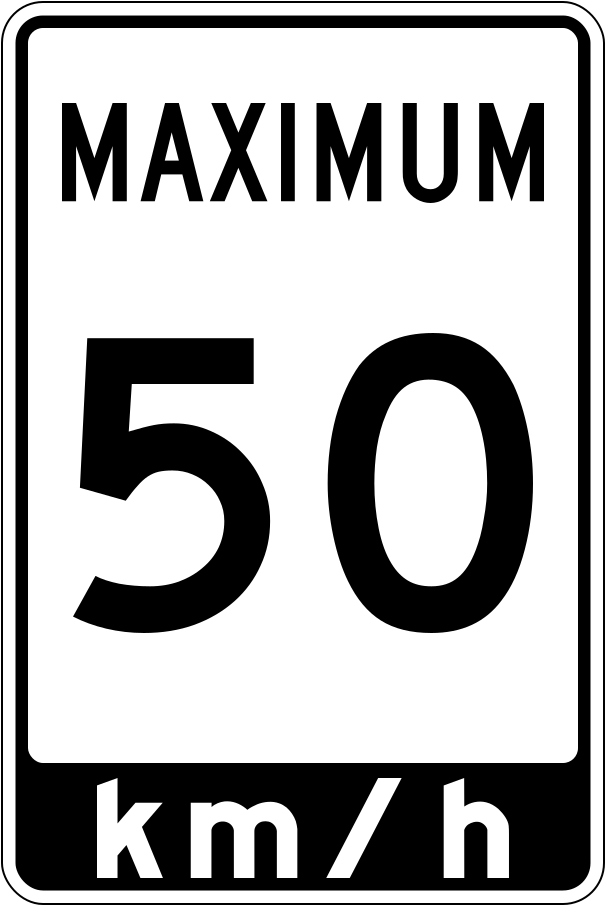
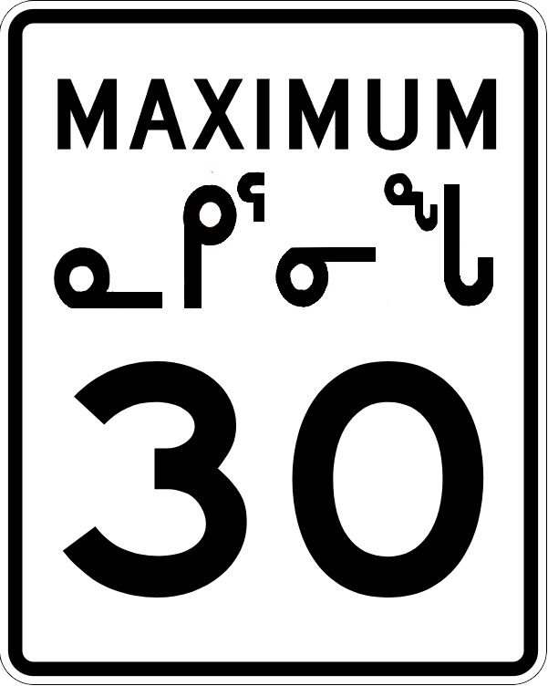
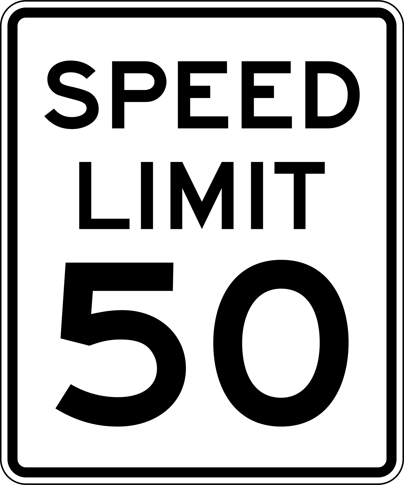

    <h2 class="section-title">{}</h2>
    <ul class="rule-list">
        <li>ドメインは.ca</li>
        <li>速度制限の表記はMAXIMUM</li>
        <li>逆▽の看板標識にYIELDと書いてあればアメリカ、書いてないならばカナダになる</li>
    </ul>
    {}
    {}

{}

{}
{}速度制限の表記はMAXIMUM{}。その標識に白背景のkm/h表記があればブリティッシュコロンビア、フランス語があればケベック、黒い背景のkm表記はオンタリオになる。{}はSPEED LIMIT。
{}

{}カナダはYEILDやONEWAYの看板に文字が無い。左がカナダ・右がアメリカ。
{}

{}こういう感じのポストが多い。どこかにCANADA POSTと書いてあるはず。
{}

{}チェッカーボードのような看板がある{}。
{}

{}TDと書かれた銀行はトロント・ドミニオン銀行の系列。RBCはRoyal Bank of Canadaの略。それぞれ国内２位と１位の資産規模。
{}

<a data-flickr-embed="true" href="https://www.flickr.com/photos/57156785@N02/44243680621/in/photolist-2apEqPF-2k3u5Vp-2k5nE34-2iy4iAq-zfK741-2b4g1hd-8ofxdx-6pVbre-6pZkMh-2ozianU-2oc7xSn-zyqpEn-LopPat-2oG9Ts8-55vEAe-fDKLZx-LW1i9o-e4oo6a-rv5Mn1-2mWAKXU-2osbwHd-2oHCBFQ-5S6fjC-2i6uvpG-vypsm-GTJfmt-sv4XYe-2nUZ1mo-FonQSJ-6HHYJw-PykKLu-D2W89U-2nb4t6W-2nGHSa8-2o1pQuT-egNVbc-9BfMp3-FZTzNH-2okTm7A-2ntWgkb-2nwCtgd-DfXeo-hpY92-2nwpGeS-2mXGC7H-2nXgvAB-cMyfLJ-2iETZYD-2nFKhBN-2m7gnDm" title="TD Canada Trust Bank (Formerly Dominion Bank) .... 420 Bloor Street East .... Toronto, Ontario"></a>

{}
{}

{}カナダには石油や天然ガスのパイプラインを管理するミッドストリーム企業がたくさんある。ただしストリートビューにはほとんどいない（通りから離れた場所にあるため）。代表的な企業はたとえばDevon・Pembina pipeline・Enbridgeなど。Canadian Natural Resourcesのようなオイルサンド・天然ガスを生産する企業も山奥に行くとあるかも。
{}

<iframe src="https://www.google.com/maps/embed?pb=!4v1680092473605!6m8!1m7!1shr6aBl_v5nMjleelgqog1Q!2m2!1d56.23560543688179!2d-120.8634784332044!3f203.7384501628231!4f-2.838224894247233!5f3.325193203789971" width="295" height="295" style="border:0;" allowfullscreen="" loading="lazy" referrerpolicy="no-referrer-when-downgrade"></iframe>
<iframe src="https://www.google.com/maps/embed?pb=!4v1681111205084!6m8!1m7!1s-UxEEFPNNm-mUb8tgXtuwQ!2m2!1d45.64246075442041!2d-73.55239018585368!3f244.4341122162465!4f6.070523922723069!5f3.325193203789971" width="295" height="295" style="border:0;" allowfullscreen="" loading="lazy" referrerpolicy="no-referrer-when-downgrade"></iframe>
<iframe src="https://www.google.com/maps/embed?pb=!4v1681111809405!6m8!1m7!1ss1cAilUaSjeVEgdmo6l1Rg!2m2!1d54.39683596741235!2d-113.5005681784792!3f282.61501806102723!4f-6.847783379797136!5f3.325193203789971" width="295" height="295" style="border:0;" allowfullscreen="" loading="lazy" referrerpolicy="no-referrer-when-downgrade"></iframe>
<iframe src="https://www.google.com/maps/embed?pb=!4v1681111872260!6m8!1m7!1shGawvDMwNEclk4vVyom39w!2m2!1d56.05702410940899!2d-118.3839628374677!3f35.51577976866718!4f-3.251675013380435!5f3.325193203789971" width="295" height="295" style="border:0;" allowfullscreen="" loading="lazy" referrerpolicy="no-referrer-when-downgrade"></iframe>

{}
{}

<iframe width="560" height="315" src="https://www.youtube.com/embed/M7pTe8AWvgg" title="YouTube video player" frameborder="0" allow="accelerometer; autoplay; clipboard-write; encrypted-media; gyroscope; picture-in-picture; web-share" allowfullscreen></iframe>

{}
{}

    <h2 class="section-title">{}</h2>
    <ul class="rule-list">
        <li>ナンバープレートを前後に付ける州とつけない州がある
            <ul>
                <li>ナンバープレートが両サイド緑なのはマニトバ州</li>
                <li>全体的に青いナンバープレートはオンタリオ州の可能性がある</li>
                <li>左下が赤っぽいのはPrince Edward Island州{}</li>
                <li>{}が新しく追加され良くまとまっているので残りはこれを参照</li>
            </ul>
        </li>
        <li>山がちな場所は限定されている</li>
    </ul>

{}
{}

{}
緑色の領域はナンバープレートが前後に必要
{}

<blockquote class="twitter-tweet">
カナダを効率よく視覚で覚えよう🇨🇦 <a href="https://t.co/R4nUSLIR7D">pic.twitter.com/R4nUSLIR7D</a>
&mdash; masuharu. (@masuharu_fn) <a href="https://twitter.com/masuharu_fn/status/1910957803902279869?ref_src=twsrc%5Etfw">April 12, 2025</a></blockquote> 

<blockquote class="reddit-embed-bq" style="height:500px" data-embed-height="723"><a href="https://www.reddit.com/r/geoguessr/comments/xzhxb4/oc_map_of_all_canadian_license_plate_and/">(OC) map of all canadian license plate and rear/front plate obligation</a>  by<a href="https://www.reddit.com/user/ehe78/">u/ehe78</a> in<a href="https://www.reddit.com/r/geoguessr/">geoguessr</a></blockquote>

{}
{}
{}
黄緑色の場所は平坦で茶色の場所は険しい山が広がっている。ブリティッシュコロンビアはバンクーバー周辺以外にはほとんど平坦な場所が無いことが分かる{}。黄色い部分はそこまで高くない山や丘が広がっている地域{}。
{}

{}
{}

    <h4 class="section-title">道路にあるもの</h4>
    <ul class="rule-list">
        <li>STOPの看板が地域ごとに微妙に異なる
            <ul>
                <li>Inuktitut（イヌクティトット語）が見られるのはヌナブト準州のイルカルイト{}</li>
                <li>ARRETはケベック</li>
                <li class="no-evidence">STOPとARRET併記はニューブランズウィックとオンタリオ</li>
            </ul>
        </li>
        <li>速度制限の看板が地域ごとに微妙に異なる
            <ul>
                <li>白背景のkm/h表記があればブリティッシュコロンビア</li>
                <li>フランス語があればケベック</li>
                <li>黒い背景のkm表記はオンタリオ</li>
            </ul>
        </li>
        <li>ランプに青いキャップみたいなものが付いているのはノバスコシアに多い{}</li>
        <li>黒とオレンジのコーンはオンタリオ・白とオレンジのコーンはケベック{}</li>
        <li>２：１に分かれた電柱が交互に繰り返されている時はサスカチュワンに多い{}</li>
    </ul>

{}
{}
{}
{}

{}
{}

{}
オンタリオ州とマニトバ州をつなぐ道路のオンタリオ側の標識は `km/h` の部分が黒背景になっている。またオレンジと黒のカラーで書かれるときもある。
{}

<iframe src="https://www.google.com/maps/embed?pb=!4v1680092550361!6m8!1m7!1sQbi9zOhBSaKoAR4ljsZv_w!2m2!1d49.73933749078834!2d-95.15201809047014!3f145.05850004916792!4f0.1372081059932384!5f3.325193203789971" width="295" height="295" style="border:0;" allowfullscreen="" loading="lazy" referrerpolicy="no-referrer-when-downgrade"></iframe>

{}
オンタリオ州とマニトバ州をつなぐ道路のマニトバ州側の速度表記の看板には黒背景が無い。
{}

<iframe src="https://www.google.com/maps/embed?pb=!4v1680091669251!6m8!1m7!1s4SuXJP7m_ct16ebj318vxQ!2m2!1d49.73906045156971!2d-95.15518707897421!3f298.17287454440634!4f-3.983277349376138!5f3.325193203789971" width="295" height="295" style="border:0;" allowfullscreen="" loading="lazy" referrerpolicy="no-referrer-when-downgrade"></iframe>

{}
{}

<iframe src="https://www.google.com/maps/embed?pb=!4v1688194481220!6m8!1m7!1sE2tMoBGmDU8h-hPklPQtVw!2m2!1d45.04539402267391!2d-63.58207986510813!3f347.98628370681354!4f17.581990047851534!5f3.325193203789971" width="295" height="295" style="border:0;" allowfullscreen="" loading="lazy" referrerpolicy="no-referrer-when-downgrade"></iframe>
<iframe src="https://www.google.com/maps/embed?pb=!4v1688194489780!6m8!1m7!1sk35dR-h_P81v9eFn0IWTOQ!2m2!1d45.28727647879248!2d-66.04170670988759!3f70.67517204626664!4f15.700334599913589!5f3.325193203789971" width="295" height="295" style="border:0;" allowfullscreen="" loading="lazy" referrerpolicy="no-referrer-when-downgrade"></iframe>

{}
{}
{}
左の黒とオレンジのコーンはオンタリオ・右の白とオレンジのコーンはケベックのもの
{}

<iframe src="https://www.google.com/maps/embed?pb=!4v1682432065632!6m8!1m7!1s_tnrWo6hZCZxIDQ8K4Mf0A!2m2!1d49.02144291015642!2d-88.2895963216308!3f268.6020266512863!4f-3.2304603493074353!5f3.2229282956142877" width="295" height="295" style="border:0;" allowfullscreen="" loading="lazy" referrerpolicy="no-referrer-when-downgrade"></iframe>
<iframe src="https://www.google.com/maps/embed?pb=!4v1682432492247!6m8!1m7!1sLO_H97dvPqc3aO3fixvorg!2m2!1d45.49181109498912!2d-73.58142739183401!3f134.36495306086366!4f-5.588569419165907!5f3.325193203789971" width="295" height="295" style="border:0;" allowfullscreen="" loading="lazy" referrerpolicy="no-referrer-when-downgrade"></iframe>

{}
{}
{}
２：１に分かれた電柱が交互に繰り返されている時はサスカチュワンに多い{}。２：１→１：２→２：１→...となっている。
{}

<iframe src="https://www.google.com/maps/embed?pb=!4v1683088341064!6m8!1m7!1sHSAkHzAcEW14USPlrlJKRA!2m2!1d52.36115476111625!2d-107.0386419099979!3f255.28033037458422!4f0.9650869034524447!5f3.325193203789971" width="590" height="290" style="border:0;" allowfullscreen="" loading="lazy" referrerpolicy="no-referrer-when-downgrade"></iframe>

{}
{}

    <h4 class="section-title">ボラード</h4>
    <ul class="rule-list">
        <li>細くて上に赤い反射板があるボラードはケベック</li>
        <li>◆のプレートがあるのはオンタリオ{}</li>
    </ul>

{}
{}
{}
細い、濃い赤色の反射板があるボラードはケベック州{}。{}にも似たようなボラードがある{}点にのみ注意。
{}

{}
{}
{}
オンタリオ州に多い。色が付いていないものもある。
{}

<iframe src="https://www.google.com/maps/embed?pb=!4v1688194680751!6m8!1m7!1s67cxOWY5jKmWodnleg05sA!2m2!1d49.04608186779922!2d-90.6204380212422!3f117.51831448775125!4f-5.780874631208945!5f3.325193203789971" width="295" height="295" style="border:0;" allowfullscreen="" loading="lazy" referrerpolicy="no-referrer-when-downgrade"></iframe>

{}
{}

    <h4 class="section-title">農業の分布</h4>
    <ul class="rule-list">
        <li>サスカチュワンやアルバータには平らな小麦畑が広がっている</li>
        <li>トウモロコシはトロント周辺に多い{}</li>
    </ul>

{}
{}

{}
{}

{}
大豆とトウモロコシはトロント周辺に多い{}。
{}

<iframe src="https://www.google.com/maps/embed?pb=!4v1682764595902!6m8!1m7!1s-wUG-AnpToNq4Vh74i5-2Q!2m2!1d43.95818152610437!2d-81.57718105212717!3f28.86601260554493!4f-9.820514044298804!5f0.7820865974627469" width="295" height="295" style="border:0;" allowfullscreen="" loading="lazy" referrerpolicy="no-referrer-when-downgrade"></iframe>
<iframe src="https://www.google.com/maps/embed?pb=!4v1682764683187!6m8!1m7!1s8rDXmLHQC7aYjWgsXBpwzQ!2m2!1d45.71301262218953!2d-72.66900302579654!3f264.0231635834412!4f-8.3041599233093!5f3.0765622637983046" width="295" height="295" style="border:0;" allowfullscreen="" loading="lazy" referrerpolicy="no-referrer-when-downgrade"></iframe>

{}
{}

    <h4 class="mb-4">代表的な企業の説明</h4>
    <table class="table table-striped table-bordered">
        <thead class="table-light">
            <tr>
                <th scope="col" class="col-width-2">企業名</th>
                <th scope="col" class="col-width-1">コード</th>
                <th scope="col" class="col-width-7">説明</th>
                <th scope="col" class="col-width-05">決算</th>
                <th scope="col" class="col-width-05">配当履歴</th>
            </tr>
        </thead>
        <tbody class="corp-desc">
            <tr>
                <td>Pembina Pipeline</td>
                <td>{}</td>
                <td>石油・天然ガスのミッドストリーム大手。</td>
                <td>{}</td>
                <td>{}</td>
            </tr>
            <tr>
                <td>Canadian National Railway</td>
                <td>{}</td>
                <td>カナダ国内最大の鉄道会社であり、カナダ国内ではCNR以外で大陸を横断している鉄道はない。</td>
                <td>{}</td>
                <td>{}</td>
            </tr>
            <tr>
                <td>Teck Resources</td>
                <td>{}</td>
                <td>金属・鉱業に従事する。製鉄用石炭・亜鉛・銅と主に扱い（収益の9割以上）、副次的に産出する鉛・金・モリブデンなども扱う。</td>
                <td>{}</td>
                <td>{}</td>
            </tr>
            <tr>
                <td>Nutrien</td>
                <td>{}</td>
                <td>肥料メーカーとして世界２位の規模。カリ肥料生産１位、窒素肥料生産世界２位。</td>
                <td>{}</td>
                <td>{}</td>
            </tr>
            <tr>
                <td>Cameco</td>
                <td>{}</td>
                <td>上場しているウラン鉱山関係会社としては世界最大（と思われる）。カナダはカザフスタンに次いでウランの生産が多い{}。</td>
                <td>{}</td>
                <td>{}</td>
            </tr>
        </tbody>
    </table>

