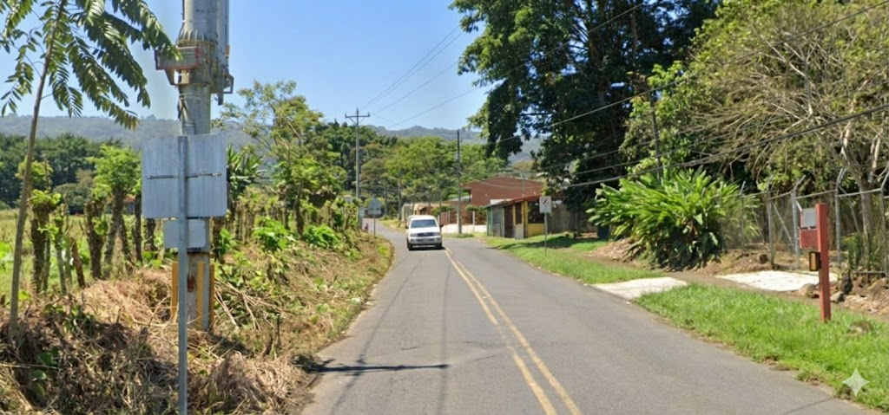

    <h2 class="section-title">{}</h2>
    <ul class="rule-list">
        <li>ドメインは.co.cr</li>
        <li>車は右側通行</li>
        <li>ナンバープレートが白背景に青文字</li>
        <li>とまれが「ALTO」はコスタリカ・{}・{}・{}のどれか</li>
        <li>火山があり黒っぽい土のエリアが多い</li>
        <li>標識の棒はシルバーで裏側にクロスがあることも{}</li>
    </ul>

{}
{}

{}
ナンバープレートは白背景に青文字が多い{}
{}

{}
灰色の□やコの形{}のポールを使った標識が多い。標識の裏にクロスがあることもある{}
{}

{}
火山灰による肥沃な土地が広がっており、かなり黒っぽい土壌が多い{}。国内のいろいろな場所で歩いている。流石に場所の特定まではできなさそう。
{}

<iframe src="https://www.google.com/maps/embed?pb=!4v1718907192354!6m8!1m7!1sLyK4tVfngidC-ng-3gSiEA!2m2!1d10.04577082160527!2d-84.26301217300175!3f203.0279562875457!4f4.393129302166031!5f0.4000000000000002" width="90%" height="450" style="border:0;" allowfullscreen="" loading="lazy" referrerpolicy="no-referrer-when-downgrade"></iframe>

{}
火山灰による肥沃な土地が広がっており、かなり黒っぽい土壌が多い{}。国内のいろいろな場所で歩いている。流石に場所の特定まではできなさそう。
{}

<iframe src="https://www.google.com/maps/embed?pb=!4v1718907192354!6m8!1m7!1sLyK4tVfngidC-ng-3gSiEA!2m2!1d10.04577082160527!2d-84.26301217300175!3f203.0279562875457!4f4.393129302166031!5f0.4000000000000002" width="90%" height="450" style="border:0;" allowfullscreen="" loading="lazy" referrerpolicy="no-referrer-when-downgrade"></iframe>

{}
国営通信会社 ICE（Instituto Costarricense de Electricidad）のkölbiの看板が見つかる{}{{% ref "https://es.wikipedia.org/wiki/K%C3%B6lbi" "Kölbi" %}}。プリペイドのチャージなどができるスポットに看板がある。
{}

{}
{}