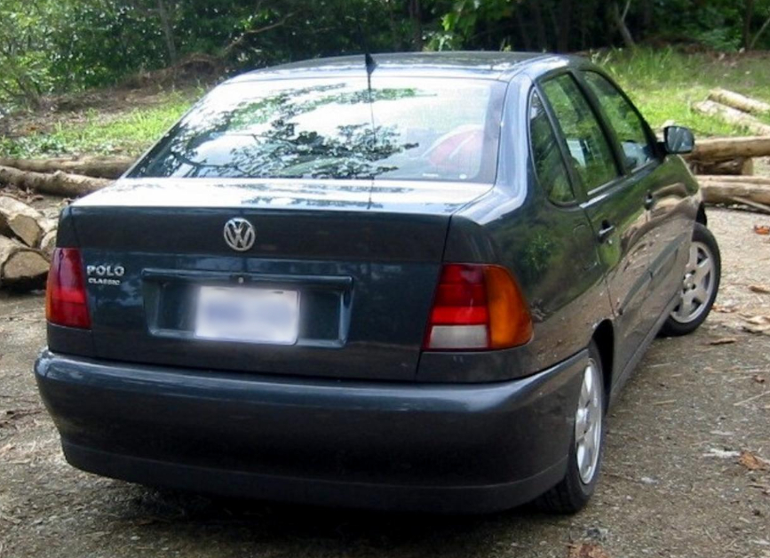

    <h2 class="section-title">{}</h2>
    <ul class="rule-list">
        <li>ドメインは.co.cr</li>
        <li>後ろのナンバープレートが白背景に青文字</li>
        <li>徒歩での撮影ばかりでありサン・ホセ周辺が多い</li>
        <li>とまれが「ALTO」はコスタリカ・{}・{}・{}のどれか</li>
        <li>暗い色の砂浜の上を歩いている</li>
    </ul>

{}
{}

{}
後ろのナンバープレートが白背景に青文字が多い{}
{}

{}

By Zcarstvnz - This file has been extracted from another file, <a href="https://creativecommons.org/licenses/by-sa/4.0/deed.ja">CC BY-SA 4.0</a>, <a href="https://commons.wikimedia.org/w/index.php?curid=92156353">Wikimedia Commons(Link)</a>
{}

{}
少し黒い色の砂浜の上を歩いている{}
{}

{}
火山灰による肥沃な土地が広がっており、かなり黒っぽい土壌の森を歩いている{}。国内のいろいろな場所で歩いている。流石に場所の特定まではできなさそう。
{}

<iframe src="https://www.google.com/maps/embed?pb=!4v1718907192354!6m8!1m7!1sLyK4tVfngidC-ng-3gSiEA!2m2!1d10.04577082160527!2d-84.26301217300175!3f203.0279562875457!4f4.393129302166031!5f0.4000000000000002" width="95%" height="450" style="border:0;" allowfullscreen="" loading="lazy" referrerpolicy="no-referrer-when-downgrade"></iframe>

{}
{}