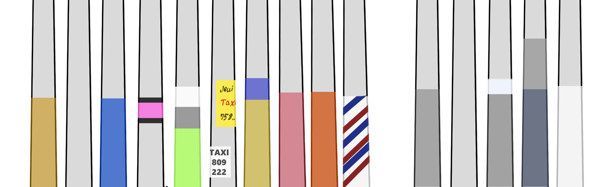

    <h2 class="section-title">{}</h2>
    <ul class="rule-list">
        <li>ドメインは.do</li>
        <li>言語はスペイン語</li>
        <li>電柱は四角い{}</li>
        <li>Googleカーに黒色の４本のゴムが見える{}</li>
    </ul>

{}
{}
{}
Googleカーに黒色の４本のゴムが見える。
{}

<iframe src="https://www.google.com/maps/embed?pb=!4v1681038505133!6m8!1m7!1sHIWY9XdvrtzrqomkjjDP_g!2m2!1d19.48752697663341!2d-70.66124367199151!3f175.0572363472984!4f-86.21107333924112!5f0.7820865974627469" width="495" height="315" style="border:0;" allowfullscreen="" loading="lazy" referrerpolicy="no-referrer-when-downgrade"></iframe>

{}
見たことある色をメモしていたけれどどうやら自分の家の前の電柱を自分の家の壁と同じ色にすることが多いらしい。
なので都市ごとの傾向がはっきりあるのか不明だが、サントドミンゴはオレンジやピンクのような派手な色の電柱が多くタクシーの広告がよく貼られているように思う。一応左がサントドミンゴ・右がサンチアゴで見た電柱。
{}

<iframe src="https://www.google.com/maps/embed?pb=!4v1688184946199!6m8!1m7!1szUGf2oX2VYrx4wGl4_T7fA!2m2!1d18.49617685482304!2d-69.90707459329121!3f23.727634144042035!4f-9.094777794373243!5f3.0913181505019067" width="400" height="300" style="border:0;" allowfullscreen="" loading="lazy" referrerpolicy="no-referrer-when-downgrade"></iframe>

{}
{}

<iframe src="https://www.google.com/maps/embed?pb=!4v1681038655380!6m8!1m7!1squcIsTa9lAifWBkmwDCUtA!2m2!1d19.48689530196004!2d-70.66121308573531!3f100.52754817554397!4f-3.4878675176739193!5f2.1823840120346865" width="295" height="295" style="border:0;" allowfullscreen="" loading="lazy" referrerpolicy="no-referrer-when-downgrade"></iframe>

{}
{}

    <h2 class="section-title">{}</h2>
    <ul class="rule-list">
        <li class="no-evidence">北東の方が山がち・全体的に山がちで電柱が地味な色ならサンチアゴかも</li>
        <li class="no-evidence">逆に北東の方が平ら・電柱が派手な色・タクシーの広告が電柱にたくさん貼ってあるならサントドミンゴかも</li>
    </ul>

