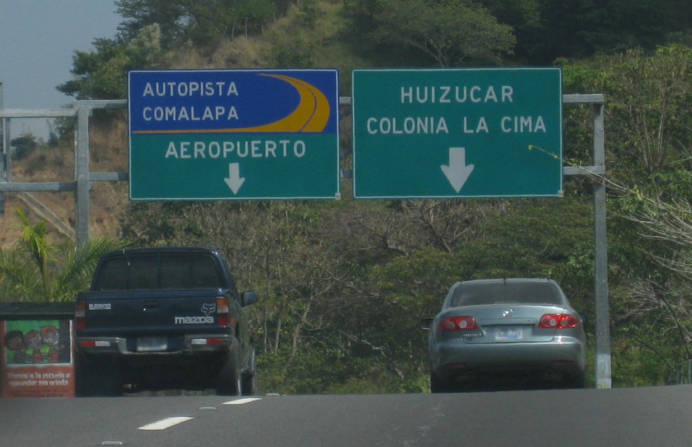

    <h2 class="section-title">{}</h2>
    <ul class="rule-list">
        <li>ドメインは.sv</li>
        <li>2024年3月の時点では公式カバレッジはない</li>
        <li>ナンバープレートが青色っぽく見える</li>
    </ul>

{}
{}

{}
ナンバープレートが青色っぽく見える。
{}

{}
{}