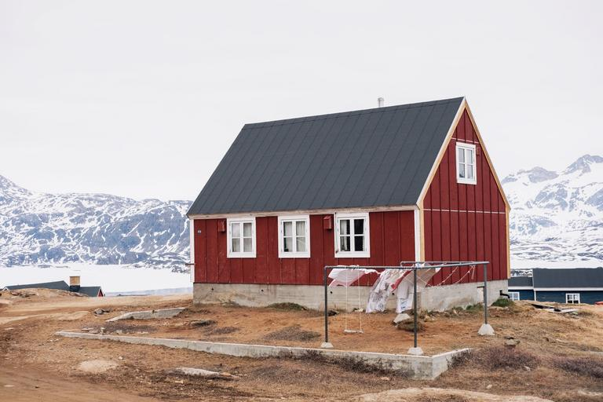
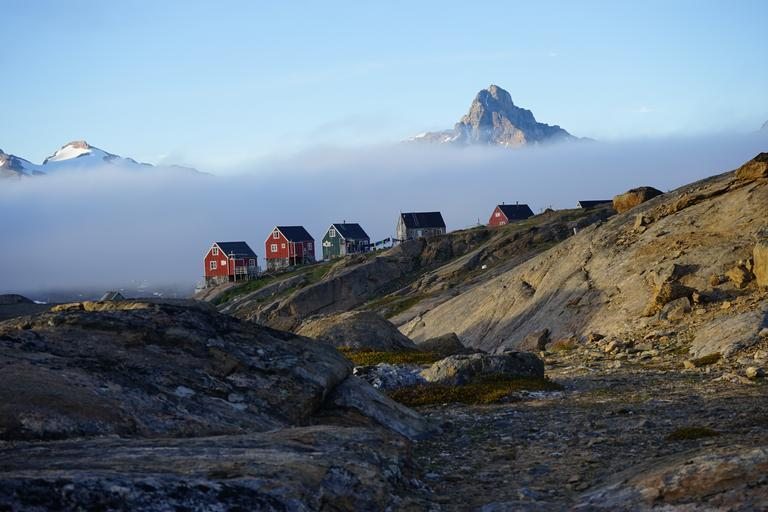

    <h2 class="section-title">{}</h2>
    <ul class="rule-list">
        <li>デンマークの自治領で島の大部分が氷でおおわれている{}</li>
        <li>家は地面に直接建っておらず岩の上や土台の上に建っている</li>
        <li>Google Carが特徴的なのでマップでポチポチして覚える</li>

{}
{}
{}
グリーンランドは先住民が８割以上を占めていて、公用語はグリーンランド語。永久凍土の混じった領域は夏に氷が溶けることで地面が凹み、逆に冬は再び凍り地面が盛り上がる。そのためその影響を受けないように岩などの上に家を立てているケースが多いという。家の土台に隙間があったりコンクリートで固められていたりする{}。寒さの影響で道路もまっ平ではないことが多いという{}）。
{}

{}
船に乗っている時は旗が見えることがある。旗が無い船・違う船もあるので注意。
{}

<iframe src="https://www.google.com/maps/embed?pb=!4v1683535598356!6m8!1m7!1sJWKXNtbZpJL-rPFjVTFcOw!2m2!1d65.65127559241013!2d-37.31975792701175!3f22.734939967993213!4f-35.61737462945672!5f1.7431718349436869" width="495" height="295" style="border:0;" allowfullscreen="" loading="lazy" referrerpolicy="no-referrer-when-downgrade"></iframe>

{}
Google Carが特徴的
{}

<iframe src="https://www.google.com/maps/embed?pb=!4v1686390451593!6m8!1m7!1siqs6NGkbB7O4Px9s_ct61Q!2m2!1d64.16964879365322!2d-51.73017917481543!3f359.41528509947415!4f-41.78736194440895!5f1.5120995218794824" width="490" height="330" style="border:0;" allowfullscreen="" loading="lazy" referrerpolicy="no-referrer-when-downgrade"></iframe>

{}
{}