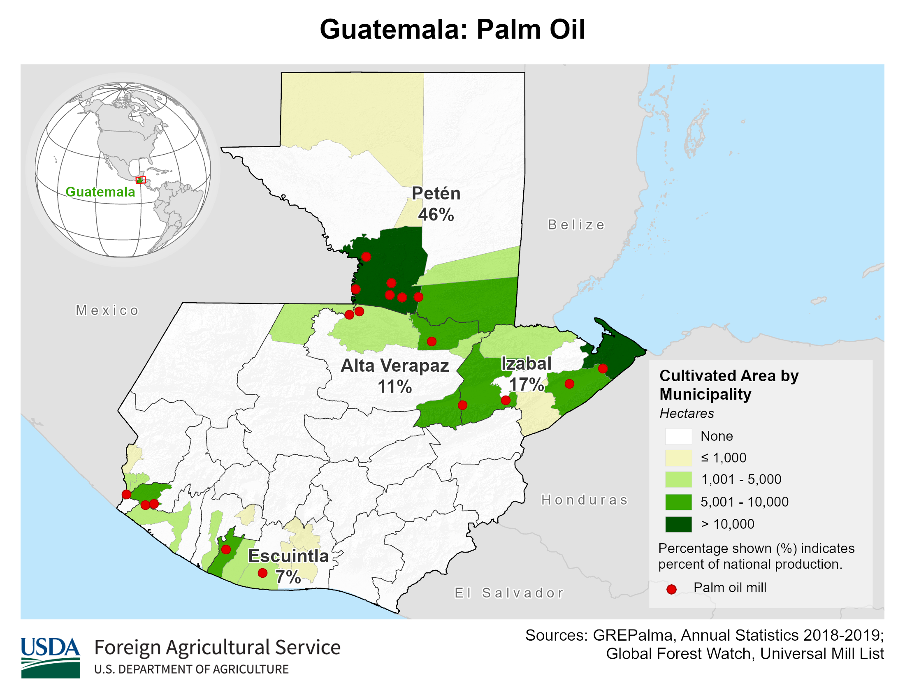

    <h2 class="section-title">{}</h2>
    <ul class="rule-list">
        <li>言語はスペイン語</li>
        <li>ドメインは.gt</li>
        <li>バスが派手で、屋根の上にも荷物を乗せるためのバーが付いているかも。</li>
        <li>Google Carが特徴的</li>
        <li>とまれが「ALTO」は{}かグアテマラ</li>
    </ul>

{}
{}
{}
バスが派手で、屋根の上にも荷物を乗せるためのバーが付いているかも。チキンバスはスペイン語でla camioneta、la burra、またはel busとも。バスでニワトリや動物を運ぶことがあるためチキンバスと呼ぶらしい。屋根の上に荷物を載せるためのスペースがある場合もある。{}
{}

<iframe src="https://www.google.com/maps/embed?pb=!4v1678285133602!6m8!1m7!1svonsqW8I3o_V-H6DqMXfUQ!2m2!1d15.47127207947023!2d-90.37138437853376!3f258.3161581963785!4f-10.2963691260683!5f2.860710194420352" width="295" height="295" style="border:0;" allowfullscreen="" loading="lazy" referrerpolicy="no-referrer-when-downgrade"></iframe>
<iframe src="https://www.google.com/maps/embed?pb=!4v1678285338262!6m8!1m7!1sDSFJcsqcxKcFgliN8LRLPQ!2m2!1d14.58797463037846!2d-90.50131445405357!3f21.438612252403026!4f-4.1815581957442305!5f2.780129043384721" width="295" height="295" style="border:0;" allowfullscreen="" loading="lazy" referrerpolicy="no-referrer-when-downgrade"></iframe>

{}
Google Carが特徴的
{}

<iframe src="https://www.google.com/maps/embed?pb=!4v1682552199079!6m8!1m7!1sy1zkYxqM9_0AEEZg32silQ!2m2!1d14.90353348739371!2d-90.6782027447204!3f16.380623089322356!4f-81.3000728772805!5f0.4000000000000002" width="590" height="400" style="border:0;" allowfullscreen="" loading="lazy" referrerpolicy="no-referrer-when-downgrade"></iframe>

{}
{}

<iframe src="https://www.google.com/maps/embed?pb=!4v1682515539101!6m8!1m7!1sfrLINfz-3GOinrlXBbvleA!2m2!1d14.90488787304172!2d-90.67940776587537!3f240.5911790134093!4f-17.908893700407873!5f1.7758818387440702" width="295" height="295" style="border:0;" allowfullscreen="" loading="lazy" referrerpolicy="no-referrer-when-downgrade"></iframe>

{}
{}
{}
{}

    <h2 class="section-title">{}</h2>
    <ul class="rule-list">
        <li>農業や周りが山がちかどうかが場所によって異なる
            <ul>
                <li>農作物の分布データ出典：<a href="https://ipad.fas.usda.gov/countrysummary/default.aspx?id=GT">Guatemala Production - U.S. DEPARTMENT OF AGRICULTUREUSDA(USDA)</a></li>
            </ul>
        </li>
    </ul>

{}
{}

{}
グアテマラでパームオイルの生産が多いのは中央と東の海岸。
{}

<iframe src="https://www.google.com/maps/embed?pb=!4v1685182034939!6m8!1m7!1stetn6Ojd5QIM9vNqf7PUBQ!2m2!1d16.14055322806418!2d-90.18063088457873!3f86.6838692644644!4f-3.2878926522082708!5f0.7725546915467838" width="295" height="295" style="border:0;" allowfullscreen="" loading="lazy" referrerpolicy="no-referrer-when-downgrade"></iframe>
<iframe src="https://www.google.com/maps/embed?pb=!4v1685182084492!6m8!1m7!1siXRysI1lRdYhkzRw4BIfKA!2m2!1d15.61112876200453!2d-88.47185409306853!3f177.1729930044097!4f3.731704273373353!5f0.8119852830719789" width="295" height="295" style="border:0;" allowfullscreen="" loading="lazy" referrerpolicy="no-referrer-when-downgrade"></iframe>

{}
{}
