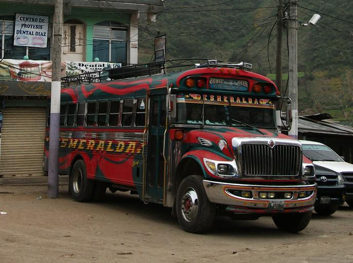
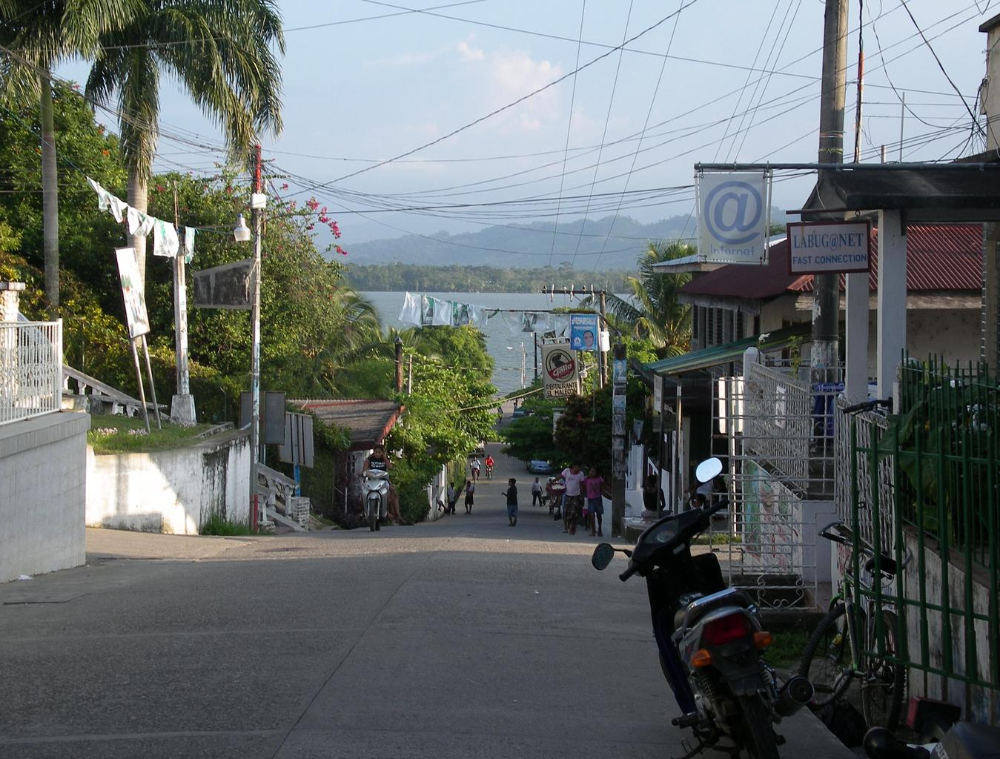
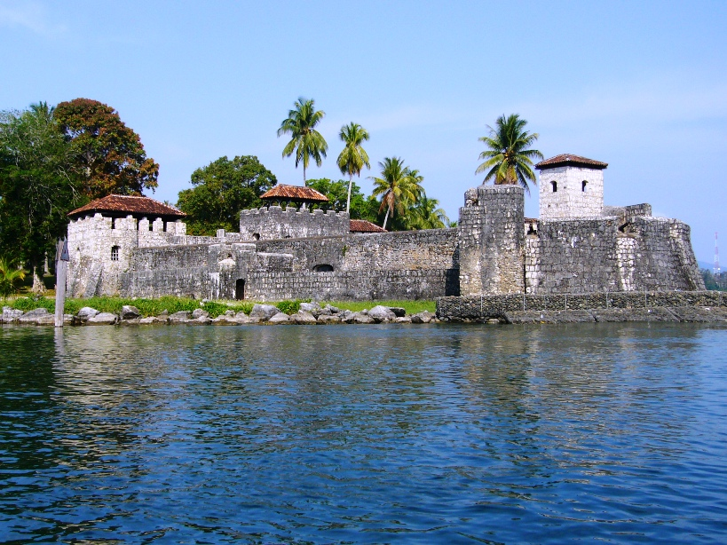
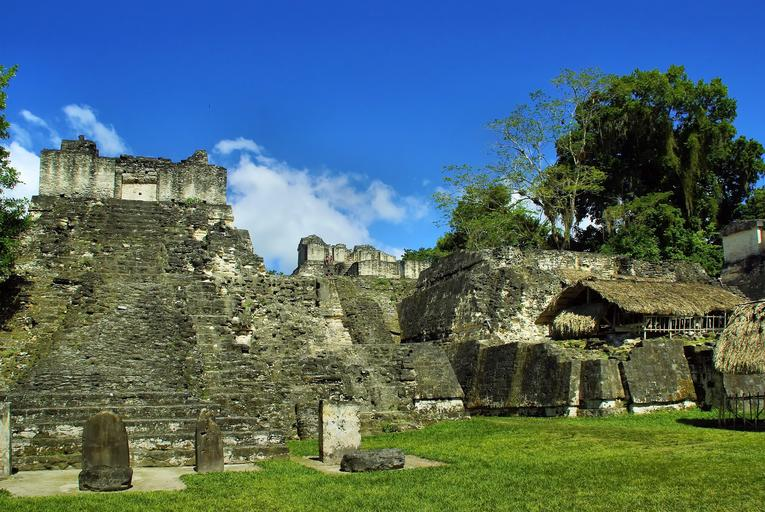
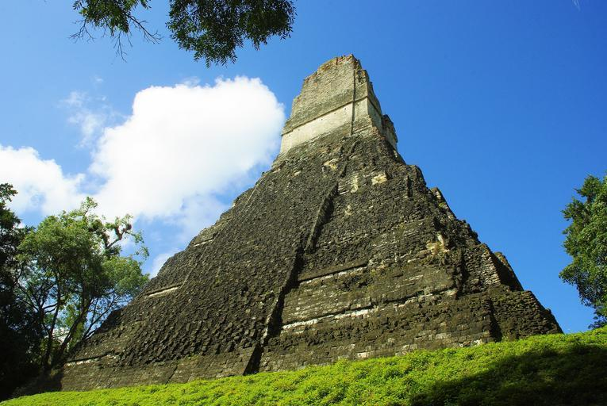

    <h2 class="section-title">{}</h2>
    <ul class="rule-list">
        <li>言語はスペイン語</li>
        <li>ドメインは.gt</li>
        <li>バスが派手で、屋根の上にも荷物を乗せるためのバーが付いているかも。</li>
        <li>Google Carが特徴的</li>
        <li>とまれが「ALTO」は{}・{}・{}・グアテマラ</li>
    </ul>

{}
{}
{}
バスが派手で、屋根の上にも荷物を乗せるためのバーが付いている{}。チキンバスはスペイン語でla camioneta、la burra、またはel busとも。バスでニワトリや動物を運ぶことがあるためチキンバスと呼ぶらしい。屋根の上に荷物を載せるためのスペースがある場合もある。{}
{}

{}
Google Carが特徴的{}
{}

<iframe src="https://www.google.com/maps/embed?pb=!4v1682552199079!6m8!1m7!1sy1zkYxqM9_0AEEZg32silQ!2m2!1d14.90353348739371!2d-90.6782027447204!3f16.380623089322356!4f-81.3000728772805!5f0.4000000000000002" width="590" height="400" style="border:0;" allowfullscreen="" loading="lazy" referrerpolicy="no-referrer-when-downgrade"></iframe>

{}
{}

<iframe src="https://www.google.com/maps/embed?pb=!4v1682515539101!6m8!1m7!1sfrLINfz-3GOinrlXBbvleA!2m2!1d14.90488787304172!2d-90.67940776587537!3f240.5911790134093!4f-17.908893700407873!5f1.7758818387440702" width="295" height="295" style="border:0;" allowfullscreen="" loading="lazy" referrerpolicy="no-referrer-when-downgrade"></iframe>

{}
{}

    <h2 class="section-title">{}</h2>
    <ul class="rule-list">
        <li>一部地域ではアブラヤシのプランテーションが見られる
            <ul>
                <li>農作物の分布データ出典：<a href="https://ipad.fas.usda.gov/countrysummary/default.aspx?id=GT">Guatemala Production - U.S. DEPARTMENT OF AGRICULTUREUSDA(USDA)</a></li>
            </ul>
        </li>
    </ul>

{}
{}

{}
グアテマラでパームオイルの生産が多いのは中央と東の海岸{}。海沿いにも生産地がすこしだけある。
{}

{}
{}

    <h2 class="section-title">{}</h2>
    <ul class="rule-list">
        <li>LívingstonはGarifunaの文化が残っており街の雰囲気が他のちがう{{% ref "https://ja.wikipedia.org/wiki/%E3%83%AA%E3%83%93%E3%83%B3%E3%82%B0%E3%82%B9%E3%83%88%E3%83%B3_(%E3%82%B0%E3%82%A2%E3%83%86%E3%83%9E%E3%83%A9)" "リビングストン" %}}</li>
        <li>Castillo de San Felipe de Laraへの道がある{}</li>
        <li>Tikalにはマヤの大都市の遺跡が残っている{}</li>
    </ul>

{}
{}

{}
Lívingstonに直接アクセスできる陸路は存在しない。ヤシの木が多く北に海が見える{}。赤いトゥクトゥクが多い気がする{}。チキンバスは見られない。
{}

{}
{}

{}
17世紀に設立されたスペインの要塞{}。
{}

{}
{}

{}
世界遺産であるティカルの遺跡を歩いている{}。
{}

{}

{}
