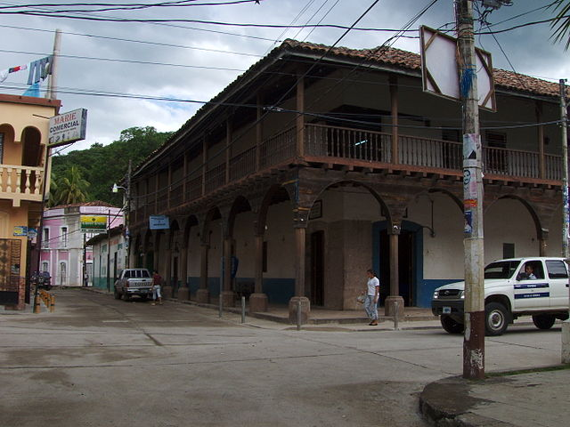
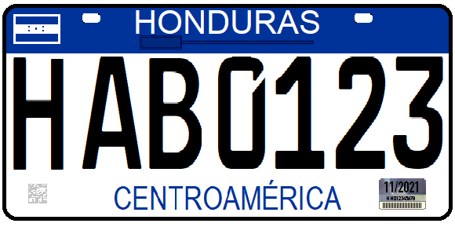

    <h2 class="section-title">{}</h2>
    <ul class="rule-list">
        <li>ドメインは.hn</li>
        <li>Google公式ストリートビューはない</li>
        <li>八角形電柱が使われている</li>
    </ul>

{}
{}

{}
隣国の{}と同じく八角形電柱が使われている{}。
{}

{}
２０１８年までは緑色の、それ以降は青色のナンバープレートが使用されている。
{}

{}

CC0
{}

{}
{}