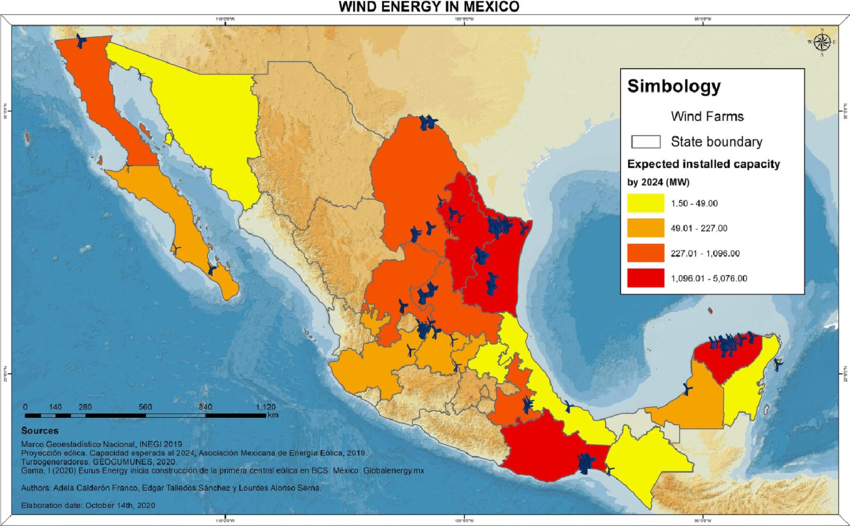

    <h2 class="section-title">{}</h2>
        <ul class="rule-list">
        <li>The domain is .mx</li>
        <li>Language is Spanish</li>
        <li>OXXO is a major convenience store chain</li>
        <li>Many utility poles are octagonal</li>
        <li>Major companies often end with -MEX or -MX (PEMEX, CEMEX, CINEMEX)</li>
        <li>White-and-orange bollards are common</li>
        <li>You can spot a blue VeTV antenna on houses</li>
        <li>Stop signs often say ALTO (also seen in Guatemala, Panama, and Costa Rica)</li>
    </ul>
    {}
    {}

{}
{}

{}
Many major Mexican companies end with -MEX (PEMEX, CEMEX, CINEMEX). OXXO is a major Mexican convenience store, though it also appears in Chile.
{}

{}
Octagonal utility poles are distinctive{}. Colombia can have similar poles, so double-check other clues.
{}

{}
ALTO stop signs appear in Mexico, Guatemala, Panama, and Costa Rica{}. Mexico also uses white/orange directional arrows in some regions{}.
{}

{}
White-and-orange bollards often appear along highways{}.
{}

By <a href="https://en.wikipedia.org/wiki/User:Cdw1952" class="extiw" title="wikipedia:User:Cdw1952">Cdw1952</a> at <a href="https://en.wikipedia.org/wiki/" class="extiw" title="wikipedia:">English Wikipedia</a>, <a href="https://creativecommons.org/licenses/by-sa/3.0" title="Creative Commons Attribution-Share Alike 3.0">CC BY-SA 3.0</a>, <a href="https://commons.wikimedia.org/w/index.php?curid=72669295">Link</a>

{}
Grupo Modelo and Corona branding is a useful commercial clue{}.
{}

{}
{}

<iframe src="https://www.google.com/maps/embed?pb=!4v1681038190947!6m8!1m7!1s9nAl0N31Ju0CBkdr4voz_A!2m2!1d21.87217575161593!2d-102.3095089272366!3f242.0139138779507!4f-14.54817443941107!5f1.606254004703728" width="295" height="295" style="border:0;" allowfullscreen="" loading="lazy" referrerpolicy="no-referrer-when-downgrade"></iframe>
<iframe src="https://www.google.com/maps/embed?pb=!4v1679459072284!6m8!1m7!1s8PmLY24JPH4SftL8hA2CZA!2m2!1d25.75251926645027!2d-100.3004127618978!3f93.71490274714154!4f-1.98958654281806!5f3.2793573082848697" width="295" height="295" style="border:0;" allowfullscreen="" loading="lazy" referrerpolicy="no-referrer-when-downgrade"></iframe>
<iframe src="https://www.google.com/maps/embed?pb=!4v1681001959331!6m8!1m7!1sxAM4-ZNdAtGAwJFYsrGxRQ!2m2!1d27.43836612238844!2d-99.49859360331283!3f213.0166319742502!4f-6.839769541205769!5f3.314171391274682" width="295" height="295" style="border:0;" allowfullscreen="" loading="lazy" referrerpolicy="no-referrer-when-downgrade"></iframe>
<iframe src="https://www.google.com/maps/embed?pb=!4v1681001887650!6m8!1m7!1sm37ENm7cZoTUk_9QmdELmg!2m2!1d27.44392882621393!2d-99.52223275917264!3f200.2997580111676!4f-7.532300258326686!5f1.208598839741584" width="295" height="295" style="border:0;" allowfullscreen="" loading="lazy" referrerpolicy="no-referrer-when-downgrade"></iframe>

{}
{}
{}
You can often spot a blue VeTV antenna attached to houses.
{}

<iframe src="https://www.google.com/maps/embed?pb=!4v1684040103096!6m8!1m7!1sJVizNVDgcV900kZKyIHKsg!2m2!1d17.51239783750989!2d-91.99159441195232!3f299.8752202123155!4f4.119409984765227!5f3.2932924915878594" width="295" height="295" style="border:0;" allowfullscreen="" loading="lazy" referrerpolicy="no-referrer-when-downgrade"></iframe>
<iframe src="https://www.google.com/maps/embed?pb=!4v1684040292000!6m8!1m7!1sEmKGN7ptKtolUzxaKbIQxw!2m2!1d25.68334074243041!2d-100.3154806771452!3f249.51757455387454!4f8.032419984405948!5f3.325193203789971" width="295" height="295" style="border:0;" allowfullscreen="" loading="lazy" referrerpolicy="no-referrer-when-downgrade"></iframe>

{}
{}

<iframe src="https://www.google.com/maps/embed?pb=!4v1681939768408!6m8!1m7!1sTjIIPhxmYopEa6ZkghhcNQ!2m2!1d25.02755830611226!2d-100.5520773206742!3f196.9516418201439!4f-31.383141622281663!5f3.1991076698735967" width="295" height="295" style="border:0;" allowfullscreen="" loading="lazy" referrerpolicy="no-referrer-when-downgrade"></iframe>
<iframe src="https://www.google.com/maps/embed?pb=!4v1679326979706!6m8!1m7!1sTnKtDpcSLRQ4RjMe4Sjd4g!2m2!1d25.54072681401005!2d-103.6382544135941!3f127.84925597748136!4f-19.074318903338067!5f3.2440693678505452" width="295" height="295" style="border:0;" allowfullscreen="" loading="lazy" referrerpolicy="no-referrer-when-downgrade"></iframe>

{}
{}
{}
Many Mexican companies have MEX at the end of their names.
{}

<iframe src="https://www.google.com/maps/embed?pb=!4v1681001582971!6m8!1m7!1stum5t4nmHLXc9ze0BzAiog!2m2!1d27.44889898098879!2d-99.51935115950234!3f70.82730241772708!4f-16.24011429841073!5f3.2238639420880415" width="295" height="295" style="border:0;" allowfullscreen="" loading="lazy" referrerpolicy="no-referrer-when-downgrade"></iframe>
<iframe src="https://www.google.com/maps/embed?pb=!4v1681521750363!6m8!1m7!1sPcpR6tpcU1sgf9sNo_4PeQ!2m2!1d18.7015081507322!2d-88.38674114610056!3f263.8729299527826!4f-18.094240210637224!5f0.8164310715774429" width="295" height="295" style="border:0;" allowfullscreen="" loading="lazy" referrerpolicy="no-referrer-when-downgrade"></iframe>

{}
{}

<iframe src="https://www.google.com/maps/embed?pb=!4v1685121404728!6m8!1m7!1syPURJXcwbJVqYCIg3eZXgQ!2m2!1d19.11496650661053!2d-98.64331097224446!3f154.51219893435274!4f-74.2594996313238!5f0.4000000000000002" width="295" height="295" style="border:0;" allowfullscreen="" loading="lazy" referrerpolicy="no-referrer-when-downgrade"></iframe>

{}
{}

<iframe src="https://www.google.com/maps/embed?pb=!4v1679676346295!6m8!1m7!1sptDPEUGadZCel8Vwz0khJA!2m2!1d18.25720171037926!2d-97.54428259097156!3f113.29189671981759!4f4.696430976423443!5f3.325193203789971" width="295" height="295" style="border:0;" allowfullscreen="" loading="lazy" referrerpolicy="no-referrer-when-downgrade"></iframe>

{}
{}
{}
Mexican music for the road.
{}

<iframe width="560" height="315" src="https://www.youtube.com/embed/4mP2DbESxGo?si=PvEVlU3WN4OI2SNK" title="YouTube video player" frameborder="0" allow="accelerometer; autoplay; clipboard-write; encrypted-media; gyroscope; picture-in-picture; web-share" allowfullscreen></iframe>

{}
{}

    <h2 class="section-title">{}</h2>
    <ul class="rule-list">
        <li>State names and highway shields help narrow the region</li>
        <li>The first digit of phone area codes hints at region: 2-9; even numbers trend north, odd numbers trend south</li>
        <li>Key area codes:
            <ul>
                <li>55 - Mexico City{}</li>
                <li>614 - Chihuahua{}</li>
                <li>656 - Ciudad Juarez{}</li>
                <li>663/664 - Tijuana{}</li>
                <li>686 - Mexicali{}</li>
            </ul>
        </li>
        <li class="no-evidence">Areas near the US sometimes show 000-000-0000 style numbers{}</li>
    </ul>

{}
{}

{}
Area code map for Mexico.
{}

By <a href="//commons.wikimedia.org/w/index.php?title=User:XIC123&amp;action=edit&amp;redlink=1" class="new" title="User:XIC123 (page does not exist)">XIC123</a> - Own work, <a href="https://creativecommons.org/licenses/by-sa/4.0" title="Creative Commons Attribution-Share Alike 4.0">CC BY-SA 4.0</a>, <a href="https://commons.wikimedia.org/w/index.php?curid=149986159">Link</a>

{}
{}

{}

    <ul class="rule-list">
        <li>Wind power is concentrated along the Isthmus of Tehuantepec (Oaxaca)</li>
    </ul>

{}
Wind farms cluster along Oaxaca's coast{}{}.
{}

    <ul class="rule-list">
        <li>Coconut palm plantations exist along the coast of Guerrero</li>
        <li>Sometimes you can tell a town by the color of the license plate.</li>
    </ul>

{}
{}

{}
Coconut palm plantations exist along the coast of Guerrero (data: <a href="https://ipad.fas.usda.gov/countrysummary/default.aspx?id=MX">USDA FAS Country Summary Mexico</a>).
{}

<iframe src="https://www.google.com/maps/embed?pb=!4v1682944891203!6m8!1m7!1sQTSgniwWjFDeK5aKmKl1XA!2m2!1d16.99165953045512!2d-100.1237792495057!3f86.65871881903603!4f12.885509653288338!5f0.9042402409955568" width="590" height="250" style="border:0;" allowfullscreen="" loading="lazy" referrerpolicy="no-referrer-when-downgrade"></iframe>

{}
{}
{}

{}

<iframe src="https://www.google.com/maps/embed?pb=!4v1681719067854!6m8!1m7!1sgylLmuJ3IZfTXZ7RMW36sA!2m2!1d21.5163933518265!2d-104.9006927575845!3f48.83007536049431!4f-9.816624964845346!5f3.325193203789971" width="295" height="295" style="border:0;" allowfullscreen="" loading="lazy" referrerpolicy="no-referrer-when-downgrade"></iframe>

Red license plates on the lower right are common around Nayarit.

{}
{}
{}

Public Domain
{}

<iframe src="https://www.google.com/maps/embed?pb=!4v1681719352208!6m8!1m7!1spn0dOi8NviCruhvOcfFU6Q!2m2!1d20.66214401084474!2d-103.3539136619186!3f275.4124592924797!4f-6.463612869127061!5f3.325193203789971" width="295" height="295" style="border:0;" allowfullscreen="" loading="lazy" referrerpolicy="no-referrer-when-downgrade"></iframe>

Jalisco's license plate is yellow on top and light blue on the bottom.

{}
{}

    <ul class="rule-list">
        <li>There's a clue in the color of the cab.
            <ul>
                <li>Cabs in Mexico City are pink.</li>
                <li class="no-evidence">Sonora cabs are white with SONOLA written on the side.</li>
                <li class="no-evidence">Cabs in Monterrey are yellow.</li>
            </ul>
        </li>
    </ul>

{}
{}

{}
{}

<iframe src="https://www.google.com/maps/embed?pb=!4v1679458863603!6m8!1m7!1s4RycP9oyVHyyfykYBqOxWw!2m2!1d29.09357410608328!2d-110.984242537779!3f304.3327860034546!4f-17.309773440110092!5f2.8989011536707783" width="295" height="295" style="border:0;" allowfullscreen="" loading="lazy" referrerpolicy="no-referrer-when-downgrade"></iframe>

{}
{}

<iframe src="https://www.google.com/maps/embed?pb=!4v1679459246412!6m8!1m7!1sT-JobBKxcKUJd3JlEPU0UA!2m2!1d25.67772911259084!2d-100.3180719930014!3f74.89862641189546!4f-9.062797298225789!5f3.325193203789971" width="295" height="295" style="border:0;" allowfullscreen="" loading="lazy" referrerpolicy="no-referrer-when-downgrade"></iframe>
<iframe src="https://www.google.com/maps/embed?pb=!4v1679459308499!6m8!1m7!1sNucgw5wKbsBiOUwNE9B3Yw!2m2!1d25.74495341159165!2d-100.3066423200428!3f214.26809021321327!4f-6.221660791867066!5f3.325193203789971" width="295" height="295" style="border:0;" allowfullscreen="" loading="lazy" referrerpolicy="no-referrer-when-downgrade"></iframe>

{}
{}
{}
The area around this town is likely to be written in English because Americans come here by plane for sightseeing. The surrounding trees are distinctive.
{}

<iframe src="https://www.google.com/maps/embed?pb=!4v1681522088884!6m8!1m7!1s8m38-qAvewkTHd25Tt0RrQ!2m2!1d19.58042244884665!2d-88.04444830736489!3f51.22711437413797!4f-32.35609661970913!5f2.6641871236477472" width="295" height="295" style="border:0;" allowfullscreen="" loading="lazy" referrerpolicy="no-referrer-when-downgrade"></iframe>
<iframe src="https://www.google.com/maps/embed?pb=!4v1681518865295!6m8!1m7!1sbFiTf-JIQTrv5HAA6ZKI6A!2m2!1d19.58023131640169!2d-88.04407947938945!3f250.2737280606325!4f-6.794132456995868!5f3.325193203789971" width="295" height="295" style="border:0;" allowfullscreen="" loading="lazy" referrerpolicy="no-referrer-when-downgrade"></iframe>

{}
{}

<iframe src="https://www.google.com/maps/embed?pb=!4v1681521880152!6m8!1m7!1sL1iqlazUA4hIFyyhVOjL4A!2m2!1d21.16288078148741!2d-86.85248546837562!3f184.74123425153283!4f-10.372636751105972!5f3.0837205458794528" width="295" height="295" style="border:0;" allowfullscreen="" loading="lazy" referrerpolicy="no-referrer-when-downgrade"></iframe>

{}
{}

    <h4 class="mb-4">Representative companies</h4>
    <table class="table table-striped table-bordered">
        <thead class="table-light">
            <tr>
                <th scope="col" class="col-width-2">Company</th>
                <th scope="col" class="col-width-1">Ticker</th>
                <th scope="col" class="col-width-7">Overview</th>
                <th scope="col" class="col-width-05">IR</th>
                <th scope="col" class="col-width-05">Dividends</th>
            </tr>
        </thead>
        <tbody class="corp-desc">
            <tr>
                <td>Coca-Cola FEMSA</td>
                <td>{}</td>
                <td>Mexico's largest Coca-Cola bottler and one of the biggest in Latin America.</td>
                <td>{}</td>
                <td>{}</td>
            </tr>
            <tr>
                <td>America Movil</td>
                <td>{}</td>
                <td>Latin America's largest telecom group, with major mobile operations across the region.</td>
                <td>{}</td>
                <td>{}</td>
            </tr>
        </tbody>
    </table>

