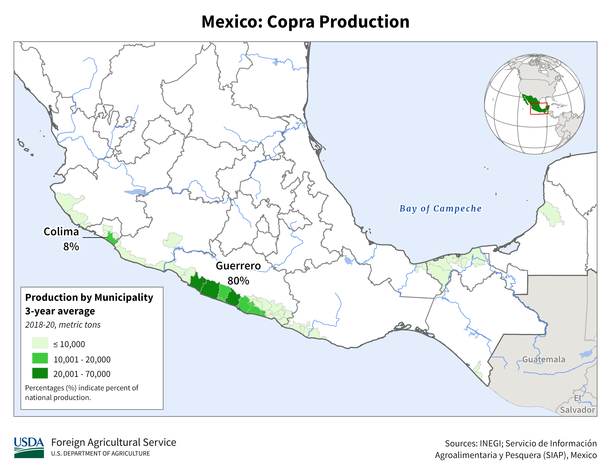
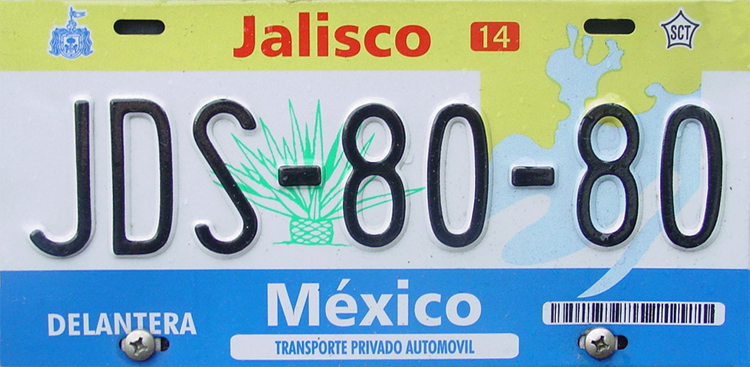

    <h2 class="section-title">{}</h2>
    <ul class="rule-list">
        <li>ドメインは.mx</li>
        <li>言語はスペイン語</li>
        <li>OXXOはメキシコのコンビニ</li>
        <li>電柱は8角形のものが多い</li>
        <li>メキシコの大手企業は～MEXや～MXと名前が付いていることが多い</li>
        <li>白色と黒色で塗られた円形のボラードがある</li>
        <li>VeTVと書いてある青色のアンテナが家に付いていることがある</li>
        <li>とまれが「ALTO」はメキシコか{}</li>
    </ul>
    {}

{}
{}

{}
～MEXと名の付く会社はメキシコの大手企業に多い。石油大手Pemex・通信大手telmex・セメント大手Cemexなど。OXXOはメキシコの大手コンビニで街中に多く見かける。ただしOXXOは{}の都市部にも店がある点に注意。
{}

{}
8角形の電柱が特徴的、ただし{}や{}などにもたまにあって100%メキシコとはならないので周りの雰囲気も合わせてメキシコと判断する。とりわけ電柱が黒と黄色で塗られていたらコロンビアを考えてみる。画像は<a href="https://commons.wikimedia.org/wiki/Category:Utility_poles_in_Quintana_Roo#/media/File:Mucho_OXXO_-_Playa_del_Carmen_QR_-_Nov_2020.jpg">ここ</a>のCC0画像。
{}

{}
とまれが「ALTO」はメキシコか{}。また矢印がなんか太い気がする（自作なので正確な図ではないです）。
{}

{}
白色と黒色で塗られた円形のボラードがある。
{}

By <a href="https://en.wikipedia.org/wiki/User:Cdw1952" class="extiw" title="wikipedia:User:Cdw1952">Cdw1952</a> at <a href="https://en.wikipedia.org/wiki/" class="extiw" title="wikipedia:">English Wikipedia</a>, <a href="https://creativecommons.org/licenses/by-sa/3.0" title="Creative Commons Attribution-Share Alike 3.0">CC BY-SA 3.0</a>, <a href="https://commons.wikimedia.org/w/index.php?curid=72669295">Link</a>

{}
{}

<iframe src="https://www.google.com/maps/embed?pb=!4v1679459072284!6m8!1m7!1s8PmLY24JPH4SftL8hA2CZA!2m2!1d25.75251926645027!2d-100.3004127618978!3f93.71490274714154!4f-1.98958654281806!5f3.2793573082848697" width="295" height="295" style="border:0;" allowfullscreen="" loading="lazy" referrerpolicy="no-referrer-when-downgrade"></iframe>
<iframe src="https://www.google.com/maps/embed?pb=!4v1681001959331!6m8!1m7!1sxAM4-ZNdAtGAwJFYsrGxRQ!2m2!1d27.43836612238844!2d-99.49859360331283!3f213.0166319742502!4f-6.839769541205769!5f3.314171391274682" width="295" height="295" style="border:0;" allowfullscreen="" loading="lazy" referrerpolicy="no-referrer-when-downgrade"></iframe>

{}
{}
{}
薄い青のアンテナでVeTVと書いてあることが多い
{}

<iframe src="https://www.google.com/maps/embed?pb=!4v1684040103096!6m8!1m7!1sJVizNVDgcV900kZKyIHKsg!2m2!1d17.51239783750989!2d-91.99159441195232!3f299.8752202123155!4f4.119409984765227!5f3.2932924915878594" width="295" height="295" style="border:0;" allowfullscreen="" loading="lazy" referrerpolicy="no-referrer-when-downgrade"></iframe>
<iframe src="https://www.google.com/maps/embed?pb=!4v1684040292000!6m8!1m7!1sEmKGN7ptKtolUzxaKbIQxw!2m2!1d25.68334074243041!2d-100.3154806771452!3f249.51757455387454!4f8.032419984405948!5f3.325193203789971" width="295" height="295" style="border:0;" allowfullscreen="" loading="lazy" referrerpolicy="no-referrer-when-downgrade"></iframe>

{}
{}

<iframe src="https://www.google.com/maps/embed?pb=!4v1681939768408!6m8!1m7!1sTjIIPhxmYopEa6ZkghhcNQ!2m2!1d25.02755830611226!2d-100.5520773206742!3f196.9516418201439!4f-31.383141622281663!5f3.1991076698735967" width="295" height="295" style="border:0;" allowfullscreen="" loading="lazy" referrerpolicy="no-referrer-when-downgrade"></iframe>
<iframe src="https://www.google.com/maps/embed?pb=!4v1679326979706!6m8!1m7!1sTnKtDpcSLRQ4RjMe4Sjd4g!2m2!1d25.54072681401005!2d-103.6382544135941!3f127.84925597748136!4f-19.074318903338067!5f3.2440693678505452" width="295" height="295" style="border:0;" allowfullscreen="" loading="lazy" referrerpolicy="no-referrer-when-downgrade"></iframe>

{}
{}
{}
～MEXと名の付く会社はメキシコの大手企業に多い
{}

<iframe src="https://www.google.com/maps/embed?pb=!4v1681001582971!6m8!1m7!1stum5t4nmHLXc9ze0BzAiog!2m2!1d27.44889898098879!2d-99.51935115950234!3f70.82730241772708!4f-16.24011429841073!5f3.2238639420880415" width="295" height="295" style="border:0;" allowfullscreen="" loading="lazy" referrerpolicy="no-referrer-when-downgrade"></iframe>
<iframe src="https://www.google.com/maps/embed?pb=!4v1681521750363!6m8!1m7!1sPcpR6tpcU1sgf9sNo_4PeQ!2m2!1d18.7015081507322!2d-88.38674114610056!3f263.8729299527826!4f-18.094240210637224!5f0.8164310715774429" width="295" height="295" style="border:0;" allowfullscreen="" loading="lazy" referrerpolicy="no-referrer-when-downgrade"></iframe>

{}
{}

<iframe src="https://www.google.com/maps/embed?pb=!4v1685121404728!6m8!1m7!1syPURJXcwbJVqYCIg3eZXgQ!2m2!1d19.11496650661053!2d-98.64331097224446!3f154.51219893435274!4f-74.2594996313238!5f0.4000000000000002" width="295" height="295" style="border:0;" allowfullscreen="" loading="lazy" referrerpolicy="no-referrer-when-downgrade"></iframe>

{}
{}

    <h2 class="section-title">{}</h2>
    <ul class="rule-list">
        <li>州の名前を覚えておくと絞り込みの役に立つ（<a href="https://ja.wikipedia.org/wiki/%E3%83%A1%E3%82%AD%E3%82%B7%E3%82%B3">Wiki</a>）</li>
        <li>State Highway(白色の盾のようなマーク)の標識に道路番号と州の名前が書いてあるかも</li>
        <li>市外局番の先頭の数字でおよその地域が特定できる(2~9)、偶数は上・奇数は下のイメージ</li>
        <li class="no-evidence">アメリカに近いエリアの市外局番は 000-000-0000 の表記かも{}</li>
    </ul>

<blockquote class="twitter-tweet">
画像１枚で国１こ覚えたい。 <a href="https://twitter.com/hashtag/GeoGuessr?src=hash&amp;ref_src=twsrc%5Etfw">#GeoGuessr</a>  その③　メキシコ <a href="https://t.co/KeTRiY67Lj">pic.twitter.com/KeTRiY67Lj</a>
&mdash; Μείνε (@meine_geo) <a href="https://twitter.com/meine_geo/status/1636192764026310656?ref_src=twsrc%5Etfw">March 16, 2023</a></blockquote> 

    <ul class="rule-list">
        <li>Guerreroの海沿いにはココヤシのプランテーションが存在する</li>
    </ul>

{}
{}

{}
Guerreroの海沿いにのみココヤシのプランテーションが存在する。{}
{}

<iframe src="https://www.google.com/maps/embed?pb=!4v1682944891203!6m8!1m7!1sQTSgniwWjFDeK5aKmKl1XA!2m2!1d16.99165953045512!2d-100.1237792495057!3f86.65871881903603!4f12.885509653288338!5f0.9042402409955568" width="590" height="250" style="border:0;" allowfullscreen="" loading="lazy" referrerpolicy="no-referrer-when-downgrade"></iframe>

{}
{}

    <ul class="rule-list">
        <li>ナンバープレートの色で町が分かることがある
            <ul>
                <li>Jalisco：上が黄色で下が水色</li>
                <li>Nayarit：右下が赤色</li>
                <li>Chiapas：真ん中が橙色</li>
            </ul>
        </li>
    </ul>

{}
{}
{}

Public Domain
{}

{}
{}
{}

{}

<iframe src="https://www.google.com/maps/embed?pb=!4v1681719067854!6m8!1m7!1sgylLmuJ3IZfTXZ7RMW36sA!2m2!1d21.5163933518265!2d-104.9006927575845!3f48.83007536049431!4f-9.816624964845346!5f3.325193203789971" width="295" height="295" style="border:0;" allowfullscreen="" loading="lazy" referrerpolicy="no-referrer-when-downgrade"></iframe>

右下が赤いナンバープレートはNayarit周辺に多い

{}
{}

<iframe src="https://www.google.com/maps/embed?pb=!4v1688040917873!6m8!1m7!1sit7obQ-mnLT8XqT1rr5Bsg!2m2!1d15.34044894635397!2d-92.99091741501793!3f66.65401088740333!4f-8.327155137592257!5f3.325193203789971" width="295" height="295" style="border:0;" allowfullscreen="" loading="lazy" referrerpolicy="no-referrer-when-downgrade"></iframe>

{}
{}

    <ul class="rule-list">
        <li>タクシーにヒントがある
            <ul>
                <li>メキシコシティのタクシーにはCDMXと書いてありピンク色</li>
                <li class="no-evidence">ソノラのタクシーは白色で横にSONOLAと書いてある</li>
                <li class="no-evidence">モンテレイのタクシーは黄色</li>
            </ul>
        </li>
    </ul>

{}
{}

{}
{}

<iframe src="https://www.google.com/maps/embed?pb=!4v1679458863603!6m8!1m7!1s4RycP9oyVHyyfykYBqOxWw!2m2!1d29.09357410608328!2d-110.984242537779!3f304.3327860034546!4f-17.309773440110092!5f2.8989011536707783" width="295" height="295" style="border:0;" allowfullscreen="" loading="lazy" referrerpolicy="no-referrer-when-downgrade"></iframe>

{}
{}

<iframe src="https://www.google.com/maps/embed?pb=!4v1679459246412!6m8!1m7!1sT-JobBKxcKUJd3JlEPU0UA!2m2!1d25.67772911259084!2d-100.3180719930014!3f74.89862641189546!4f-9.062797298225789!5f3.325193203789971" width="295" height="295" style="border:0;" allowfullscreen="" loading="lazy" referrerpolicy="no-referrer-when-downgrade"></iframe>
<iframe src="https://www.google.com/maps/embed?pb=!4v1679459308499!6m8!1m7!1sNucgw5wKbsBiOUwNE9B3Yw!2m2!1d25.74495341159165!2d-100.3066423200428!3f214.26809021321327!4f-6.221660791867066!5f3.325193203789971" width="295" height="295" style="border:0;" allowfullscreen="" loading="lazy" referrerpolicy="no-referrer-when-downgrade"></iframe>

{}
{}
{}
アメリカ人が飛行機で観光に来るためこの町付近は英語表記が多いと思われる。周りの木が特徴的。
{}

<iframe src="https://www.google.com/maps/embed?pb=!4v1681522088884!6m8!1m7!1s8m38-qAvewkTHd25Tt0RrQ!2m2!1d19.58042244884665!2d-88.04444830736489!3f51.22711437413797!4f-32.35609661970913!5f2.6641871236477472" width="295" height="295" style="border:0;" allowfullscreen="" loading="lazy" referrerpolicy="no-referrer-when-downgrade"></iframe>
<iframe src="https://www.google.com/maps/embed?pb=!4v1681518865295!6m8!1m7!1sbFiTf-JIQTrv5HAA6ZKI6A!2m2!1d19.58023131640169!2d-88.04407947938945!3f250.2737280606325!4f-6.794132456995868!5f3.325193203789971" width="295" height="295" style="border:0;" allowfullscreen="" loading="lazy" referrerpolicy="no-referrer-when-downgrade"></iframe>

{}
{}

<iframe src="https://www.google.com/maps/embed?pb=!4v1681521880152!6m8!1m7!1sL1iqlazUA4hIFyyhVOjL4A!2m2!1d21.16288078148741!2d-86.85248546837562!3f184.74123425153283!4f-10.372636751105972!5f3.0837205458794528" width="295" height="295" style="border:0;" allowfullscreen="" loading="lazy" referrerpolicy="no-referrer-when-downgrade"></iframe>

{}
{}