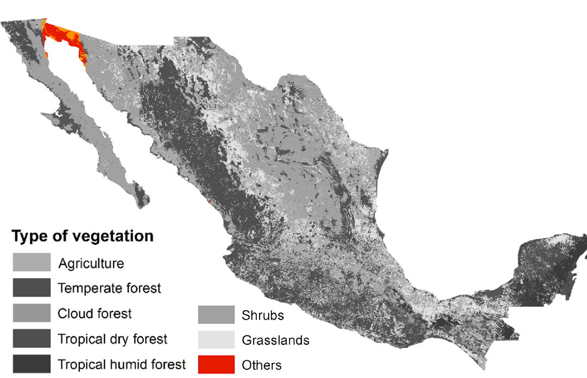
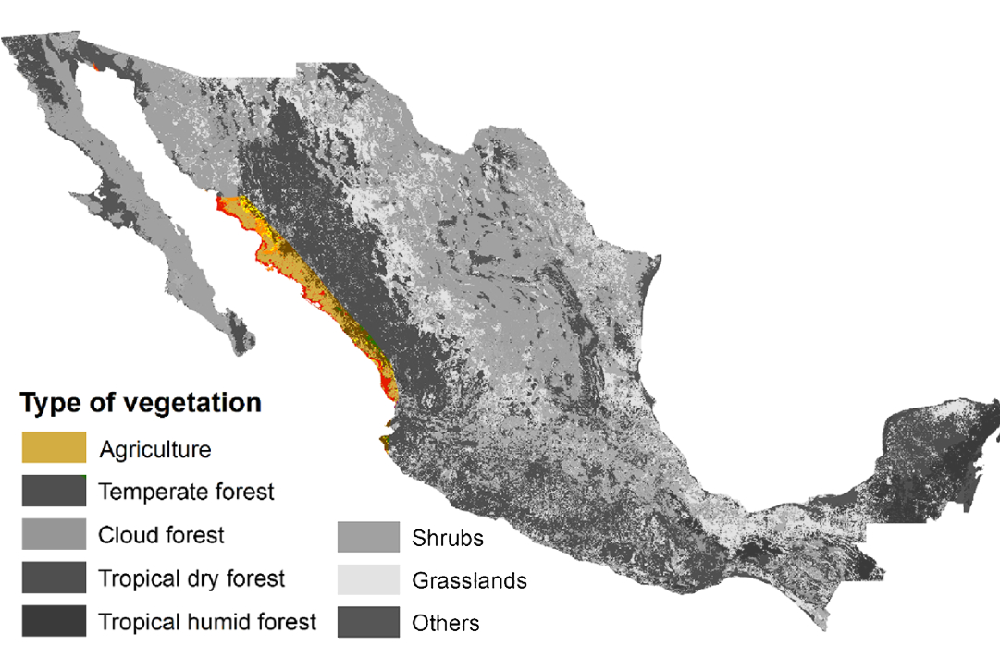

    <h2 class="section-title">{}</h2>
    <ul class="rule-list">
        <li>ドメインは.mx</li>
        <li>言語はスペイン語</li>
        <li>OXXOはメキシコのコンビニ</li>
        <li>電柱は8角形のものが多い</li>
        <li>メキシコの大手企業は～MEXや～MXと名前が付いていることが多い</li>
        <li>白色と黒色で塗られた円形のボラードがある</li>
        <li>VeTVと書いてある青色のアンテナが家に付いていることがある</li>
        <li>とまれが「ALTO」はメキシコ・{}・{}・{}</li>
    </ul>
    {}

{}
{}

{}
～MEXと名の付く会社はメキシコの大手企業に多い{}。石油大手Pemex・通信大手telmex・セメント大手Cemexなど。OXXOはメキシコの大手コンビニで街中に多く見かける。ただしOXXOは{}の都市部にも店がある点に注意。
{}

{}
8角形の電柱が特徴的{}。ただし{}にもたまにあって100%メキシコとはならないので周りの雰囲気も合わせてメキシコと判断する（コロンビアの例{}）。電柱に『～MEX』と書かれていたら確実にメキシコ{}。
{}

{}
とまれが「ALTO」はメキシコ・{}・{}・{}のどれか{}。またメキシコの矢印はなんか太い気がする{}。
{}

{}
白色と黒色で塗られた円形のボラードがある。
{}

By <a href="https://en.wikipedia.org/wiki/User:Cdw1952" class="extiw" title="wikipedia:User:Cdw1952">Cdw1952</a> at <a href="https://en.wikipedia.org/wiki/" class="extiw" title="wikipedia:">English Wikipedia</a>, <a href="https://creativecommons.org/licenses/by-sa/3.0" title="Creative Commons Attribution-Share Alike 3.0">CC BY-SA 3.0</a>, <a href="https://commons.wikimedia.org/w/index.php?curid=72669295">Link</a>

{}
円形の電力計がある{}{}。またメキシコと{}では水色のアンテナをよく見かける。
{}

{}
メキシコのビール醸造所であるGrupo Modeloが製造するコロナビール{{% ref "https://ja.wikipedia.org/wiki/%E3%82%B3%E3%83%AD%E3%83%8A%E3%83%93%E3%83%BC%E3%83%AB" "コロナビール" %}}のロゴが見られる{}。
{}

{}
{}

<iframe src="https://www.google.com/maps/embed?pb=!4v1679459072284!6m8!1m7!1s8PmLY24JPH4SftL8hA2CZA!2m2!1d25.75251926645027!2d-100.3004127618978!3f93.71490274714154!4f-1.98958654281806!5f3.2793573082848697" width="295" height="295" style="border:0;" allowfullscreen="" loading="lazy" referrerpolicy="no-referrer-when-downgrade"></iframe>
<iframe src="https://www.google.com/maps/embed?pb=!4v1681001959331!6m8!1m7!1sxAM4-ZNdAtGAwJFYsrGxRQ!2m2!1d27.43836612238844!2d-99.49859360331283!3f213.0166319742502!4f-6.839769541205769!5f3.314171391274682" width="295" height="295" style="border:0;" allowfullscreen="" loading="lazy" referrerpolicy="no-referrer-when-downgrade"></iframe>

{}
{}
{}
薄い青のアンテナでVeTVと書いてあることが多い
{}

<iframe src="https://www.google.com/maps/embed?pb=!4v1684040103096!6m8!1m7!1sJVizNVDgcV900kZKyIHKsg!2m2!1d17.51239783750989!2d-91.99159441195232!3f299.8752202123155!4f4.119409984765227!5f3.2932924915878594" width="295" height="295" style="border:0;" allowfullscreen="" loading="lazy" referrerpolicy="no-referrer-when-downgrade"></iframe>
<iframe src="https://www.google.com/maps/embed?pb=!4v1684040292000!6m8!1m7!1sEmKGN7ptKtolUzxaKbIQxw!2m2!1d25.68334074243041!2d-100.3154806771452!3f249.51757455387454!4f8.032419984405948!5f3.325193203789971" width="295" height="295" style="border:0;" allowfullscreen="" loading="lazy" referrerpolicy="no-referrer-when-downgrade"></iframe>

{}
{}

<iframe src="https://www.google.com/maps/embed?pb=!4v1681939768408!6m8!1m7!1sTjIIPhxmYopEa6ZkghhcNQ!2m2!1d25.02755830611226!2d-100.5520773206742!3f196.9516418201439!4f-31.383141622281663!5f3.1991076698735967" width="295" height="295" style="border:0;" allowfullscreen="" loading="lazy" referrerpolicy="no-referrer-when-downgrade"></iframe>
<iframe src="https://www.google.com/maps/embed?pb=!4v1679326979706!6m8!1m7!1sTnKtDpcSLRQ4RjMe4Sjd4g!2m2!1d25.54072681401005!2d-103.6382544135941!3f127.84925597748136!4f-19.074318903338067!5f3.2440693678505452" width="295" height="295" style="border:0;" allowfullscreen="" loading="lazy" referrerpolicy="no-referrer-when-downgrade"></iframe>

{}
{}
{}
～MEXと名の付く会社はメキシコの大手企業に多い
{}

<iframe src="https://www.google.com/maps/embed?pb=!4v1681001582971!6m8!1m7!1stum5t4nmHLXc9ze0BzAiog!2m2!1d27.44889898098879!2d-99.51935115950234!3f70.82730241772708!4f-16.24011429841073!5f3.2238639420880415" width="295" height="295" style="border:0;" allowfullscreen="" loading="lazy" referrerpolicy="no-referrer-when-downgrade"></iframe>
<iframe src="https://www.google.com/maps/embed?pb=!4v1681521750363!6m8!1m7!1sPcpR6tpcU1sgf9sNo_4PeQ!2m2!1d18.7015081507322!2d-88.38674114610056!3f263.8729299527826!4f-18.094240210637224!5f0.8164310715774429" width="295" height="295" style="border:0;" allowfullscreen="" loading="lazy" referrerpolicy="no-referrer-when-downgrade"></iframe>

{}
{}

<iframe src="https://www.google.com/maps/embed?pb=!4v1685121404728!6m8!1m7!1syPURJXcwbJVqYCIg3eZXgQ!2m2!1d19.11496650661053!2d-98.64331097224446!3f154.51219893435274!4f-74.2594996313238!5f0.4000000000000002" width="295" height="295" style="border:0;" allowfullscreen="" loading="lazy" referrerpolicy="no-referrer-when-downgrade"></iframe>

{}
{}
{}
バハ・カリフォルニア州
{}

<iframe width="560" height="315" src="https://www.youtube.com/embed/4mP2DbESxGo?si=PvEVlU3WN4OI2SNK" title="YouTube video player" frameborder="0" allow="accelerometer; autoplay; clipboard-write; encrypted-media; gyroscope; picture-in-picture; web-share" allowfullscreen></iframe>

{}
{}

    <h2 class="section-title">{}</h2>
    <ul class="rule-list">
        <li>市外局番の先頭の数字でおよその地域が特定できる(2~9)、偶数は上・奇数は下のイメージ
            <ul>
                <li>55：メキシコシティ{}</li>
                <li>614：チワワ（Chihuahua）{}</li>
                <li>656：シウダー・フアレス（Ciudad Juárez）{}</li>
                <li>663・664：ティフアナ（Tijuana）{}</li>
                <li>686：メヒカリ（Mexicali）{}</li>
            </ul>
        </li>
    </ul>

{}
{}

{}
『55』はメキシコシティ。タクシーの模様も重要なヒント。
{}

<blockquote class="twitter-tweet">
画像１枚で国１こ覚えたい。 <a href="https://twitter.com/hashtag/GeoGuessr?src=hash&amp;ref_src=twsrc%5Etfw">#GeoGuessr</a>  その③　メキシコ <a href="https://t.co/KeTRiY67Lj">pic.twitter.com/KeTRiY67Lj</a>
&mdash; Μείνε (@meine_geo) <a href="https://twitter.com/meine_geo/status/1636192764026310656?ref_src=twsrc%5Etfw">March 16, 2023</a></blockquote> 

{}
{}

<blockquote class="twitter-tweet">
メキシコのエリアコード600番台のmapを作成しました <a href="https://t.co/CjgrxbuEGL">pic.twitter.com/CjgrxbuEGL</a>
&mdash; niwai (@niwai725) <a href="https://twitter.com/niwai725/status/1693241714545508850?ref_src=twsrc%5Etfw">August 20, 2023</a></blockquote> 

{}
{}

    <ul class="rule-list">
        <li>さまざまな種類の植生が存在する
            <ul>
                <li>カリフォルニア湾の一番奥は平坦で木もほとんど生えてない地域</li>
                <li>西側の海沿いの平坦な地域では農業が行われていて東側に山が見える</li>
                <li>北東側の海沿いの平坦な地域でも農業が行われている</li>
                <li>{}, <a href="https://creativecommons.org/licenses/by/4.0/legalcode">CC BY 4.0</a></li>
            </ul>
        </li>
        <li>農業の分布に地域性がある
            <ul>
                <li>Guerreroの海沿いにはココヤシのプランテーションが存在する</li>
                <li>Chiapasと186号線沿いにアブラヤシのプランテーションがある</li>
            </ul>
        </li>
    </ul>

{}
{}

画像出典：<a href="https://www.emerald.com/insight/content/doi/10.1108/IJCCSM-08-2018-0062/full/html">参考文献より</a>, <a href="https://creativecommons.org/licenses/by/4.0/legalcode">CC BY 4.0</a>

{}
{}。
{}

{}
{}

{}
木もサボテンも生えてなさそう。
{}

<iframe src="https://www.google.com/maps/embed?pb=!4v1693626484622!6m8!1m7!1sVqhLtXFAYj1jbAx6bDnhjA!2m2!1d31.43251402318006!2d-115.0494189216987!3f339.79149413735803!4f12.036253423230406!5f0.4000000000000002" width="590" height="280" style="border:0;" allowfullscreen="" loading="lazy" referrerpolicy="no-referrer-when-downgrade"></iframe>
<iframe src="https://www.google.com/maps/embed?pb=!4v1693626537768!6m8!1m7!1scSpRv3Ee1iMvHoX4xWrGYQ!2m2!1d31.70903597829781!2d-113.988204754503!3f44.6851294319801!4f9.662115747257076!5f0.4000000000000002" width="590" height="280" style="border:0;" allowfullscreen="" loading="lazy" referrerpolicy="no-referrer-when-downgrade"></iframe>

{}
{}

{}
サボテンが生えている場所がある。図は単純化しすぎていてもっと多様な景色がある。平坦で無い場所や山が見える場所も多い。
{}

<iframe src="https://www.google.com/maps/embed?pb=!4v1695099852437!6m8!1m7!1sSX2crZ-cbVTPzOMPt0Tt6Q!2m2!1d29.30878750069611!2d-114.2653475136884!3f129.8092330983428!4f1.0680303811966354!5f0.4000000000000002" width="590" height="280" style="border:0;" allowfullscreen="" loading="lazy" referrerpolicy="no-referrer-when-downgrade"></iframe>
<iframe src="https://www.google.com/maps/embed?pb=!4v1695100351900!6m8!1m7!1stZdRGDvrNGVqrz3c2PqMVA!2m2!1d29.78458588295717!2d-114.7754242379417!3f138.04706614348635!4f12.232374602247774!5f0.4000000000000002" width="590" height="280" style="border:0;" allowfullscreen="" loading="lazy" referrerpolicy="no-referrer-when-downgrade"></iframe>

{}
{}

{}
平坦で農業の様子が見えて、遠くにごつごつした山が見えることもある。
{}

<iframe src="https://www.google.com/maps/embed?pb=!4v1695100585196!6m8!1m7!1sgnR0ThW9LriHZf2ismYuMg!2m2!1d25.75834060328217!2d-108.4804244715005!3f0.2889402842183242!4f4.0167329823510585!5f0.7820865974627469" width="590" height="280"  style="border:0;" allowfullscreen="" loading="lazy" referrerpolicy="no-referrer-when-downgrade"></iframe>
<iframe src="https://www.google.com/maps/embed?pb=!4v1693625533960!6m8!1m7!1smsTcVRrQw-dbic9Hb9LeSw!2m2!1d25.02883549800032!2d-107.8239421155597!3f73.08712019573166!4f-5.359408887550231!5f0.975039551555405" width="590" height="280" style="border:0;" allowfullscreen="" loading="lazy" referrerpolicy="no-referrer-when-downgrade"></iframe>

{}
{}

{}
？？？
{}

<iframe src="https://www.google.com/maps/embed?pb=!4v1695099994452!6m8!1m7!1ssT__3344dVUf2G1NT3CBrg!2m2!1d23.72838020305813!2d-105.6870084989594!3f222.12693664333545!4f11.93615461207888!5f0.7820865974627469" width="590" height="280" style="border:0;" allowfullscreen="" loading="lazy" referrerpolicy="no-referrer-when-downgrade"></iframe>
<iframe src="https://www.google.com/maps/embed?pb=!4v1695100043283!6m8!1m7!1svqDU40uYNat_seoefe1f0g!2m2!1d22.17378617618213!2d-104.7232251441188!3f236.13489289229855!4f4.035154462213086!5f0.7820865974627469" width="590" height="280" style="border:0;" allowfullscreen="" loading="lazy" referrerpolicy="no-referrer-when-downgrade"></iframe>

{}
{}

{}
？？？
{}

<iframe src="https://www.google.com/maps/embed?pb=!4v1695100091063!6m8!1m7!1seFkNElCGa4jatE7pEn2VpA!2m2!1d23.73146232120942!2d-101.856355821498!3f55.82928223841073!4f5.57932098338955!5f0.7820865974627469" width="590" height="280" style="border:0;" allowfullscreen="" loading="lazy" referrerpolicy="no-referrer-when-downgrade"></iframe>
<iframe src="https://www.google.com/maps/embed?pb=!4v1695100128619!6m8!1m7!1sk7tTTJqsoJtPMKeWEgyjfA!2m2!1d26.21404802676051!2d-102.7235106603036!3f213.66394949584793!4f5.258364191502423!5f0.7820865974627469" width="590" height="280" style="border:0;" allowfullscreen="" loading="lazy" referrerpolicy="no-referrer-when-downgrade"></iframe>

{}
{}

{}
東側とおなじくこちらでも農業が行われるが、山は見えないと思われる。
{}

<iframe src="https://www.google.com/maps/embed?pb=!4v1695098429484!6m8!1m7!1ss3QDPfzgdXgNrhdeOsK9ww!2m2!1d25.67704690448053!2d-97.5946512078193!3f120.54146700617399!4f2.0649412659985558!5f0.7820865974627469" width="590" height="280" style="border:0;" allowfullscreen="" loading="lazy" referrerpolicy="no-referrer-when-downgrade"></iframe>
<iframe src="https://www.google.com/maps/embed?pb=!4v1695098483111!6m8!1m7!1sGjevq5dHoqEu7KzUCugYIQ!2m2!1d25.18339534118774!2d-97.95522199861607!3f317.4655134838271!4f14.367468771543756!5f0.4000000000000002" width="590" height="280" style="border:0;" allowfullscreen="" loading="lazy" referrerpolicy="no-referrer-when-downgrade"></iframe>

{}
{}

{}
？？？
{}

<iframe src="https://www.google.com/maps/embed?pb=!4v1695368270633!6m8!1m7!1s8FQIdoSW00FfWEe1jRNbRg!2m2!1d18.15102722612788!2d-94.85487590642649!3f172.9412612348174!4f1.2244506430221236!5f0.7820865974627469" width="590" height="280" style="border:0;" allowfullscreen="" loading="lazy" referrerpolicy="no-referrer-when-downgrade"></iframe>
<iframe src="https://www.google.com/maps/embed?pb=!4v1695368407843!6m8!1m7!1sNfAeaEUXKBd5yR2yv0RBhA!2m2!1d18.13649866512451!2d-93.73460114699523!3f342.9002307005016!4f4.121700914993099!5f0.4000000000000002" width="590" height="280" style="border:0;" allowfullscreen="" loading="lazy" referrerpolicy="no-referrer-when-downgrade"></iframe>

{}
{}

{}
？？？
{}

<iframe src="https://www.google.com/maps/embed?pb=!4v1695367608806!6m8!1m7!1sZa_AxfgA21-vSkfmyQ68pA!2m2!1d19.50941907777958!2d-90.1728950075663!3f255.8818506293013!4f5.752925120443237!5f0.4000000000000002" width="590" height="280" style="border:0;" allowfullscreen="" loading="lazy" referrerpolicy="no-referrer-when-downgrade"></iframe>
<iframe src="https://www.google.com/maps/embed?pb=!4v1695367581208!6m8!1m7!1sjlOQ6z3Ck5uAr2ZxGy80Tg!2m2!1d21.17306115082154!2d-88.46647526330227!3f174.15311130611744!4f10.702779210455049!5f0.4000000000000002" width="590" height="280" style="border:0;" allowfullscreen="" loading="lazy" referrerpolicy="no-referrer-when-downgrade"></iframe>

{}
{}

{}
？？？
{}

<iframe src="https://www.google.com/maps/embed?pb=!4v1695367862691!6m8!1m7!1sLW0mTSbrz8PqRwhrHFkcDg!2m2!1d19.80282261103021!2d-87.47777332081064!3f349.86543260293314!4f14.601799178475872!5f0.4000000000000002" width="590" height="280" style="border:0;" allowfullscreen="" loading="lazy" referrerpolicy="no-referrer-when-downgrade"></iframe>
<iframe src="https://www.google.com/maps/embed?pb=!4v1695367758795!6m8!1m7!1s4pMEFHrulQSK24_Wu9WVQA!2m2!1d18.54207712533977!2d-88.46735425629878!3f318.3980474971268!4f9.819858013687366!5f0.4000000000000002" width="590" height="280" style="border:0;" allowfullscreen="" loading="lazy" referrerpolicy="no-referrer-when-downgrade"></iframe>

{}
{}

{}
Guerreroの海沿いにのみココヤシのプランテーションが存在する。{}
{}

<iframe src="https://www.google.com/maps/embed?pb=!4v1682944891203!6m8!1m7!1sQTSgniwWjFDeK5aKmKl1XA!2m2!1d16.99165953045512!2d-100.1237792495057!3f86.65871881903603!4f12.885509653288338!5f0.9042402409955568" width="590" height="250" style="border:0;" allowfullscreen="" loading="lazy" referrerpolicy="no-referrer-when-downgrade"></iframe>

{}
{}

{}
分布上はたくさんあるように見えるけれど、実際には道路が少ないのでゲーム上で遭遇するのは稀かも。
{}

<iframe src="https://www.google.com/maps/embed?pb=!4v1690446541147!6m8!1m7!1sSn59mD6hE2I-vtQMM4vLrA!2m2!1d18.30187402088926!2d-91.25097875805089!3f310.3095166079618!4f-8.212093973636826!5f1.2699771960987585"width="295" height="295" style="border:0;" allowfullscreen="" loading="lazy" referrerpolicy="no-referrer-when-downgrade"></iframe>
<iframe src="https://www.google.com/maps/embed?pb=!4v1690446551389!6m8!1m7!1sE0GcvOybQUjOOGcWprsEBQ!2m2!1d15.25871209385946!2d-92.85380372736698!3f71.19773244831516!4f1.8473922982750821!5f0.4000000000000002"width="295" height="295" style="border:0;" allowfullscreen="" loading="lazy" referrerpolicy="no-referrer-when-downgrade"></iframe>

{}
{}

    <ul class="rule-list">
        <li>ナンバープレートの色で町が分かることがある
            <ul>
                <li>Jalisco：上が黄色で下が水色</li>
                <li>Nayarit：右下が赤色</li>
                <li>Chiapas：真ん中が橙色</li>
            </ul>
        </li>
    </ul>

{}
{}
{}

Public Domain
{}

{}
{}
{}

{}

<iframe src="https://www.google.com/maps/embed?pb=!4v1681719067854!6m8!1m7!1sgylLmuJ3IZfTXZ7RMW36sA!2m2!1d21.5163933518265!2d-104.9006927575845!3f48.83007536049431!4f-9.816624964845346!5f3.325193203789971" width="295" height="295" style="border:0;" allowfullscreen="" loading="lazy" referrerpolicy="no-referrer-when-downgrade"></iframe>

右下が赤いナンバープレートはNayarit周辺に多い

{}
{}

<iframe src="https://www.google.com/maps/embed?pb=!4v1688040917873!6m8!1m7!1sit7obQ-mnLT8XqT1rr5Bsg!2m2!1d15.34044894635397!2d-92.99091741501793!3f66.65401088740333!4f-8.327155137592257!5f3.325193203789971" width="295" height="295" style="border:0;" allowfullscreen="" loading="lazy" referrerpolicy="no-referrer-when-downgrade"></iframe>

{}
{}

    <ul class="rule-list">
        <li>タクシーにヒントがある
            <ul>
                <li>メキシコシティのタクシーにはCDMXと書いてありピンク色</li>
                <li class="no-evidence">ソノラのタクシーは白色で横にSONOLAと書いてある</li>
                <li class="no-evidence">モンテレイのタクシーは黄色</li>
            </ul>
        </li>
    </ul>

{}
{}

{}
{}

<iframe src="https://www.google.com/maps/embed?pb=!4v1679458863603!6m8!1m7!1s4RycP9oyVHyyfykYBqOxWw!2m2!1d29.09357410608328!2d-110.984242537779!3f304.3327860034546!4f-17.309773440110092!5f2.8989011536707783" width="295" height="295" style="border:0;" allowfullscreen="" loading="lazy" referrerpolicy="no-referrer-when-downgrade"></iframe>

{}
{}

<iframe src="https://www.google.com/maps/embed?pb=!4v1679459246412!6m8!1m7!1sT-JobBKxcKUJd3JlEPU0UA!2m2!1d25.67772911259084!2d-100.3180719930014!3f74.89862641189546!4f-9.062797298225789!5f3.325193203789971" width="295" height="295" style="border:0;" allowfullscreen="" loading="lazy" referrerpolicy="no-referrer-when-downgrade"></iframe>
<iframe src="https://www.google.com/maps/embed?pb=!4v1679459308499!6m8!1m7!1sNucgw5wKbsBiOUwNE9B3Yw!2m2!1d25.74495341159165!2d-100.3066423200428!3f214.26809021321327!4f-6.221660791867066!5f3.325193203789971" width="295" height="295" style="border:0;" allowfullscreen="" loading="lazy" referrerpolicy="no-referrer-when-downgrade"></iframe>

{}
{}
{}
アメリカ人が飛行機で観光に来るためこの町付近は英語表記が多いと思われる。周りの木が特徴的。
{}

<iframe src="https://www.google.com/maps/embed?pb=!4v1681522088884!6m8!1m7!1s8m38-qAvewkTHd25Tt0RrQ!2m2!1d19.58042244884665!2d-88.04444830736489!3f51.22711437413797!4f-32.35609661970913!5f2.6641871236477472" width="295" height="295" style="border:0;" allowfullscreen="" loading="lazy" referrerpolicy="no-referrer-when-downgrade"></iframe>
<iframe src="https://www.google.com/maps/embed?pb=!4v1681518865295!6m8!1m7!1sbFiTf-JIQTrv5HAA6ZKI6A!2m2!1d19.58023131640169!2d-88.04407947938945!3f250.2737280606325!4f-6.794132456995868!5f3.325193203789971" width="295" height="295" style="border:0;" allowfullscreen="" loading="lazy" referrerpolicy="no-referrer-when-downgrade"></iframe>

{}
{}

<iframe src="https://www.google.com/maps/embed?pb=!4v1681521880152!6m8!1m7!1sL1iqlazUA4hIFyyhVOjL4A!2m2!1d21.16288078148741!2d-86.85248546837562!3f184.74123425153283!4f-10.372636751105972!5f3.0837205458794528" width="295" height="295" style="border:0;" allowfullscreen="" loading="lazy" referrerpolicy="no-referrer-when-downgrade"></iframe>

{}
{}

    <h2 class="section-title">{}</h2>
    <ul class="rule-list">
        <li>Popocatépetl山付近の国立公園でGoogle Carが見えることがある{}</li>
    </ul>

{}
{}

{}
曇っていて山はほぼ見えないけれどGoogle Carが見える{}
{}

{}
{}