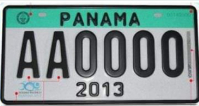

    <h2 class="section-title">{}</h2>
    <ul class="rule-list">
        <li>The official language is Spanish</li>
        <li>The domain is .pa</li>
        <li>The Google car is white and sometimes has a thick antenna</li>
        <li>License plates have a coloured band—often green or blue—along the top</li>
        <li>Yellow taxis display the city or route name on the side</li>
    </ul>
    {}
    {}

{}
{}

{}
The white Google car has a thick antenna{}. Even when the pole is not visible, the blur is usually large{}. Do not confuse it with {}{} or {}{}.
{}

<iframe src="https://www.google.com/maps/embed?pb=!4v1706662054975!6m8!1m7!1sFk8MrBC43j1quwCPtErmZA!2m2!1d7.616269920754096!2d-80.59604835540316!3f192.89858161311366!4f-1.5211878375611718!5f1.0605439775114949" width="70%" height="350" style="border:0;" allowfullscreen="" loading="lazy" referrerpolicy="no-referrer-when-downgrade"></iframe>

{}
License plates carry a coloured strip—green, blue, etc.—across the top{}{}. Private cars are only required to mount plates on the rear{}. Some plates are entirely blue or red.
{}

By <a href="//commons.wikimedia.org/w/index.php?title=User:JAVR2020&amp;amp;action=edit&amp;amp;redlink=1" class="new" title="User:JAVR2020 (page does not exist)">JAVR2020</a> - Own work, <a href="https://creativecommons.org/licenses/by-sa/4.0" title="Creative Commons Attribution-Share Alike 4.0">CC BY-SA 4.0</a>, <a href="https://commons.wikimedia.org/w/index.php?curid=112377174">Link</a>

{}

By <a href="//commons.wikimedia.org/w/index.php?title=User:Alloyblue&amp;amp;action=edit&amp;amp;redlink=1" class="new" title="User:Alloyblue (page does not exist)">Alloyblue</a> - Own work, <a href="https://creativecommons.org/licenses/by-sa/4.0" title="Creative Commons Attribution-Share Alike 4.0">CC BY-SA 4.0</a>, <a href="https://commons.wikimedia.org/w/index.php?curid=122526911">Link</a>
{}

{}
Yellow taxis display the city or route on their flanks{}.
{}

{}
{}
{}
You can find huts with thatched roofs{}.
{}

{}
{}

    <h2 class="section-title">{}</h2>
    <ul class="rule-list">
        <li>Check the plate on utility poles: a horizontal orientation means west of Panama City, vertical means east{}
            <ul>
                <li>West of Panama City{}</li>
                <li>East of Panama City{}</li>
                <li>Colón, north of Panama City, tends to have vertical plates as well{}</li>
            </ul>
        </li>
        <li>Western Panama is mountainous
            <ul>
                <li>North-west: heavy rainfall and mountains to the south{}</li>
                <li>West: slightly drier with mountains to the north{}</li>
            </ul>
        </li>
    </ul>

{}
{}

Image cropped from: By <a rel="nofollow" class="external text" href="https://www.flickr.com/people/132545975@N04">Melissa McMasters</a> from Memphis, TN, United States - <a rel="nofollow" class="external text" href="https://www.flickr.com/photos/cricketsblog/52729221354/">La Mesa, Panama</a>, <a href="https://creativecommons.org/licenses/by/2.0" title="Creative Commons Attribution 2.0">CC BY 2.0</a>, <a href="https://commons.wikimedia.org/w/index.php?curid=129314200">Link</a>

{}
{}

By <a href="//commons.wikimedia.org/wiki/User:Sadalmelik" title="User:Sadalmelik">Sadalmelik</a> - Own work, <a href="https://creativecommons.org/licenses/by-sa/3.0" title="Creative Commons Attribution-Share Alike 3.0">CC BY-SA 3.0</a>, <a href="https://commons.wikimedia.org/w/index.php?curid=2763803">Link</a>

{}
{}

{}
{}

    <h2 class="section-title">{}</h2>
    <ul class="rule-list">
        <li>The Panama Canal zone features ships and container terminals{}</li>
        <li>Around Barú Volcano near the western border you may find dark volcanic rocks{}</li>
    </ul>

{}
{}

{}
Few roads along the canal have Street View, so viewpoints with ships are limited{}.
{}

{}
{}

{}
Look for large rounded black rocks near the volcano{}—they are not numerous but stand out.
{}

{}
{}

    <h4 class="mb-4">Representative Companies</h4>
    <table class="table table-striped table-bordered">
        <thead class="table-light">
            <tr>
                <th scope="col" class="col-width-2">Company</th>
                <th scope="col" class="col-width-1">Ticker</th>
                <th scope="col" class="col-width-7">Overview</th>
                <th scope="col" class="col-width-05">IR</th>
                <th scope="col" class="col-width-05">Dividend</th>
            </tr>
        </thead>
        <tbody class="corp-desc">
            <tr>
                <td>Banco Latinoamericano de Comercio Exterior</td>
                <td>{}</td>
                <td>The first Latin American company to list on the New York Stock Exchange; available via SBI Securities.</td>
                <td>{}</td>
                <td>{}</td>
            </tr>
        </tbody>
    </table>

