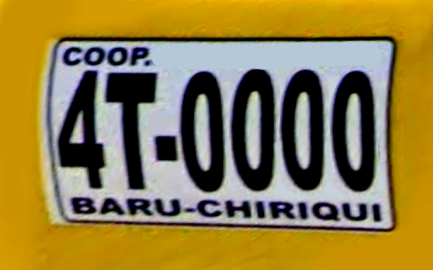
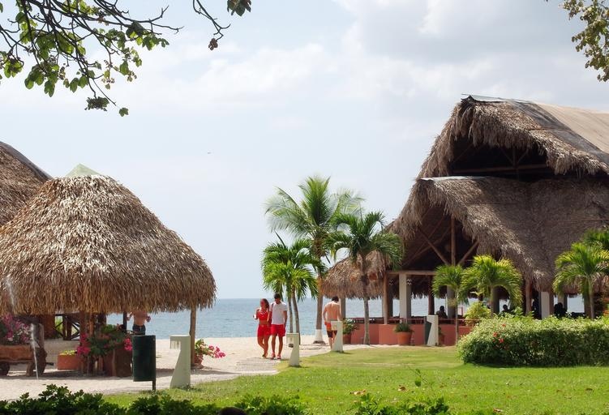
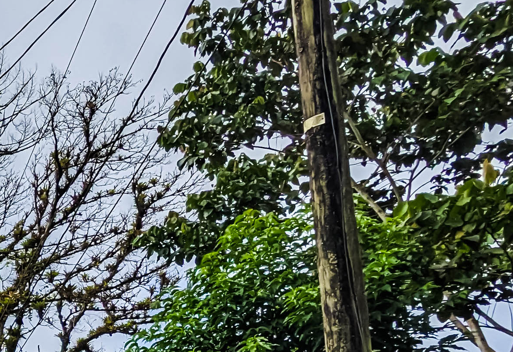
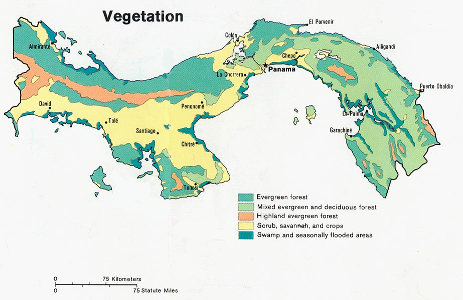

    <h2 class="section-title">{}</h2>
    <ul class="rule-list">
        <li>公用語はスペイン語</li>
        <li>ドメインは.pa</li>
        <li>白いGoogle Carが見える。太目のアンテナが付いていることがある。</li>
        <li>ナンバープレートの上部に緑や青などの色が付いている</li>
        <li>黄色のタクシーが走っていて側面に都市名やルート名が書いてある</li>
    </ul>
    {}

{}
{}

{}
白いGoogle Car。太目のアンテナが付いていることが多い{}。
{}

<iframe src="https://www.google.com/maps/embed?pb=!4v1695955162713!6m8!1m7!1s0016NeUregUkB4x_Fh0BNA!2m2!1d8.16556081065612!2d-77.69900331318206!3f118.18064581541348!4f1.573811064270302!5f0.7820865974627469" width="295" height="295" style="border:0;" allowfullscreen="" loading="lazy" referrerpolicy="no-referrer-when-downgrade"></iframe>
<iframe src="https://www.google.com/maps/embed?pb=!4v1695954874058!6m8!1m7!1seRX_cQTdoOHaOHwx5IAKIw!2m2!1d8.329075073773875!2d-80.5195868482123!3f344.05897326548825!4f-10.310925321769318!5f1.8409328819346227" width="295" height="295" style="border:0;" allowfullscreen="" loading="lazy" referrerpolicy="no-referrer-when-downgrade"></iframe>

{}
ナンバープレートの上部に緑や青などの色が付いている{}{}。一般の乗用車は後ろにのみナンバープレートの設置が義務付けられている{}。全体が青色や赤色の時もある。
{}

By <a href="//commons.wikimedia.org/w/index.php?title=User:JAVR2020&amp;amp;action=edit&amp;amp;redlink=1" class="new" title="User:JAVR2020 (page does not exist)">JAVR2020</a> - Own work, <a href="https://creativecommons.org/licenses/by-sa/4.0" title="Creative Commons Attribution-Share Alike 4.0">CC BY-SA 4.0</a>, <a href="https://commons.wikimedia.org/w/index.php?curid=112377174">Link</a>

{}

By <a href="//commons.wikimedia.org/w/index.php?title=User:Alloyblue&amp;amp;action=edit&amp;amp;redlink=1" class="new" title="User:Alloyblue (page does not exist)">Alloyblue</a> - Own work, <a href="https://creativecommons.org/licenses/by-sa/4.0" title="Creative Commons Attribution-Share Alike 4.0">CC BY-SA 4.0</a>, <a href="https://commons.wikimedia.org/w/index.php?curid=122526911">Link</a>
{}

{}
黄色いタクシーが走っている。側面に都市名やルート名が書いてある{}。
{}

{}
{}
{}
藁ぶき屋根の小屋がある{}
{}

{}
{}

    <h2 class="section-title">{}</h2>
    <ul class="rule-list">
        <li>電柱のプレートが横向きならパナマより西へ、縦向きなら東へ向かう{}
            <ul>
                <li>パナマ市より西{}</li>
                <li>パナマ市より東{}</li>
                <li>パナマ市の北のコロン市周辺{}（動画では言及されていないけれど恐らく縦が多いので注意）
            </ul>
        </li>
        <li>西側に山脈がある
            <ul>
                <li>北西：降水量が多く南側に山が見える{}
                <li>西：すこし乾燥していて北に山脈が見える{}</li>
            </ul>
        </li>
    </ul>

{}
{}

以下より切り抜き：By <a rel="nofollow" class="external text" href="https://www.flickr.com/people/132545975@N04">Melissa McMasters</a> from Memphis, TN, United States - <a rel="nofollow" class="external text" href="https://www.flickr.com/photos/cricketsblog/52729221354/">La Mesa, Panama</a>, <a href="https://creativecommons.org/licenses/by/2.0" title="Creative Commons Attribution 2.0">CC BY 2.0</a>, <a href="https://commons.wikimedia.org/w/index.php?curid=129314200">Link</a>

{}
{}

By <a href="//commons.wikimedia.org/wiki/User:Sadalmelik" title="User:Sadalmelik">Sadalmelik</a> - Own work, <a href="https://creativecommons.org/licenses/by-sa/3.0" title="Creative Commons Attribution-Share Alike 3.0">CC BY-SA 3.0</a>, <a href="https://commons.wikimedia.org/w/index.php?curid=2763803">Link</a>

{}
{}

{}
{}