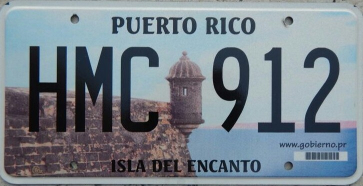

    <h2 class="section-title">{}</h2>
    <ul class="rule-list">
        <li>Domain negaranya .pr</li>
        <li>Bahasa Spanyol dan Inggris dipakai berdampingan</li>
        <li>Pelat nomor biasanya terpasang hanya di belakang</li>
        <li>Ada tiang listrik tebal berbentuk persegi</li>
        <li>Dalam citra sebelum 2023 antena Google Car berada di sisi kanan{}</li>
        <li>Nomor telepon sering diawali 787</li>
    </ul>
    {}

{}
{}
{}
Anda tidak akan menemukan mobil dengan pelat depan. Tiang persegi kadang memiliki cat warna-warni di bagian bawah{}. Pada citra 2014–2023, sisi kiri pelat tampak gelap sedangkan sisi kanan terlihat terang{}.
{}

{}

Public Domain
{}

{}
Rambu batas kecepatan memakai MPH{}, tetapi patok jarak di tepi jalan tetap dalam kilometer{}. Kemungkinan jalan utama dibuat saat era Spanyol (kilometer), lalu Amerika Serikat memperkenalkan mobil sehingga batas kecepatan ditulis dalam mil.
{}

{}
Rambu rute punya beberapa bentuk. Rambu bundar biasanya memakai nomor 100 hingga 9000-an{}{}.
{}

{}
Nomor telepon umumnya diawali 787{}.
{}

Oleh Roca Ruiz - <a rel="nofollow" class="external free" href="https://www.flickr.com/photos/roca-ruiz/6687927479/">https://www.flickr.com/photos/roca-ruiz/6687927479/</a>, <a href="https://creativecommons.org/licenses/by-sa/2.0" title="Creative Commons Attribution-Share Alike 2.0">CC BY-SA 2.0</a>, <a href="https://commons.wikimedia.org/w/index.php?curid=30928121">Link</a>

{}
{}
{}
Antena Google Car berada di sisi kanan{}. Guam dan Kepulauan Mariana Utara juga memiliki antena, jadi perhatikan detail lainnya.
{}

<iframe src="https://www.google.com/maps/embed?pb=!4v1681073805681!6m8!1m7!1sSXC3NjR1gmB4s-EnHU-z3w!2m2!1d18.29687656679984!2d-66.04911133718261!3f79.01839543384352!4f-24.831690071108028!5f2.912250869756515" width="295" height="295" style="border:0;" allowfullscreen="" loading="lazy" referrerpolicy="no-referrer-when-downgrade"></iframe>

{}
{}
