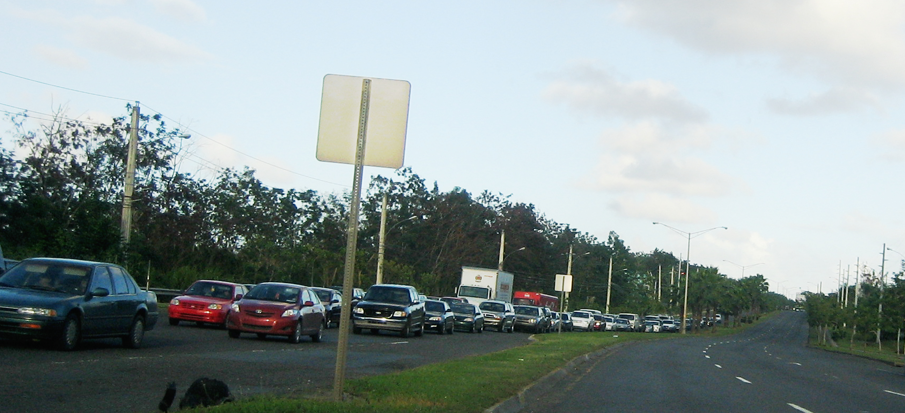
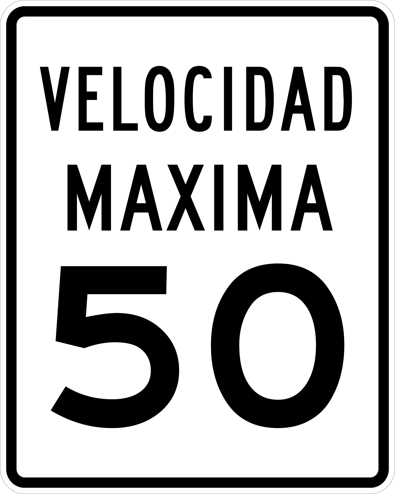
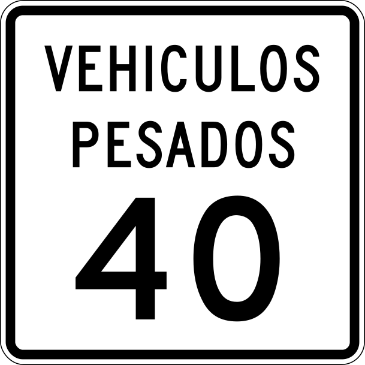
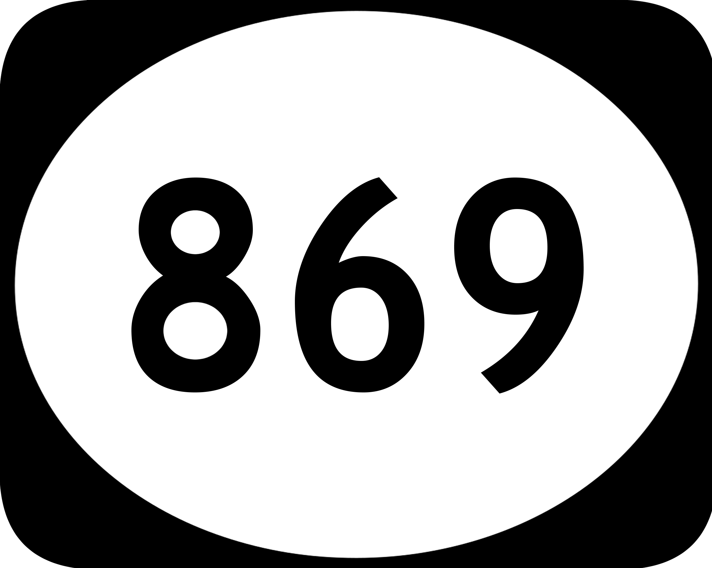
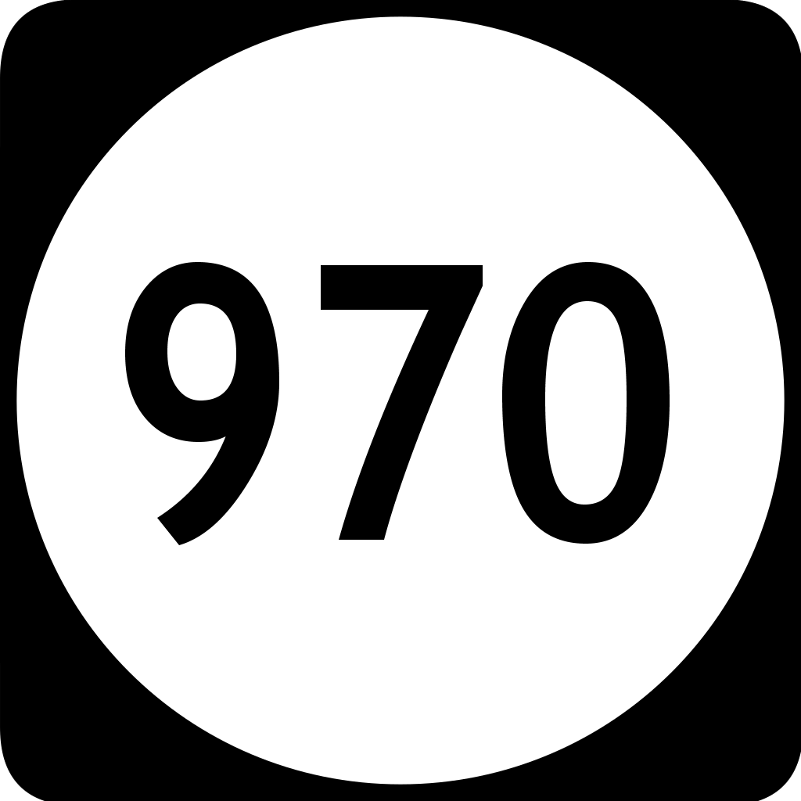

    <h2 class="section-title">{}</h2>
    <ul class="rule-list">
        <li>ドメインは.pr</li>
        <li>言語はスペイン語と英語が使用される</li>
        <li>車のナンバープレートが付いているのは後ろだけ</li>
        <li>太目の四角の電柱がある</li>
        <li>GoogleCarのアンテナが右側の方にある{}</li>
    </ul>
    {}

{}
{}
{}
ナンバープレートが前に付いていない車しかない。四角の電柱があり、下の方に色が付いていることもある{}。
{}

{}
速度上限の看板が特徴的
{}

{}
高速道路の看板が数種類あり、特に〇の形の看板は基本的に100番～9999番の間で数が大きい{}{}。
{}

{}
{}
{}
GoogleCarのアンテナが右側の方にある{}。アンテナはグアムや北マリアナ諸島にもあるので注意。
{}

<iframe src="https://www.google.com/maps/embed?pb=!4v1681073805681!6m8!1m7!1sSXC3NjR1gmB4s-EnHU-z3w!2m2!1d18.29687656679984!2d-66.04911133718261!3f79.01839543384352!4f-24.831690071108028!5f2.912250869756515" width="295" height="295" style="border:0;" allowfullscreen="" loading="lazy" referrerpolicy="no-referrer-when-downgrade"></iframe>

{}
{}
