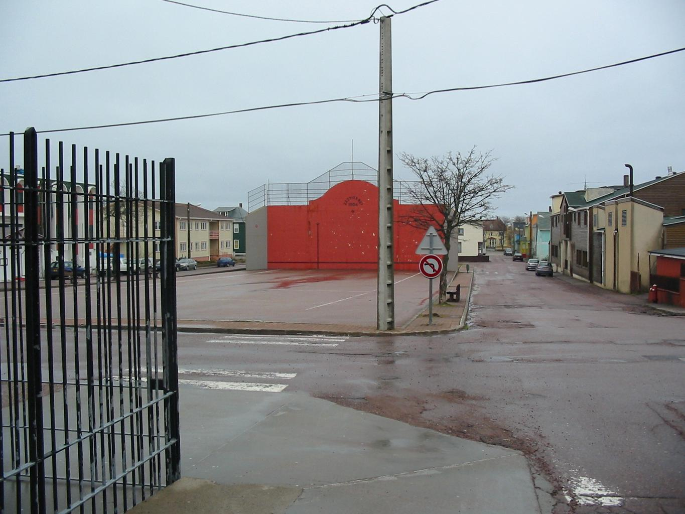

    <h2 class="section-title">{}</h2>
    <ul class="rule-list">
        <li>The country domain is .pm.</li>
        <li>The Google car has a distinctive appearance.</li>
        <li class="no-evidence">Road surfaces often look stained red across the island.</li>
    </ul>

{}
{}

{}
French-style utility poles, tricolour flags, colourful houses, and flat terrain {}. When the scene feels like {} yet also carries a {} atmosphere, it is likely these islands. Roads may appear broadly reddish {}.
{}

{}The Google car is very recognizable{}{}

No image available.

{}
{}
