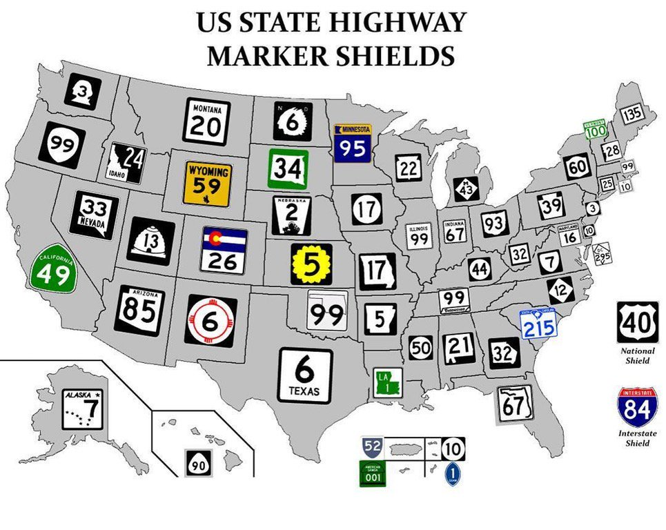
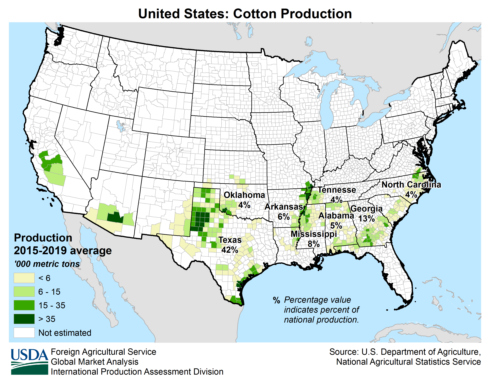

    <h2 class="section-title">{}</h2>
    <ul class="rule-list">
        <li>Blue post</li>
        <li>Speed limit signs are SPEED LIMIT.</li>
        <li>Often there is a row of trash cans in front of the house. There is even a "WM", the logo of Waste Management, a major garbage disposal company in the United States.</li>
        <li>If the reverse ▽ sign (Yield the Road) sign says YIELD, it is USA, if not, it is Canada.</li>
    </ul>
    {}

{}
{}
{}
Blue post
{}

<iframe src="https://www.google.com/maps/embed?pb=!4v1681568495995!6m8!1m7!1sPmW10yn8ltoYli893GEBDg!2m2!1d40.74137574620001!2d-73.98973810768969!3f342.68093605072727!4f-11.19950492023132!5f3.325193203789971" width="295" height="295" style="border:0;" allowfullscreen="" loading="lazy" referrerpolicy="no-referrer-when-downgrade"></iframe>

{}
There are many large companies based in the United States. Companies like Waste management, Electric Power, and Water Authority are also publicly traded and have signs and logos all over town.
{}

<iframe src="https://www.google.com/maps/embed?pb=!4v1679500169876!6m8!1m7!1sPZq6sgqnfJR05EFwokhvdw!2m2!1d35.03033535580299!2d-110.7120324141037!3f240.45588519171642!4f-10.845926098660556!5f3.3031406727473978" width="295" height="295" style="border:0;" allowfullscreen="" loading="lazy" referrerpolicy="no-referrer-when-downgrade"></iframe>
<iframe src="https://www.google.com/maps/embed?pb=!4v1681568462715!6m8!1m7!1sPKqMbO7lDtKE9PGHUs_XSw!2m2!1d40.74214014071776!2d-73.99103169731926!3f268.2398095804339!4f7.099516766554316!5f3.325193203789971" width="295" height="295" style="border:0;" allowfullscreen="" loading="lazy" referrerpolicy="no-referrer-when-downgrade"></iframe>
<iframe src="https://www.google.com/maps/embed?pb=!4v1680483536123!6m8!1m7!1sCWzP34xaWEWdoxezFQ0_Ig!2m2!1d38.50743521268857!2d-90.32915889749124!3f36.354531633365504!4f-7.775544757794904!5f3.325193203789971" width="295" height="295" style="border:0;" allowfullscreen="" loading="lazy" referrerpolicy="no-referrer-when-downgrade"></iframe>
<iframe src="https://www.google.com/maps/embed?pb=!4v1681256541373!6m8!1m7!1sj09-kZVbz0dQ5mpPGgQf-w!2m2!1d39.71647180511258!2d-104.8225030302597!3f129.1590060215013!4f19.60124204073361!5f3.304990000730533" width="295" height="295" style="border:0;" allowfullscreen="" loading="lazy" referrerpolicy="no-referrer-when-downgrade"></iframe>

{}
{}

    <h2 class="section-title">{}</h2>
    <ul class="rule-list">
        <li class="important-rule">① Maybe you can narrow down the state by whether the license plate is on the front or not and the color of the license plate<a href="https://docs.google.com/spreadsheets/d/1P7LRYb13phYIYWlu4KSXxTosMGV44tHFU_EgqQvEXVQ/edit#gid=0">[Materials]</a>{}.
            <ul>
                <li class="no-evidence">Are most license plates in states with "new" yellow?{}</li>
            </ul>
        </li>
        <li>② Post office buildings often have the state and city name on the wall.</li>
        <li>③ Once you find the Interstate and State Highway signs, you can narrow down your location.
            <ul>
                <li class="important-rule">States can often be identified by their state highway signs. In some states, the shape of the state is the shape of the sign.</li>
                <li>Interstate highways (signs in blue with red hats) with even-numbered roads extending east-west and odd-numbered roads extending north-south, with the northeast having larger numbers.</li>
                <li>The highway exits are numbered, such as "Exit 1," and can be seen by zooming in.</li>
            </ul>
        </li>
    </ul>

{}
{}
{}
First, remember the areas that do not require a license plate on the front of the car (yellow areas), then remember the color of the license plate（Image source：By Raccoonny - Own work, CC BY-SA 4.0, <a href="https://commons.wikimedia.org/w/index.php?curid=122568316">Wikimedia Commons</a>）.
{}

{}
{}
{}
{}

<iframe src="https://www.google.com/maps/embed?pb=!4v1681687672403!6m8!1m7!1sr2fYXxuXlaBALYa-378jPA!2m2!1d37.68900621611955!2d-97.13520247827725!3f272.14006136701346!4f3.8147606970918275!5f3.325193203789971" width="590" height="300" style="border:0;" allowfullscreen="" loading="lazy" referrerpolicy="no-referrer-when-downgrade"></iframe>

{}
{}

Apparently the following rules do not apply to 100% of all.
<ul class="rule-list">
    <li>United States numbered highways
        <ul>
            <li>North-south highways are oddly numbered, with higher numbers from east to west.</li>
            <li>East-west highways are even and numbered from north to south.</li>
        </ul>
    </li>
    <li>Dwight David Eisenhower National System of Interstate and Defense Highways
        <ul>
            <li class="no-evidence">North-south highways are oddly numbered, with lower numbers from east to west.</li>
            <li class="no-evidence">East-west highways are even, with lower numbers from north to south.</li>
        </ul>
    </li>
</ul>

{}

{}
{}
{}
{}

<iframe width="590" height="335" src="https://www.youtube.com/embed/Q_KB4MP_HZo" title="YouTube video player" frameborder="0" allow="accelerometer; autoplay; clipboard-write; encrypted-media; gyroscope; picture-in-picture; web-share" allowfullscreen></iframe>

{}
{}

    <h2 class="section-title">Agricultural Distribution</h2>
    <ul class="rule-list">
        <li>Data Source：<a href="https://www.usda.gov/policies-and-links">U.S. Department of Agriculture</a></li>
    </ul>

{}
{}

{}
Corn production flourishes along the corn belt{}.
However, corn is widely produced throughout the U.S., so the mere fact that a cornfield was found would not be enough to determine that it is in the central part of the country.
{}

<iframe src="https://www.google.com/maps/embed?pb=!4v1682733134448!6m8!1m7!1sdy4W4vPozx8ohCgjQeTPZw!2m2!1d41.176852598073!2d-87.79877689286823!3f271.2171390393599!4f-5.1519386637587985!5f1.5047631167738094" width="590" height="300" style="border:0;" allowfullscreen="" loading="lazy" referrerpolicy="no-referrer-when-downgrade"></iframe>

{}
{}

{}
Soybeans are also distributed similarly to corn{}.
{}

{}
{}

{}
Most of the rice fields are in certain areas of California and along the river to the coast in Arkansas{}. If it is in California, from the clues on the utility poles, it should be possible to determine that it is in California.
{}

<iframe src="https://www.google.com/maps/embed?pb=!4v1682733490202!6m8!1m7!1s4A3IkVME8LVYpuCXg-OuaA!2m2!1d39.49365609048166!2d-121.7822379196536!3f221.79363223039482!4f-5.790068187062502!5f3.2786393840952575" width="295" height="295" style="border:0;" allowfullscreen="" loading="lazy" referrerpolicy="no-referrer-when-downgrade"></iframe>
<iframe src="https://www.google.com/maps/embed?pb=!4v1682734884108!6m8!1m7!1sMEXmr5wqageIfPuhj8E0iw!2m2!1d35.79319395387087!2d-89.8386351406563!3f121.71333783003216!4f-3.589889380682493!5f3.325193203789971" width="295" height="295" style="border:0;" allowfullscreen="" loading="lazy" referrerpolicy="no-referrer-when-downgrade"></iframe>

{}
{}

{}
No sign of cotton, but white cotton may have fallen by the roadside.{}？
{}

<iframe src="https://www.google.com/maps/embed?pb=!4v1682735996734!6m8!1m7!1sEoQ6csXiM6a72t-5Lb5-Og!2m2!1d33.46990965072755!2d-101.818398460253!3f197.95125231968635!4f-20.326037687398497!5f3.1477169517970793" width="295" height="295" style="border:0;" allowfullscreen="" loading="lazy" referrerpolicy="no-referrer-when-downgrade"></iframe>
<iframe src="https://www.google.com/maps/embed?pb=!4v1682736049473!6m8!1m7!1sOI7-S9mUEoFcMKBxHPuW9Q!2m2!1d33.61479697415089!2d-101.6134666971198!3f236.01923132521446!4f-12.615322855656387!5f2.9290789356164444" width="295" height="295" style="border:0;" allowfullscreen="" loading="lazy" referrerpolicy="no-referrer-when-downgrade"></iframe>

{}
{}

{}
Specific areas around Florida{}.
{}

<iframe src="https://www.google.com/maps/embed?pb=!4v1682736662963!6m8!1m7!1sCmGChqhfRZwxQ5vtqkL7ZQ!2m2!1d26.54856124221731!2d-80.91671755371033!3f91.42825537003402!4f-5.256725945766988!5f2.7989670233367177" width="590" height="300" style="border:0;" allowfullscreen="" loading="lazy" referrerpolicy="no-referrer-when-downgrade"></iframe>

{}
{}

{}
There is no overlap of areas with corn or soybeans.
{}

{}
{}

    <h2 class="section-title">Further detailed tips</h2>
    <ul class="rule-list">
        <li>Sometimes the name of the state or city is written on the trash can.</li>
        <li>The type of signal could narrow down the state.[<a href="https://docs.google.com/spreadsheets/d/1nNwxiXr1L0NnZWrK5NDbccorawjq_ObjhNpYwySF-M8/edit#gid=2027359894">document</a>]{}</li>
    </ul>

