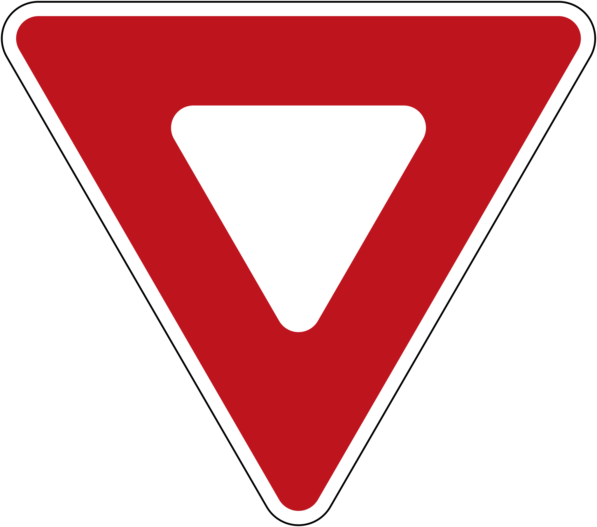
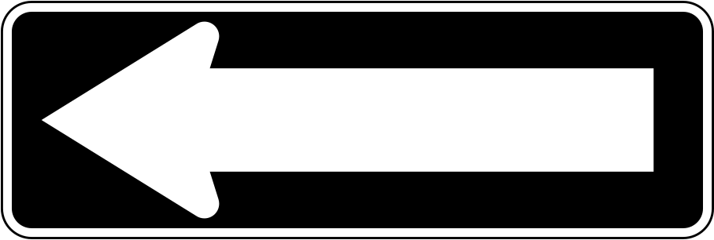
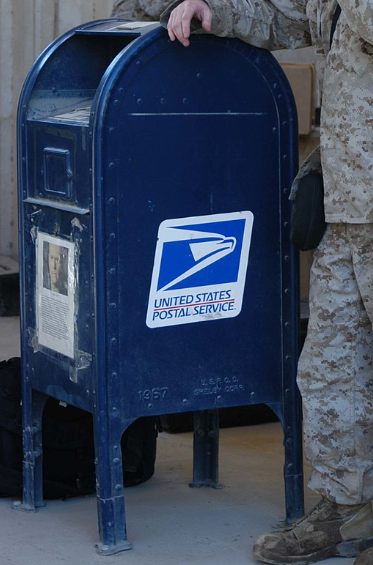
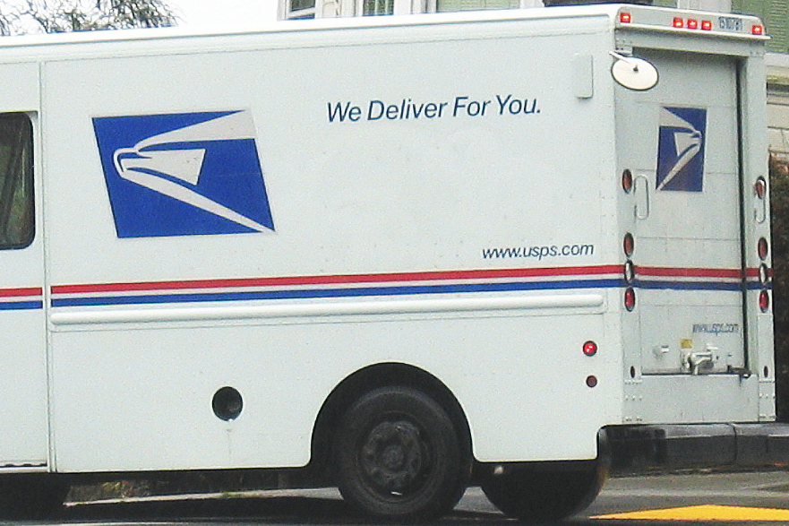
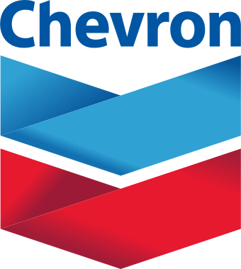
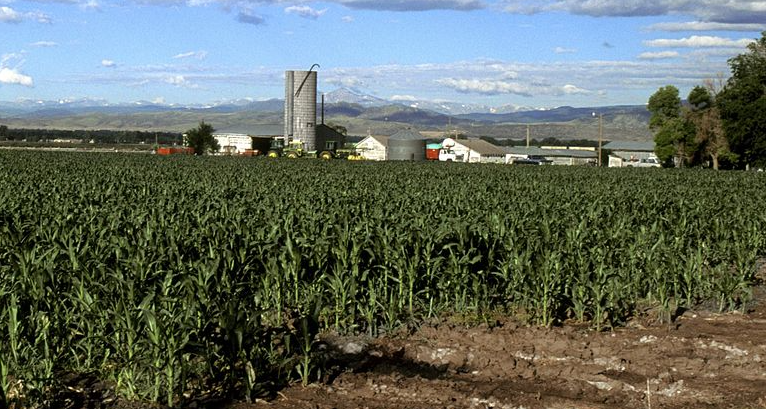
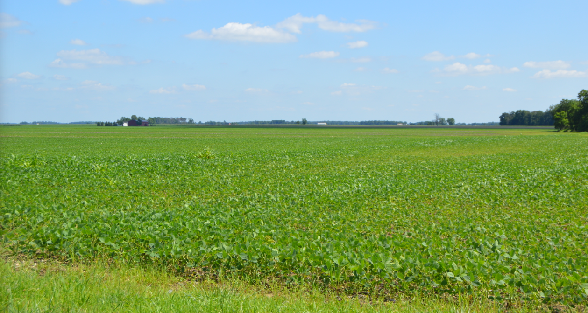
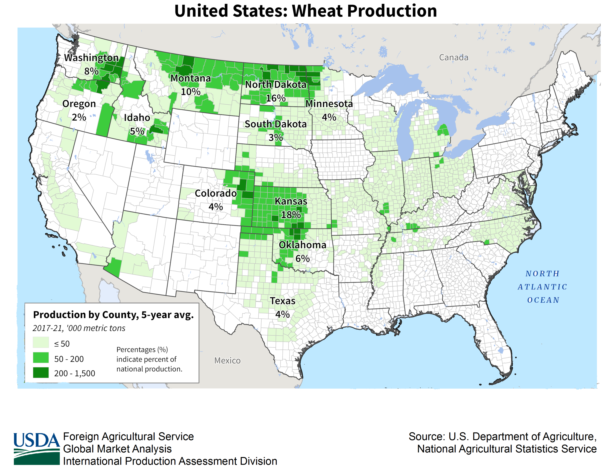
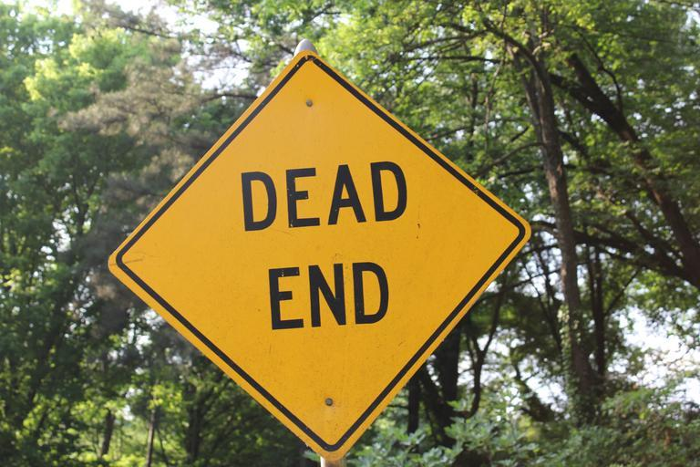
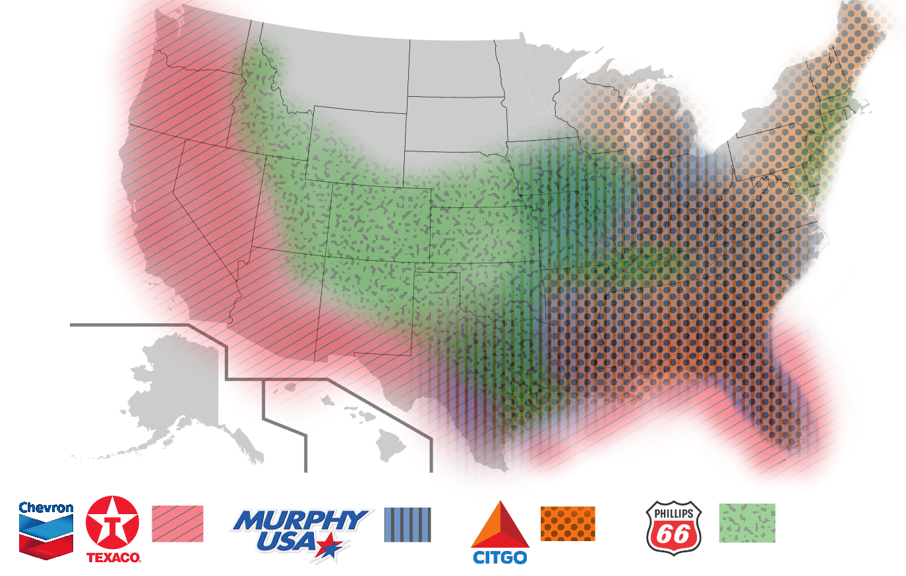

    <h2 class="section-title">{}</h2>
    <ul class="rule-list">
        <li>Las esquinas suelen tener buzones azules.</li>
        <li>Las señales de velocidad muestran la leyenda SPEED LIMIT.</li>
        <li>Un triángulo invertido con la palabra YIELD indica Estados Unidos; si el texto falta, normalmente será Canadá.</li>
        <li>En Estados Unidos y Canadá la línea central suele ser una doble franja amarilla.</li>
        <li>Es habitual ver hileras de contenedores de basura frente a las casas.</li>
        <li>El límite de velocidad puede aparecer en MPH.</li>
    </ul>
    {}
    {}

{}
{}
{}Las señales de velocidad dicen SPEED LIMIT{}. Si sólo aparece la palabra SPEED, probablemente estés en el estado de Oregón. {} utiliza la palabra MAXIMUM.{}

{}
Tanto Estados Unidos como {} usan con frecuencia la doble línea amarilla como línea central{}.
{}

{}Las señales YIELD y ONEWAY en Estados Unidos incluyen texto{}. En la imagen izquierda se ve el modelo estadounidense; a la derecha, el canadiense.{}

{}
Localiza el buzón azul; en Canadá es rojo. Si encuentras una oficina de correos, revisa la fachada: a menudo indica el estado y la ciudad.
{}

{}
Muchas empresas de gran tamaño tienen sede en Estados Unidos. Incluso servicios como recogida de residuos, electricidad o agua son cotizados, por lo que sus logotipos aparecen por todas partes. De izquierda a derecha: Waste Management y Republic Services (gestión de residuos; sus logotipos figuran en los contenedores), Chevron y Citgo (gasolineras), Target (retail), entre otros.
{}

{}
{}

    <h2>Productos relacionados con EE. UU.</h2>
    

        
    

    <h2 class="section-title">{}</h2>
    <h4 class="section-title">Islas vinculadas a Estados Unidos</h4>
    <ul class="rule-list">
        <li>Estados Unidos administra o mantiene vínculos con varias islas alejadas del continente.
            <ul>
                <li>{}</li>
                <li>{}</li>
                <li>{}</li>
                <li>{}</li>
                <li>{}</li>
                <li>{} (territorio no incorporado con autogobierno)</li>
            </ul>
        </li>
    </ul>
    <h4 class="section-title">Pistas específicas por estado</h4>
    <ul class="rule-list">
        <li>{}</li>
        <li>{}</li>
        <li>{}</li>
        <li>{}</li>
    </ul>
    <h4 class="section-title">Cómo afinar el estado</h4>
    
Determina primero si estás en una isla y luego observa las matrículas, los escudos de las carreteras estatales, el relieve y la vegetación, si el terreno es plano, y el estilo de los barrios. Algunos estados ofrecen pistas muy distintivas.

    <ul class="rule-list">
        <li>① Ver si los vehículos llevan matrícula delantera y conocer sus colores ayuda a limitar el estado<a href="https://docs.google.com/spreadsheets/d/1P7LRYb13phYIYWlu4KSXxTosMGV44tHFU_EgqQvEXVQ/edit#gid=0">[Referencia]</a>{}. Empieza memorizando dónde es obligatoria la placa frontal.
            <ul>
                <li><a href="https://en.wikipedia.org/wiki/United_States_license_plate_designs_and_serial_formats">Listado de matrículas de EE. UU. (Wikipedia)</a></li>
                <li class="no-evidence">Las placas con “new” suelen verse amarillentas{}.</li>
                <li>Colores característicos por estado
                    <ul>
                        <li>Predominio negro → Delaware</li>
                        <li>Predominio verde → Vermont</li>
                        <li>Naranja intenso → Nueva York</li>
                        <li>Totalmente amarilla → Alaska</li>
                        <li>Amarillo pálido total o en ambos lados → Misisipi</li>
                        <li>Fondo blanco con panel naranja a la derecha → Utah</li>
                        <li>Fondo blanco con una naranja en el centro → Florida / Georgia</li>
                        <li>Fondo blanco con un árbol verde en el centro → Oregón</li>
                        <li>Fondo blanco con franja roja arriba → Ohio</li>
                        <li>Fondo blanco con franja celeste superior → Minnesota / Montana / Iowa</li>
                        <li>Arriba azul, abajo amarillo → Pensilvania</li>
                        <li>Arriba rojizo y abajo azul → Idaho</li>
                        <li>Toque rojizo arriba y números en azul marino → California</li>
                        <li>Mitad superior azul intensa y mitad inferior blanca → Connecticut; Illinois puede verse parecida.</li>
                        <li>Superior blanca e inferior azul pálido → Kentucky</li>
                        <li class="no-evidence">Superior amarillenta e inferior azul claro → ¿Washington?</li>
                        <li>Matrícula frontal con arcoíris → Hawái</li>
                    </ul>
                </li>
            </ul>
        </li>
        <li>② Ubicar los escudos de las interestatales o de las carreteras estatales ayuda a precisar la posición.
            <ul>
                <li>Los escudos estatales suelen delatar el estado; en algunos casos la silueta coincide con el mapa.</li>
                <li>Las interestatales (señal azul con “sombrero” rojo) usan números pares para rutas este–oeste e impares para norte–sur; los valores crecen hacia el noreste.</li>
                <li>Las salidas están numeradas (“Exit 1”, etc.) y se distinguen al hacer zoom.</li>
            </ul>
        </li>
        <li>③ Las islas hawaianas también tienen Street View y su suelo se ve oscuro o rojizo{}</li>
    </ul>

{}
{}
{}
Memoriza primero los estados que no obligan a llevar placa delantera (en amarillo) y después los colores. La iluminación y el ángulo pueden variar el tono, así que requiere práctica. Recuerda que los coches se mueven, por lo que la matrícula no asegura al 100% el estado.
{}

Por Raccoonny – obra propia, <a href="https://creativecommons.org/licenses/by-sa/4.0/deed.ja">CC BY-SA 4.0</a>, <a href="https://commons.wikimedia.org/w/index.php?curid=122568316">Wikimedia Commons</a>

<blockquote class="reddit-embed-bq" style="height:500px" data-embed-height="500">      <a href="https://www.reddit.com/r/geoguessr/comments/kop8sr/theyre_blurred_but_the_colors_might_be_helpful/">They’re blurred but the colors might be helpful</a>  by      <a href="https://www.reddit.com/user/untoasted-bread69">u/untoasted-bread69</a> in      <a href="https://www.reddit.com/r/geoguessr/">geoguessr</a>    </blockquote>

{}
{}

Las reglas siguientes no se cumplen al 100%, pero orientan bastante.
<ul class="rule-list">
    <li>United States numbered highways
        <ul>
            <li>Las rutas norte–sur llevan números impares que aumentan de este a oeste.</li>
            <li>Las rutas este–oeste llevan números pares que aumentan de norte a sur.</li>
        </ul>
    </li>
    <li>Sistema interestatal Dwight D. Eisenhower
        <ul>
            <li class="no-evidence">Las interestatales norte–sur usan números impares que disminuyen al desplazarse hacia el oeste.</li>
            <li class="no-evidence">Las interestatales este–oeste usan números pares que disminuyen al desplazarse hacia el sur.</li>
        </ul>
    </li>
</ul>

{}

{}
{}
{}
Los nombres propios son muy distintivos y el suelo suele verse oscuro o rojizo.
{}

<iframe src="https://www.google.com/maps/embed?pb=!4v1691858062776!6m8!1m7!1sPYugKXOVUcX1-hJy4TZ5tg!2m2!1d20.24482224228152!2d-155.8840741655078!3f-5.088449531737773!4f-3.270031217481801!5f0.4000000000000002"width="295" height="295" style="border:0;" allowfullscreen="" loading="lazy" referrerpolicy="no-referrer-when-downgrade"></iframe>

{}
{}

    <h4 class="section-title">Distribución agrícola</h4>
    <ul class="rule-list">
        <li>Si ves maíz, es más prudente buscar en la franja central-oriental.</li>
        <li>Los arrozales con bandas amarillas en los postes suelen estar en el norte de California; sin banda se ubican a lo largo del Misisipi.</li>
        <li>Fuente de datos: <a href="https://www.usda.gov/policies-and-links">U.S. Department of Agriculture</a></li>
    </ul>

{}
{}

{}
La producción sigue el “Corn Belt”{}, aunque el maíz se cultiva en casi todo el país; no asegura que estés en el Midwest.
{}

{}
{}

{}
La soja presenta un patrón similar al del maíz{}.
{}

{}
{}

{}
Los arrozales se concentran en zonas concretas del norte de California y a lo largo del río Misisipi y la costa de Arkansas{}.
{}

{}
La caña de azúcar aparece sólo en focos concretos de Florida; en Luisiana casi no hay carreteras que crucen los cultivos{}.
{}

<iframe src="https://www.google.com/maps/embed?pb=!4v1682736662963!6m8!1m7!1sCmGChqhfRZwxQ5vtqkL7ZQ!2m2!1d26.54856124221731!2d-80.91671755371033!3f91.42825537003402!4f-5.256725945766988!5f2.7989670233367177" width="590" height="300" style="border:0;" allowfullscreen="" loading="lazy" referrerpolicy="no-referrer-when-downgrade"></iframe>

{}
{}

{}
El trigo no coincide del todo con las zonas de maíz y soja. Los mapas se ajustaron para compartir escala y colores.
{}

{}
{}

    <h4 class="section-title">Otras pistas</h4>
    <ul class="rule-list">
        <li>Si apareces en un barrio enmarañado, evita entrar en calles donde veas la parte trasera de una señal STOP: significa que vas hacia una calle menor. Cuando veas la parte frontal avanzarás hacia una vía principal{}
            <ul>
                <li>{} Salvo al suroeste, en todas las direcciones ves la parte trasera de un STOP o un aviso “NO OUTLET”. Avanza hacia el suroeste y enseguida verás el frontal del STOP orientado al este, que te guía hacia una vía mayor.</li>
            </ul>
        </li>
        <li class="no-evidence">Las cadenas de gasolineras tienen áreas de influencia distintas{}
            <ul>
                <li>Chevron → Estados del golfo de México o costa oeste</li>
                <li>Citgo → Estados orientales</li>
                <li>Phillips 66 → Estados interiores</li>
                <li>Murphy USA → Estados orientales</li>
                <li>Texaco → Estados del golfo o costa oeste</li>
            </ul>
        </li>
        <li class="no-evidence">Los adhesivos de inspección de los coches pueden indicar el estado.</li>
    </ul>

{}
{}
{}
Las señales STOP suelen colocarse donde una calle estrecha desemboca en una más amplia. Ver la parte trasera implica que entras a una calle menor; ver la parte frontal indica que accedes a una vía principal.
{}

{}
Evita las calles marcadas con NO OUTLET o DEAD END.
{}

{}
{}
{}
Mapa dibujado a mano: úsalo sólo como guía aproximada.
{}

{}
{}
{}
Algunos estados se reconocen por el adhesivo de inspección en el parabrisas.
{}

<iframe src="https://www.google.com/maps/embed?pb=!4v1686697089977!6m8!1m7!1scNsmawQmXIHwhM2LgvJ8Sw!2m2!1d29.77205520001398!2d-95.85548442263284!3f213.64170150512496!4f-24.867341361566673!5f3.325193203789971" width="295" height="295" style="border:0;" allowfullscreen="" loading="lazy" referrerpolicy="no-referrer-when-downgrade"></iframe>

{}
{}

    <h4 class="mb-4">Empresas representativas</h4>
    <table class="table table-striped table-bordered">
        <thead class="table-light">
            <tr>
                <th scope="col" class="col-width-2">Empresa</th>
                <th scope="col" class="col-width-1">Ticker</th>
                <th scope="col" class="col-width-7">Descripción</th>
                <th scope="col" class="col-width-05">IR</th>
                <th scope="col" class="col-width-05">Historial de dividendos</th>
            </tr>
        </thead>
        <tbody class="corp-desc">
            <tr>
                <td>Waste Management</td>
                <td>{}</td>
                <td>Gigante de la gestión de residuos con operaciones en Estados Unidos, Canadá y Puerto Rico. Junto con Republic Services trata cerca de la mitad de la basura del país.</td>
                <td>{}</td>
                <td>{}</td>
            </tr>
            <tr>
                <td>NextEra Energy</td>
                <td>{}</td>
                <td>Referente mundial en energías renovables; lidera la generación con viento y sol.</td>
                <td>{}</td>
                <td>{}</td>
            </tr>
            <tr>
                <td>Exxon Mobil</td>
                <td>{}</td>
                <td>Una de las “supermajors” del sector petrolero internacional{{% ref "https://ja.wikipedia.org/wiki/%E5%9B%BD%E9%9A%9B%E7%9F%B3%E6%B2%B9%E8%B3%87%E6%9C%AC" "International petroleum majors" %}}.</td>
                <td>{}</td>
                <td>{}</td>
            </tr>
            <tr>
                <td>NVIDIA</td>
                <td>{}</td>
                <td>-</td>
                <td>{}</td>
                <td>{}</td>
            </tr>
            <tr>
                <td>Microsoft</td>
                <td>{}</td>
                <td>-</td>
                <td>{}</td>
                <td>{}</td>
            </tr>
            <tr>
                <td>S&amp;P Global</td>
                <td>{}</td>
                <td>Gestora del S&amp;P 500 y del Dow Jones Industrial Average, índices muy conocidos en Japón.</td>
                <td>{}</td>
                <td>{}</td>
            </tr>
            <tr>
                <td>FactSet Research Systems</td>
                <td>{}</td>
                <td>Proveedor de datos y software financiero. Publica informes en {}.</td>
                <td>{}</td>
                <td>{}</td>
            </tr>
        </tbody>
    </table>

