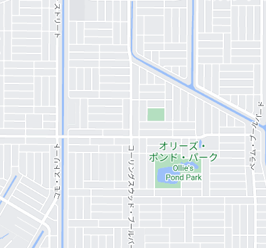

    <h2 class="section-title">国の見分け方</h2>
    <ul class="rule-list">
        <li>速度制限の看板がSPEED LIMIT</li>
        <li>ナンバープレートが前後に付いているかどうかで地域を絞り込める</li>
        <li>WM＝アメリカのゴミ収集の大手、Waste Management</li>
    </ul>

<iframe src="https://www.google.com/maps/embed?pb=!4v1679240727926!6m8!1m7!1s6uwzeZk5P3pMHUYe6pLISg!2m2!1d40.75495885181875!2d-73.87389526231001!3f351.5654380718625!4f-13.358760228294258!5f3.325193203789971" width="295" height="295" style="border:0;" allowfullscreen="" loading="lazy" referrerpolicy="no-referrer-when-downgrade"></iframe>
<iframe src="https://www.google.com/maps/embed?pb=!4v1679500169876!6m8!1m7!1sPZq6sgqnfJR05EFwokhvdw!2m2!1d35.03033535580299!2d-110.7120324141037!3f240.45588519171642!4f-10.845926098660556!5f3.3031406727473978" width="295" height="295" style="border:0;" allowfullscreen="" loading="lazy" referrerpolicy="no-referrer-when-downgrade"></iframe>
<iframe src="https://www.google.com/maps/embed?pb=!4v1679759574224!6m8!1m7!1sMgccsmgA_tiWCtZqR0joxA!2m2!1d47.14515154633965!2d-96.96744816500318!3f304.32657977828984!4f21.139234878225608!5f0.4000000000000002" width="295" height="295" style="border:0;" allowfullscreen="" loading="lazy" referrerpolicy="no-referrer-when-downgrade"></iframe>
<iframe src="https://www.google.com/maps/embed?pb=!4v1679914196265!6m8!1m7!1ssU7DqHbhwtMlINIkQnqQKg!2m2!1d38.41807861902515!2d-78.81779455870951!3f298.17731970216175!4f-2.153473723218184!5f3.325193203789971" width="295" height="295" style="border:0;" allowfullscreen="" loading="lazy" referrerpolicy="no-referrer-when-downgrade"></iframe>
<iframe src="https://www.google.com/maps/embed?pb=!4v1680483536123!6m8!1m7!1sCWzP34xaWEWdoxezFQ0_Ig!2m2!1d38.50743521268857!2d-90.32915889749124!3f36.354531633365504!4f-7.775544757794904!5f3.325193203789971" width="295" height="295" style="border:0;" allowfullscreen="" loading="lazy" referrerpolicy="no-referrer-when-downgrade"></iframe>

    <h2 class="section-title">州・地域の見分け方</h2>
    <ul class="rule-list">
        <li>ゴミ箱に州や都市の名前が書いてあることがある、特定の地域のみ事業を展開するゴミ収集業者もある。</li>
        <li>州道の看板が州の形になっていることがある</li>
        <li>州間高速道路（青色に赤い帽子を被った看板）は偶数番号の道路が東西に、奇数番号の道路は南北に伸びる。北東ほど数字が大きくなる、詳細は以下の説明参照。</li>
        <li>信号の種類で州が絞り込めるかも[<a href="https://docs.google.com/spreadsheets/d/1nNwxiXr1L0NnZWrK5NDbccorawjq_ObjhNpYwySF-M8/edit#gid=2027359894">資料</a>]{}</li>
        <li><a href="https://docs.google.com/spreadsheets/d/1P7LRYb13phYIYWlu4KSXxTosMGV44tHFU_EgqQvEXVQ/edit#gid=0">ナンバープレートの色で州を特定できる</a>かも{}</li>
    </ul>

<iframe src="https://www.google.com/maps/embed?pb=!4v1679762320637!6m8!1m7!1sD_vuBnf1eXK2ociRaPvGdg!2m2!1d32.76808624646466!2d-96.88407318209809!3f258.20358936447144!4f5.877351283916468!5f3.325193203789971" width="295" height="295" style="border:0;" allowfullscreen="" loading="lazy" referrerpolicy="no-referrer-when-downgrade"></iframe>

以下のルールは100％すべてに当てはまるわけではないらしい。
<ul class="rule-list">
    <li>アメリカ国道（United States numbered highways）
        <ul>
            <li>南北の高速道路は奇数であり、東から西に向かって番号が高くなる</li>
            <li>東西の高速道路は偶数であり、北から南に向かって番号が高くなる</li>
        </ul>
    </li>
    <li>州間高速道路（Dwight David Eisenhower National System of Interstate and Defense Highways）
        <ul>
            <li class="no-evidence">南北の高速道路は奇数であり、東から西に向かって番号が低くなる</li>
            <li class="no-evidence">東西の高速道路は偶数であり、北から南に向かって番号が低くなる</li>
        </ul>
    </li>
</ul>

{}

    <h2 class="section-title">都市・町の見分け方</h2>
    <ul class="rule-list">
    </ul>

    <h2 class="section-title">その他のルール</h2>
    <ul class="rule-list">
        <li>分譲住宅が等間隔に並んでいる場所は、地図上で区画整備された綺麗な地域</li>
    </ul>

<iframe src="https://www.google.com/maps/embed?pb=!4v1680188369521!6m8!1m7!1scS9Z9KMVw4v5g90tFC2Rng!2m2!1d27.06095681344647!2d-82.11647580019648!3f0.4410233468744309!4f-9.147972996849418!5f0.4000000000000002" width="295" height="295" style="border:0;" allowfullscreen="" loading="lazy" referrerpolicy="no-referrer-when-downgrade"></iframe>

