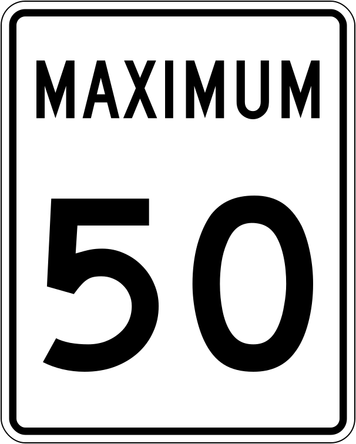

    <h2 class="section-title">{}</h2>
    <ul class="rule-list">
        <li>青いポストがある</li>
        <li>速度制限の看板がSPEED LIMIT</li>
        <li>逆▽の看板標識にYIELDと書いてあればアメリカ・書いてないならばカナダになる</li>
        <li>家の前にゴミ箱が並んでいることが多い。アメリカのゴミ収集の大手Waste Managementのロゴである『WM』があることも。</li>
    </ul>
    {}

{}
{}
{}速度制限の表記はSPEED LIMIT。ただしSPEEDしか書かれていないときはオレゴン州。{}はMAXIMUM。
{}

{}
青いポスト
{}

<iframe src="https://www.google.com/maps/embed?pb=!4v1681568495995!6m8!1m7!1sPmW10yn8ltoYli893GEBDg!2m2!1d40.74137574620001!2d-73.98973810768969!3f342.68093605072727!4f-11.19950492023132!5f3.325193203789971" width="295" height="295" style="border:0;" allowfullscreen="" loading="lazy" referrerpolicy="no-referrer-when-downgrade"></iframe>

{}
アメリカに本拠地を置く大きな企業がたくさんある。廃棄物収集・電力・水道局のような会社も上場していて、看板やロゴが街中にある。順番にWaste ManagementとRepublic Services（廃棄物収集業者でゴミ箱にロゴがある）・ChevronとCitgo(ガソリンスタンド)・Target（小売）など。
{}

{}
{}

    <h2 class="section-title">{}</h2>
    <ul class="rule-list">
        <li>① ナンバープレートが前についているかどうか・ナンバープレートの色で州を絞り込める<a href="https://docs.google.com/spreadsheets/d/1P7LRYb13phYIYWlu4KSXxTosMGV44tHFU_EgqQvEXVQ/edit#gid=0">[資料]</a>{}。前にあるかどうかだけをはじめに覚える。
            <ul>
                <li><a href="https://en.wikipedia.org/wiki/United_States_license_plate_designs_and_serial_formats">アメリカのナンバープレート一覧（Wikipedia）</a></li>
                <li>newがつく州のプレートは黄色がち？{}</li>
                <li>特徴的な色の州
                    <ul>
                        <li>全体的に黒→Delaware</li>
                        <li>全体的に緑→Vermont</li>
                        <li>全体的に濃いオレンジ→New York</li>
                        <li>全体的もしくは両サイドが薄い黄色→Mississippi</li>
                        <li>白背景で、右半分だけオレンジ→Utah</li>
                        <li>白背景で、真ん中にオレンジが描かれている→Florida・Georgia</li>
                        <li>白背景で、真ん中に緑の木が描かれている→Oregon</li>
                        <li>白背景で、上に赤いライン→Ohio</li>
                        <li>白背景で、上に水色のライン→Minnesota・Montana・Iowa</li>
                        <li>白背景で、上が青で下が黄色→Pennsylvania</li>
                        <li>白背景で、上が赤茶色で下が青色→Idaho</li>
                        <li>白背景で、上の真ん中あたりがわずかに赤く数字のエリアが紺色に見える→California</li>
                        <li>上半分がハッキリとした青色で、下半分が白→Connecticut、Illinoisも似た感じに見えるときがある</li>
                        <li>上半分が白色で、下半分がうっすらと青→Kentucky</li>
                        <li class="no-evidence">上がうっすらと黄色・下がうっすらと青→ワシントン？</li>
                    </ul>
                </li>
            </ul>
        </li>
        <li>② 郵便局の建物の壁に州と都市名が書いてあることが多い</li>
        <li>③ 州間高速道路と州道の看板を見つけたら位置を絞り込める
            <ul>
                <li>州道の看板で州が特定できることが多い。また一部の州では州の形がそのまま看板の形になっている。</li>
                <li>州間高速道路（青色に赤い帽子を被った看板）は偶数番号の道路が東西に、奇数番号の道路は南北に伸びていて、北東ほど数字が大きくなる</li>
                <li>高速道路の出口は"Exit 1"といった感じで番号が付いていてズームすると確認できる</li>
            </ul>
        </li>
        <li class="no-evidence">④ガソリンスタンドの分布が会社ごとに違う{}
            <ul>
                <li>Chevron→南の海沿いの州か西海岸の州</li>
                <li>Citgo→東側の州</li>
                <li>Phillips→内陸の州</li>
                <li>Murphy USA→東側の州</li>
                <li>Texaco→南の海沿いの州か西海岸の州</li>
            </ul>
        </li>
    </ul>

{}
{}
{}
まず、前にナンバープレートを付ける必要がないエリア（黄色のエリア）を覚えてからナンバープレートの色を覚える。テキサス州が前にもある点、北東のデラウェア州が前に付いていない点が忘れがちなので注意（画像出典：）。
{}

By Raccoonny - Own work, <a href="https://creativecommons.org/licenses/by-sa/4.0/deed.ja">CC BY-SA 4.0</a>, <a href="https://commons.wikimedia.org/w/index.php?curid=122568316">Wikimedia Commons</a>

{}
{}
{}
{}

<iframe src="https://www.google.com/maps/embed?pb=!4v1681687672403!6m8!1m7!1sr2fYXxuXlaBALYa-378jPA!2m2!1d37.68900621611955!2d-97.13520247827725!3f272.14006136701346!4f3.8147606970918275!5f3.325193203789971" width="590" height="300" style="border:0;" allowfullscreen="" loading="lazy" referrerpolicy="no-referrer-when-downgrade"></iframe>

{}
{}

以下のルールは100％すべてに当てはまるわけではないらしい。
<ul class="rule-list">
    <li>アメリカ国道（United States numbered highways）
        <ul>
            <li>南北の高速道路は奇数であり、東から西に向かって番号が高くなる</li>
            <li>東西の高速道路は偶数であり、北から南に向かって番号が高くなる</li>
        </ul>
    </li>
    <li>州間高速道路（Dwight David Eisenhower National System of Interstate and Defense Highways）
        <ul>
            <li class="no-evidence">南北の高速道路は奇数であり、東から西に向かって番号が低くなる</li>
            <li class="no-evidence">東西の高速道路は偶数であり、北から南に向かって番号が低くなる</li>
        </ul>
    </li>
</ul>

{}

{}
{}
{}
自作なので正しくないかも
{}

{}
{}
{}
いくつかの州は車の車検のシールで判別できるかも
{}

<iframe src="https://www.google.com/maps/embed?pb=!4v1686697089977!6m8!1m7!1scNsmawQmXIHwhM2LgvJ8Sw!2m2!1d29.77205520001398!2d-95.85548442263284!3f213.64170150512496!4f-24.867341361566673!5f3.325193203789971" width="295" height="295" style="border:0;" allowfullscreen="" loading="lazy" referrerpolicy="no-referrer-when-downgrade"></iframe>

{}
{}

<iframe width="590" height="335" src="https://www.youtube.com/embed/Q_KB4MP_HZo" title="YouTube video player" frameborder="0" allow="accelerometer; autoplay; clipboard-write; encrypted-media; gyroscope; picture-in-picture; web-share" allowfullscreen></iframe>

{}
{}

    <h4 class="section-title">農業の分布</h4>
    <ul class="rule-list">
        <li>コーンがあるなら中央よりも東側に行くのが無難</li>
        <li>田んぼは電柱に黄色い線があるならカリフォルニア北部・無いならばミシシッピ川沿い</li>
        <li>データ提供元：<a href="https://www.usda.gov/policies-and-links">U.S. Department of Agriculture</a></li>
    </ul>

{}
{}

{}
コーンベルトに沿ってコーンの生産が盛ん{}。しかし全米で広く生産されているのでこれだけで中央部とは決まらない。
{}

<iframe src="https://www.google.com/maps/embed?pb=!4v1682733134448!6m8!1m7!1sdy4W4vPozx8ohCgjQeTPZw!2m2!1d41.176852598073!2d-87.79877689286823!3f271.2171390393599!4f-5.1519386637587985!5f1.5047631167738094" width="590" height="300" style="border:0;" allowfullscreen="" loading="lazy" referrerpolicy="no-referrer-when-downgrade"></iframe>

{}
{}

{}
大豆もコーンに近い分布{}
{}

{}
{}

{}
田んぼがあるのはカリフォルニアの特定の地域とアーカンソーの川沿い～沿岸部がほとんど{}。カリフォルニアは電柱のヒントからわかるはず？
{}

<iframe src="https://www.google.com/maps/embed?pb=!4v1682733490202!6m8!1m7!1s4A3IkVME8LVYpuCXg-OuaA!2m2!1d39.49365609048166!2d-121.7822379196536!3f221.79363223039482!4f-5.790068187062502!5f3.2786393840952575" width="295" height="295" style="border:0;" allowfullscreen="" loading="lazy" referrerpolicy="no-referrer-when-downgrade"></iframe>
<iframe src="https://www.google.com/maps/embed?pb=!4v1682734884108!6m8!1m7!1sMEXmr5wqageIfPuhj8E0iw!2m2!1d35.79319395387087!2d-89.8386351406563!3f121.71333783003216!4f-3.589889380682493!5f3.325193203789971" width="295" height="295" style="border:0;" allowfullscreen="" loading="lazy" referrerpolicy="no-referrer-when-downgrade"></iframe>

{}
{}

{}
綿花の様子は見られないが、道端に白い綿が落ちているかも{}？
{}

<iframe src="https://www.google.com/maps/embed?pb=!4v1682735996734!6m8!1m7!1sEoQ6csXiM6a72t-5Lb5-Og!2m2!1d33.46990965072755!2d-101.818398460253!3f197.95125231968635!4f-20.326037687398497!5f3.1477169517970793" width="295" height="295" style="border:0;" allowfullscreen="" loading="lazy" referrerpolicy="no-referrer-when-downgrade"></iframe>
<iframe src="https://www.google.com/maps/embed?pb=!4v1682736049473!6m8!1m7!1sOI7-S9mUEoFcMKBxHPuW9Q!2m2!1d33.61479697415089!2d-101.6134666971198!3f236.01923132521446!4f-12.615322855656387!5f2.9290789356164444" width="295" height="295" style="border:0;" allowfullscreen="" loading="lazy" referrerpolicy="no-referrer-when-downgrade"></iframe>

{}
{}

{}
フロリダ周辺の特定の地域のみ、ルイジアナはほぼ道が無い？{}。
{}

<iframe src="https://www.google.com/maps/embed?pb=!4v1682736662963!6m8!1m7!1sCmGChqhfRZwxQ5vtqkL7ZQ!2m2!1d26.54856124221731!2d-80.91671755371033!3f91.42825537003402!4f-5.256725945766988!5f2.7989670233367177" width="590" height="300" style="border:0;" allowfullscreen="" loading="lazy" referrerpolicy="no-referrer-when-downgrade"></iframe>

{}
{}

{}
コーンや大豆と地域が重複していない。小麦の画像のみ一部加工しています（他の画像と地図が同じ形になるようにマップを加工）。
{}

{}
{}
