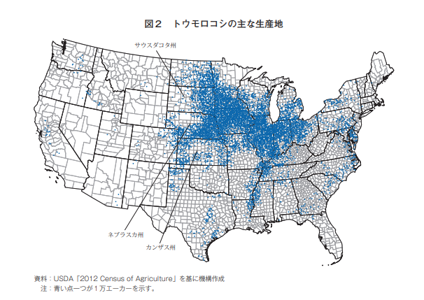

    ミシガン州・ウィスコンシン州・オハイオ州・インディアナ州・イリノイ州・ミネソタ州・ノースダコタ州・サウスダコタ州・アイオワ州・ネブラスカ州・ミズーリ州・カンザス州

<iframe src="https://www.google.com/maps/embed?pb=!4v1680635284919!6m8!1m7!1s7ZznHwjjw0NipfIdkmng5Q!2m2!1d40.14094764614759!2d-88.61202968085205!3f92.34819196808041!4f-8.662186690627081!5f1.7966719003492946" width="295" height="295" style="border:0;" allowfullscreen="" loading="lazy" referrerpolicy="no-referrer-when-downgrade"></iframe>

トウモロコシはアイオワ州、イリノイ州、ネブラスカ州、ミネソタ州の上位４州の生産量が全体の5割超を占めている。
大豆の主な生産地とトウモロコシの主な生産地が同様の分布を示しているのはトウモロコシ生産農家のほとんどが、一般的に大豆も生産しているため。
いわゆるコーンベルトの地域。

{}

