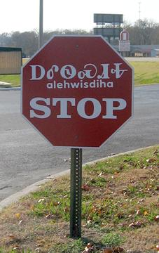

デラウェア州・メリーランド州・ワシントン特別区・ウエストバージニア州・バージニア州・ノースカロライナ州・サウスカロライナ州・ジョージア州・フロリダ州・ケンタッキー州・テネシー州・アラバマ州・ミシシッピ州・アーカンソー州・オクラホマ州・ルイジアナ州・テキサス州

    <ul class="rule-list">
        <li>ノースカロライナの一部ではチェロキー語の話者がいる</li>
    </ul>

{}
{}
{}
チェロキー族の言語でイロコイ語族に属す。ノースカロライナ州とオクラホマ州の一部に分布している{{% ref "https://ja.wikipedia.org/wiki/%E3%83%81%E3%82%A7%E3%83%AD%E3%82%AD%E3%83%BC%E8%AA%9E" "チェロキー語（ᏣᎳᎩ ᎦᏬᏂᎯᏍᏗ）" %}}。
{}

{}
{}
