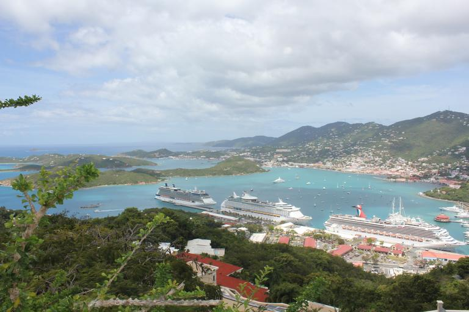
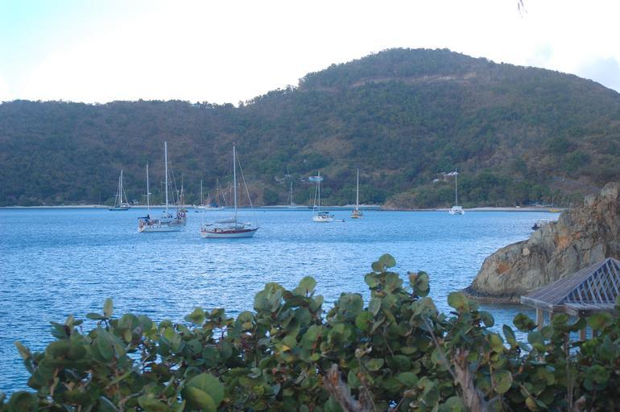
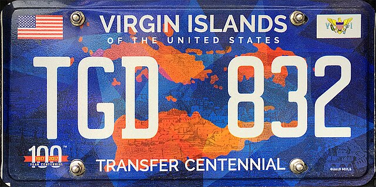

    <h2 class="section-title">{}</h2>
    <ul class="rule-list">
        <li>Domain negara berakhiran .vi.</li>
        <li>Mobil Google Street View memiliki ciri khas.</li>
        <li>Wilayah datar dengan banyak jalan lurus biasanya berada di pulau selatan, Saint Croix, yang rendah.</li>
        <li>Kontur berbukit, populasi jarang, dan hijau lebat menandakan pulau timur laut, Saint John.</li>
        <li>Perbukitan dengan kawasan padat penduduk berarti Anda berada di pulau barat laut, Saint Thomas.</li>
    </ul>

{}
{}

{}Di pulau-pulau utara, mobil-mobilnya sering berwarna putih dan medannya berbukit. Jika terlihat ramai oleh penduduk atau turis, besar kemungkinan itu Saint Thomas di barat laut{}.{}

{}Jika bagian utara terasa terpencil—mobil putih, rumah sedikit, dan banyak pepohonan—pikirkan pulau timur laut Saint John. Pada era perdagangan budak, pulau ini menanam tebu dan masih tersisa reruntuhan seperti Annaberg Sugar Plantation; kini populasinya sangat kecil{}.{}

{}Hingga 2016 mereka menggunakan plat nomor biru muda{}. Plat biru tua juga bisa dijumpai.{}

Gambar bawah oleh <a href="//commons.wikimedia.org/wiki/User:Mattes" title="User:Mattes">User:Mattes</a> – karya sendiri, <a href="https://creativecommons.org/licenses/by/2.0/de/deed.en" title="Creative Commons Attribution 2.0 de">CC BY 2.0 de</a>, <a href="https://commons.wikimedia.org/w/index.php?curid=48995829">tautan</a>

{}
Saint Croix di selatan adalah pulau terluas sekaligus terpadat{{% ref "https://ja.wikipedia.org/wiki/%E3%82%BB%E3%83%B3%E3%83%88%E3%83%BB%E3%82%AF%E3%83%AD%E3%82%A4%E5%B3%B6" "Saint Croix" %}}. Jalan yang panjang dan lurus biasanya menandakan Anda berada di pulau ini.
{}

<iframe src="https://www.google.com/maps/embed?pb=!4v1683468608791!6m8!1m7!1sGJvUrqOoZvfGAUkErhCNag!2m2!1d17.73002531779859!2d-64.74026630160122!3f159.42086040351649!4f-23.777725872264767!5f0.4000000000000002" width="295" height="295" style="border:0;" allowfullscreen="" loading="lazy" referrerpolicy="no-referrer-when-downgrade"></iframe>
<iframe src="https://www.google.com/maps/embed?pb=!4v1683468630595!6m8!1m7!1sDnaDtuUkvFSbifIANbl80w!2m2!1d17.68915204880862!2d-64.86403777173012!3f252.3491155368606!4f-17.452591588437528!5f0.7820865974627469" width="295" height="295" style="border:0;" allowfullscreen="" loading="lazy" referrerpolicy="no-referrer-when-downgrade"></iframe>

{}
{}
