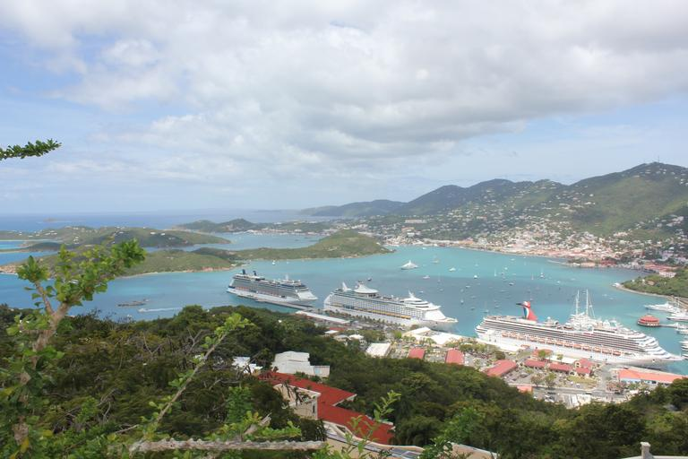
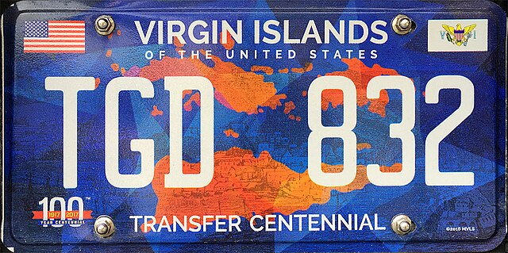

    <h2 class="section-title">{}</h2>
    <ul class="rule-list">
        <li>ドメインは.vi</li>
        <li>Google Carが特徴的</li>
        <li>起伏が少なく直線的な道が多い場合は標高が低い南島（セント・クロイ島）</li>
        <li>起伏が多く人口が少なそう・緑が広がっているならば北東（セント・ジョン島）</li>
        <li>起伏が多く人口が多そうならば北西（セント・トーマス島）</li>
    </ul>

{}
{}

{}北側の島は車が白く起伏が多い。住民や観光客が多そうならば北西のセント・トーマス島を考える{}。
{}

{}北側の島は車が白く起伏が多い。家が少なく緑が広がっているときは北東のセント・ジョン島を考えてみる。奴隷貿易時代にはサトウキビ生産が行われていたため製糖工場（Annaberg Sugar Plantation）跡地があるが、現在は衰退しており人口がとても少ない{}。
{}

{}2016年までは水色のナンバープレートが使用されていた{}。紺色や水色のナンバープレートが見つかる。
{}

下の画像のみ By <a href="//commons.wikimedia.org/wiki/User:Mattes" title="User:Mattes">User:Mattes</a> - Self-photographed, <a href="https://creativecommons.org/licenses/by/2.0/de/deed.en" title="Creative Commons Attribution 2.0 de">CC BY 2.0 de</a>, <a href="https://commons.wikimedia.org/w/index.php?curid=48995829">Link</a>

{}
南側の島（セント・クロイ島）は平地が多く人口も最も多い{{% ref "https://ja.wikipedia.org/wiki/%E3%82%BB%E3%83%B3%E3%83%88%E3%83%BB%E3%82%AF%E3%83%AD%E3%82%A4%E5%B3%B6" "セント・クロイ島" %}}。直線的な道路が広がっているならば南側に行ってみる。
{}

<iframe src="https://www.google.com/maps/embed?pb=!4v1683468608791!6m8!1m7!1sGJvUrqOoZvfGAUkErhCNag!2m2!1d17.73002531779859!2d-64.74026630160122!3f159.42086040351649!4f-23.777725872264767!5f0.4000000000000002" width="295" height="295" style="border:0;" allowfullscreen="" loading="lazy" referrerpolicy="no-referrer-when-downgrade"></iframe>
<iframe src="https://www.google.com/maps/embed?pb=!4v1683468630595!6m8!1m7!1sDnaDtuUkvFSbifIANbl80w!2m2!1d17.68915204880862!2d-64.86403777173012!3f252.3491155368606!4f-17.452591588437528!5f0.7820865974627469" width="295" height="295" style="border:0;" allowfullscreen="" loading="lazy" referrerpolicy="no-referrer-when-downgrade"></iframe>

{}
{}