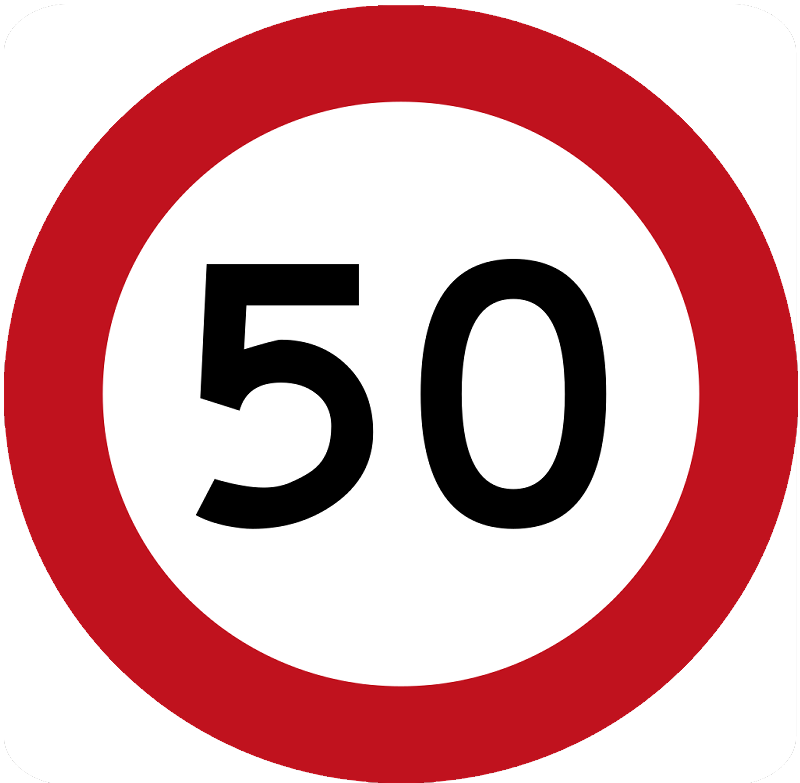

    <h2 class="section-title">{}</h2>
    <ul class="rule-list">
        <li>ドメインは.au</li>
        <li>車は左側通行</li>
        <li>ユーカリの木が沢山あり電柱もユーカリの木からできることが多い</li>
        <li>GIVE WAYが黒い文字ならばオーストラリア・赤い文字ならばニュージーランド{}</li>
        <li>オーストラリアのボラードはニュージーランドのようにぐるりと表裏にかけて塗られているわけではないので区別がつく{}。</li>
        <li>「M1」のような道路番号は{}にもあるけれどフォントが異なる</li>
    </ul>
    {}

{}
{}
{}
ユーカリの木が沢山ある、電柱もユーカリの木から作られているものがあり緑色のものがよくある。
{}

<iframe src="https://www.google.com/maps/embed?pb=!4v1679372138983!6m8!1m7!1svrdUrpYA0d7urKrX7qG5aw!2m2!1d-31.94187717111961!2d115.7847883593956!3f303.90724474218445!4f10.5337341921975!5f3.325193203789971" width="295" height="295" style="border:0;" allowfullscreen="" loading="lazy" referrerpolicy="no-referrer-when-downgrade"></iframe>
<iframe src="https://www.google.com/maps/embed?pb=!4v1679372256766!6m8!1m7!1s0rwDDjT6KvFf3xghBwbRPQ!2m2!1d-31.89526610535338!2d116.0198245833187!3f53.13381424986349!4f4.578646631674644!5f1.7427879092914158" width="295" height="295" style="border:0;" allowfullscreen="" loading="lazy" referrerpolicy="no-referrer-when-downgrade"></iframe>

{}
オーストラリアのボラードの赤い反射板は基本的に片側だけだがニュージーランドは両側に赤い部分があり赤い面積も多い。左がオーストラリア・右がニュージーランド。
{}

<iframe src="https://www.google.com/maps/embed?pb=!4v1680144661468!6m8!1m7!1sBApyf10_WfxpO26UJJ3u6w!2m2!1d-29.40199480435424!2d149.9148684407626!3f99.3413713142664!4f-19.826968570449495!5f3.3209542488875803" width="295" height="295" style="border:0;" allowfullscreen="" loading="lazy" referrerpolicy="no-referrer-when-downgrade"></iframe>
<iframe src="https://www.google.com/maps/embed?pb=!4v1681502031975!6m8!1m7!1sYOKgISqcrXEMRhe-mijsIQ!2m2!1d-35.7113153978181!2d174.0286454241244!3f162.44117437861425!4f-16.704223171344054!5f3.325193203789971" width="295" height="295" style="border:0;" allowfullscreen="" loading="lazy" referrerpolicy="no-referrer-when-downgrade"></iframe>

{}
道路番号のフォントがオーストラリアと異なる。左が南アフリカ・右がオーストラリア。
{}

{}
GIVE WAYが黒い文字で書かれているならばオーストラリア、赤い文字ならばニュージーランド。また、オーストラリアならば速度表記が細長い白いプレートに書かれている。下の図の左がオーストラリア、右がニュージーランド。
{}

    
    
    
    
    

{}
{}

<iframe src="https://www.google.com/maps/embed?pb=!4v1680144431366!6m8!1m7!1shxe_iLl3cJEDiavYyHK4Bw!2m2!1d-28.14627200205117!2d153.4778619605121!3f42.26826729503005!4f6.6985311149348945!5f3.325193203789971" width="295" height="295" style="border:0;" allowfullscreen="" loading="lazy" referrerpolicy="no-referrer-when-downgrade"></iframe>

{}
{}

<iframe src="https://www.google.com/maps/embed?pb=!4v1680144566252!6m8!1m7!1sB-a1zsMm8gvQEGItXgvsEQ!2m2!1d-28.51919408506439!2d153.1580933788061!3f170.10090920810467!4f-17.90590305808597!5f3.325193203789971" width="295" height="295" style="border:0;" allowfullscreen="" loading="lazy" referrerpolicy="no-referrer-when-downgrade"></iframe>
<iframe src="https://www.google.com/maps/embed?pb=!4v1684350092139!6m8!1m7!1sftI2P1c5dNmhsiIBHCVHRg!2m2!1d-32.05654720091714!2d151.6860635019022!3f270.4329617609021!4f-31.78218974106587!5f2.9682701783188015" width="295" height="295" style="border:0;" allowfullscreen="" loading="lazy" referrerpolicy="no-referrer-when-downgrade"></iframe>

{}
{}

<iframe width="560" height="315" src="https://www.youtube.com/embed/HQt6jIKNwgU" title="YouTube video player" frameborder="0" allow="accelerometer; autoplay; clipboard-write; encrypted-media; gyroscope; picture-in-picture; web-share" allowfullscreen></iframe>

{}
{}

    <h2 class="section-title">{}</h2>
    <ul class="rule-list">
        <li>木の生え具合を把握する
            <ul>
                <li>濃い緑色：熱帯および亜熱帯の湿った感じの広葉樹林</li>
                <li>黄色：熱帯および亜熱帯の草原・サバンナ・低木</li>
                <li>緑：温帯広葉樹など</li>
                <li>薄緑：温帯の草原・サバンナ</li>
                <li>ブラウン：地中海性の森林、森林地帯</li>
                <li>ベージュ：砂漠と乾燥した低木</li>
            </ul>
        </li>
        <li>土の色からおおよその地域が分かるときもある</li>
    </ul>

{}
{}

{}
オーストラリア付近の生態系のおおまかな区分け。（出典：By Terpsichores - Own work, <a href="https://creativecommons.org/licenses/by-sa/3.0/deed.ja">CC BY-SA 3.0</a>, <a href="https://commons.wikimedia.org/w/index.php?curid=22997727">Wikimedia commons</a>, 2023年4月28日に利用）
{}

{}
{}

{}
西側は赤色の土が多い、半乾燥環境の土壌{}。
{}

<iframe src="https://www.google.com/maps/embed?pb=!4v1682678547620!6m8!1m7!1sdSyQrifAZvrrVJQseFBk4A!2m2!1d-26.3221379505319!2d118.6349257943489!3f106.09729794173133!4f-20.614242839106808!5f0.858093203598099" width="295" height="295" style="border:0;" allowfullscreen="" loading="lazy" referrerpolicy="no-referrer-when-downgrade"></iframe>
<iframe src="https://www.google.com/maps/embed?pb=!4v1682692356525!6m8!1m7!1sSFWggLdCk2-mmChkPI4Zcw!2m2!1d-26.47779180674868!2d115.9399017365674!3f267.54136690904556!4f-26.621673919382616!5f0.7820865974627469" width="295" height="295" style="border:0;" allowfullscreen="" loading="lazy" referrerpolicy="no-referrer-when-downgrade"></iframe>

{}
{}

{}
北西沿岸部の道は特に赤い土が多い。
{}

<iframe src="https://www.google.com/maps/embed?pb=!4v1682692667454!6m8!1m7!1sh00_BSnhnuX76WKju7wpiA!2m2!1d-20.00120433566302!2d120.0172132646969!3f195.89562580028257!4f-31.187030607802264!5f2.65220710707431" width="295" height="295" style="border:0;" allowfullscreen="" loading="lazy" referrerpolicy="no-referrer-when-downgrade"></iframe>
<iframe src="https://www.google.com/maps/embed?pb=!4v1682678921859!6m8!1m7!1sJ5QY82HFgfdx66Etg6N8tw!2m2!1d-19.05070110448284!2d121.659934079889!3f302.65141637436227!4f-27.636751423319375!5f1.329845553855269" width="295" height="295" style="border:0;" allowfullscreen="" loading="lazy" referrerpolicy="no-referrer-when-downgrade"></iframe>

{}
{}

{}
中央南部の沿岸部のみ？
{}

<iframe src="https://www.google.com/maps/embed?pb=!4v1682679216794!6m8!1m7!1suH5_zvXsgfh7bnZ4PEFPzQ!2m2!1d-31.57352676797458!2d130.1460841229353!3f177.85217915532024!4f-4.9949076904402006!5f0.4000000000000002" width="295" height="295" style="border:0;" allowfullscreen="" loading="lazy" referrerpolicy="no-referrer-when-downgrade"></iframe>
<iframe src="https://www.google.com/maps/embed?pb=!4v1682679224290!6m8!1m7!1swypwCBSrHl0808j0IMVvyw!2m2!1d-31.5756938236704!2d129.909131412087!3f353.93739602189595!4f-5.36576901917185!5f0.7820865974627469" width="295" height="295" style="border:0;" allowfullscreen="" loading="lazy" referrerpolicy="no-referrer-when-downgrade"></iframe>

{}
{}

{}
西の沿岸部と色がかなり近い気がするが草が違う？
{}

<iframe src="https://www.google.com/maps/embed?pb=!4v1682693579404!6m8!1m7!1stUHzuc7VGY-QRrm4QiQrbQ!2m2!1d-21.52798632796268!2d133.8895219321043!3f111.79219172583102!4f-14.525302929226342!5f2.5709587780876224" width="295" height="295" style="border:0;" allowfullscreen="" loading="lazy" referrerpolicy="no-referrer-when-downgrade"></iframe>
<iframe src="https://www.google.com/maps/embed?pb=!4v1682693611932!6m8!1m7!1sDiOvPS_t4A6dt5ayXSIB7A!2m2!1d-25.8418606083426!2d133.3000334099683!3f343.12215148567066!4f-12.308331787376588!5f1.7427477120226769" width="295" height="295" style="border:0;" allowfullscreen="" loading="lazy" referrerpolicy="no-referrer-when-downgrade"></iframe>

{}
{}

    <ul class="rule-list">
        <li>QLDの電柱は青いマークがあることがある{}</li>
        <li>SAの電柱はいたに挟まれてる感じ{}</li>
        <li>NAの電柱は鉄製で梯子のような格子が特徴的{}</li>
        <li>TAZの電柱には緑色の何かが巻いてある</li>
        <li>WAとVICの電柱には山の形のものがある</li>
    </ul>

{}
{}

<blockquote class="twitter-tweet">
ここで現地から <a href="https://twitter.com/hashtag/GeoGuessr?src=hash&amp;ref_src=twsrc%5Etfw">#GeoGuessr</a> の電柱Tips！  黒く塗られた番号・青くて丸いマーカー・ちょっと上に傾いた横向きの碍子はすべてクイーンズランド州特有なので覚えよう！ <a href="https://t.co/Jbzg4WThyN">pic.twitter.com/Jbzg4WThyN</a>
&mdash; Daigo ʅ(･Θ･)ʃ (@Daig_O) <a href="https://twitter.com/Daig_O/status/1654019022021881856?ref_src=twsrc%5Etfw">May 4, 2023</a></blockquote> 

{}
{}

<iframe src="https://www.google.com/maps/embed?pb=!4v1682860956772!6m8!1m7!1svyXcNwin0VGrd2f1hbHaAg!2m2!1d-33.73293852674076!2d138.5605087780714!3f212.78003010968123!4f-2.1193123909354767!5f2.9760514761786894" width="295" height="295" style="border:0;" allowfullscreen="" loading="lazy" referrerpolicy="no-referrer-when-downgrade"></iframe>
<iframe src="https://www.google.com/maps/embed?pb=!4v1682876310366!6m8!1m7!1s0GIbI-sr8Q9l7AYua8OAgw!2m2!1d-33.13255954029371!2d135.5524586341847!3f262.0190664488449!4f-1.0028351410437466!5f3.325193203789971" width="295" height="295" style="border:0;" allowfullscreen="" loading="lazy" referrerpolicy="no-referrer-when-downgrade"></iframe>

{}
{}

<iframe src="https://www.google.com/maps/embed?pb=!4v1682876456537!6m8!1m7!1shd7Z7v-D90HQqyG7kY9b8g!2m2!1d-12.46811351660095!2d130.9896766812721!3f317.6882480346222!4f2.9617063585158974!5f2.8082921195720525" width="295" height="295" style="border:0;" allowfullscreen="" loading="lazy" referrerpolicy="no-referrer-when-downgrade"></iframe>
<iframe src="https://www.google.com/maps/embed?pb=!4v1682876532075!6m8!1m7!1ses2tZaQKpek-hwo6m1yQgQ!2m2!1d-19.4372709042281!2d134.2077962914484!3f155.23248416563104!4f1.7884733824074033!5f3.2930442646673095" width="295" height="295" style="border:0;" allowfullscreen="" loading="lazy" referrerpolicy="no-referrer-when-downgrade"></iframe>

{}
{}

<iframe src="https://www.google.com/maps/embed?pb=!4v1685404001233!6m8!1m7!1s0Vn_4N358KlMjKjwH83vNQ!2m2!1d-41.41784987221105!2d147.2802834785233!3f119.25273213616062!4f7.71036244768473!5f3.325193203789971" width="295" height="295" style="border:0;" allowfullscreen="" loading="lazy" referrerpolicy="no-referrer-when-downgrade"></iframe>
<iframe src="https://www.google.com/maps/embed?pb=!4v1685404021090!6m8!1m7!1sRYO6uPlcnWbLGRP_1jiaFw!2m2!1d-41.09903761842133!2d145.7259489172317!3f128.13946562875705!4f19.612412263962952!5f3.325193203789971" width="295" height="295" style="border:0;" allowfullscreen="" loading="lazy" referrerpolicy="no-referrer-when-downgrade"></iframe>

{}
{}

<iframe src="https://www.google.com/maps/embed?pb=!4v1684320660884!6m8!1m7!1sFu3-CS2FUj_3wQ6YwqFK3Q!2m2!1d-28.75661025818507!2d114.6165293377311!3f311.9909758373502!4f28.478450815917896!5f3.3203146277309257" width="295" height="295" style="border:0;" allowfullscreen="" loading="lazy" referrerpolicy="no-referrer-when-downgrade"></iframe>

{}
{}

    <ul class="rule-list">
        <li>ナンバープレートの色で地域が分かるかもしれないがモザイクが強く分かりづらい{}</li>
        <li class="no-evidence">信号機付近の機械や看板に張ってあるシールに「VicRoads」とあればビクトリア州？</li>
        <li>クリスマス島が出題されることがある{}
            <ul>
                <li>Google Carが特徴的で黄色ナンバーが多い</li>
            </ul>
        </li>
        <li>市外局番のエリアコードで地域が分かるかも{}
            <ul>
                <li>02：New South Wales・シドニー・キャンベラ</li>
                <li>03：Victoria・タスマニア・メルボルン</li>
                <li>04：オーストラリア中の携帯電話、場所指定無し</li>
                <li>07：Queensland</li>
                <li>08：中央と西側の領域・パースやダーウィンなど</li>
            </ul>
        </li>
    </ul>

{}
{}

{}
微妙に赤みがある車が多いときは北東か北のエリア（クイーンズランド）かも？
{}

<iframe src="https://www.google.com/maps/embed?pb=!4v1682233517999!6m8!1m7!1sWq0K0pNpxYlUgBtkt3QTIQ!2m2!1d-21.14715132093964!2d149.1849561159643!3f55.12812703334478!4f-18.686872793176335!5f3.325193203789971" width="295" height="295" style="border:0;" allowfullscreen="" loading="lazy" referrerpolicy="no-referrer-when-downgrade"></iframe>
<iframe src="https://www.google.com/maps/embed?pb=!4v1682233315360!6m8!1m7!1svv7zLhPdlb_doH4kc-mt1A!2m2!1d-12.52010279062024!2d131.0433048327268!3f122.20094401009418!4f-11.983834788457656!5f3.3203366790792304" width="295" height="295" style="border:0;" allowfullscreen="" loading="lazy" referrerpolicy="no-referrer-when-downgrade"></iframe>

{}

By NJM2010 - Own work, GFDL, <a href="https://commons.wikimedia.org/w/index.php?curid=13768947">Wikimedia Commons</a>

By EurovisionNim - Own work, <a href="https://creativecommons.org/licenses/by-sa/4.0/deed.ja">CC BY-SA 4.0</a>, <a href="https://commons.wikimedia.org/w/index.php?curid=67572209">Wikimedia Commons</a>
{}
{}
{}
{}
VicRoads は、オーストラリアのビクトリア州にある政府の合弁会社{}だがビクトリア州以外にあるのかは不明。
{}

<iframe src="https://www.google.com/maps/embed?pb=!4v1685179864469!6m8!1m7!1sG6T35xH2DvZQ1DVxlOYPzA!2m2!1d-35.50314630170574!2d142.8495718157322!3f124.03577012416878!4f-2.037183444451685!5f3.325193203789971" width="295" height="295" style="border:0;" allowfullscreen="" loading="lazy" referrerpolicy="no-referrer-when-downgrade"></iframe>
<iframe src="https://www.google.com/maps/embed?pb=!4v1683550019499!6m8!1m7!1sfPzunmElpDidOg_VUb2ciQ!2m2!1d-37.81457962835244!2d144.9618442307953!3f310.30284468841296!4f-8.920018177956507!5f3.293433733170092" width="295" height="295" style="border:0;" allowfullscreen="" loading="lazy" referrerpolicy="no-referrer-when-downgrade"></iframe>

{}
{}