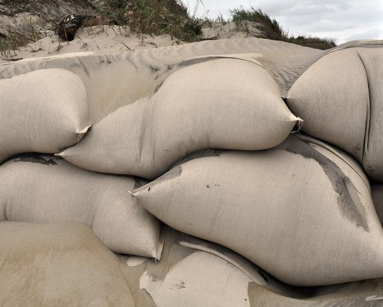

    <h2 class="section-title">{}</h2>
    <ul class="rule-list">
        <li>Domainnya adalah .cc</li>
        <li>Pohon kelapa tumbuh di mana-mana, dan buah atau cangkang kelapa sering terlihat di pinggir jalan</li>
        <li>Google Car memiliki ciri khas dengan sesuatu yang menonjol di bagian depan kanan</li>
    </ul>

{}
{}

{}
Pohon kelapa tumbuh di mana-mana, dan sering terlihat buah atau cangkang kelapa di pinggir jalan {}.
{}

{}
Google Car memiliki ciri khas dengan sesuatu yang menonjol di bagian depan kanan {}. Namun, tidak selalu terlihat di setiap tempat. Perlu diperhatikan bahwa lokasi tertentu di {} juga menggunakan mobil serupa {}.
{}

{}
Karung pasir sering ditempatkan di sepanjang pantai untuk mencegah erosi {}.
{}

{}
Kendaraan besar hampir tidak ada, dan kendaraan seperti buggy banyak digunakan. Hal ini juga berlaku di pulau terpencil lainnya seperti Pulau Santa Catalina di California, {} atau di {}, di mana buggy juga umum.
{}

<iframe src="https://www.google.com/maps/embed?pb=!4v1693802173605!6m8!1m7!1s0MbiYFIp0B9KFSNVk7k6BA!2m2!1d-12.11801584447531!2d96.89675621233285!3f82.80349905893745!4f9.378870757304867!5f0.4000000000000002" width="600" height="300" style="border:0;" allowfullscreen="" loading="lazy" referrerpolicy="no-referrer-when-downgrade"></iframe>

{}
{}
