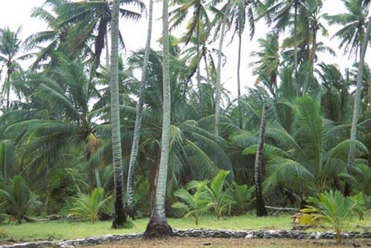
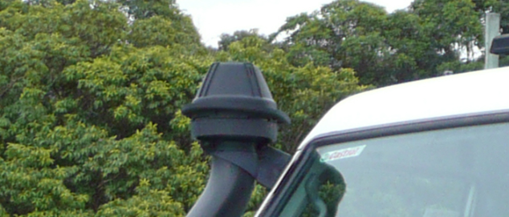

    <h2 class="section-title">{}</h2>
    <ul class="rule-list">
        <li>ドメインは.cc</li>
        <li>ココヤシの木がどこでも栽培されており道端に実か殻のようなものも落ちている</li>
        <li>Google Carが特徴的で右前になにか付いている</li>
    </ul>

{}
{}

{}
ココヤシの木がどこでも栽培されており道端にココナッツの実か殻のようなものも落ちていることも多い{}。
{}

{}
Google Carが特徴的で右前になにか付いていて特徴的{}。ただしすべての場所でこれが見えるわけではないので注意。
{}

<iframe src="https://www.google.com/maps/embed?pb=!4v1683433736164!6m8!1m7!1s2ZkWNpu0REMuQkXHWWH9gQ!2m2!1d-12.15443198755341!2d96.82479744032698!3f115.07805190299995!4f-37.61774122681439!5f3.0119252385875366" width="495" height="295" style="border:0;" allowfullscreen="" loading="lazy" referrerpolicy="no-referrer-when-downgrade"></iframe>

{}
{}