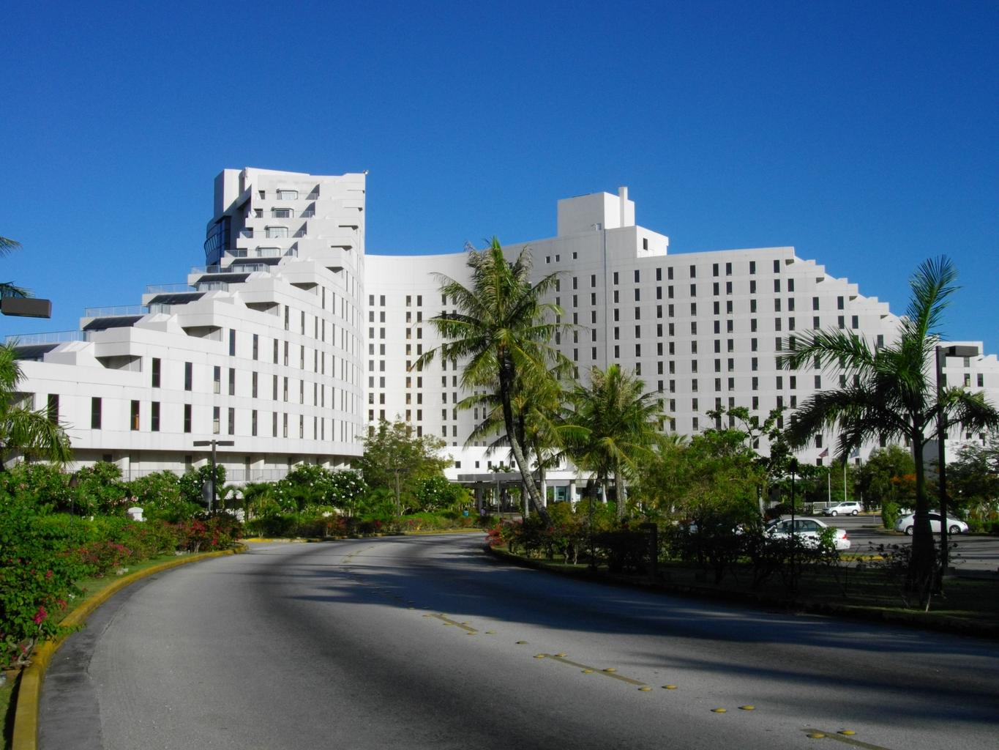

    <h2 class="section-title">{}</h2>
    <ul class="rule-list">
        <li>ドメインは.gu</li>
        <li>Google Carが特徴的で長いアンテナが右前にあり左後ろにわずかに金属が見えることがある</li>
        <li>{}と同じく観光地であるため日本語や韓国語が見つかる</li>
        <li>砂浜の上を歩く場所があり高層の観光ホテルが見えることが多い</li>
    </ul>

{}
{}

{}
Google Carが特徴的で長いアンテナが右前にある。{}と異なり左後ろにわずかに金属が見えることが多い。ただし見えない時もある。
{}

<iframe src="https://www.google.com/maps/embed?pb=!4v1683472584933!6m8!1m7!1sdEZoGOru-GFkj3C8nyX61Q!2m2!1d13.35562096234083!2d144.6520598201832!3f155.2014085480648!4f-17.561906953218127!5f3.325193203789971" width="295" height="295" style="border:0;" allowfullscreen="" loading="lazy" referrerpolicy="no-referrer-when-downgrade"></iframe>
<iframe src="https://www.google.com/maps/embed?pb=!4v1683472560317!6m8!1m7!1sn4mQ5tDX9swmmFYf6ubvxw!2m2!1d13.63113676691807!2d144.8478596683341!3f294.1601954862158!4f-50.61123433320337!5f3.325193203789971" width="295" height="295" style="border:0;" allowfullscreen="" loading="lazy" referrerpolicy="no-referrer-when-downgrade"></iframe>

{}
砂浜の上を歩く場所があり高層の観光ホテルが見えることが多い{}
{}

{}
{}
{}
家の前や道端に何かが生えている？グアム以外でも離島によくある。
{}

<iframe src="https://www.google.com/maps/embed?pb=!4v1685047436940!6m8!1m7!1srmYA6GBHyUHyAdlbKoOH5Q!2m2!1d13.52094131423855!2d144.8373787535323!3f1.0157292059205054!4f-16.32673677660253!5f3.3141337806016518" width="295" height="295" style="border:0;" allowfullscreen="" loading="lazy" referrerpolicy="no-referrer-when-downgrade"></iframe>
<iframe src="https://www.google.com/maps/embed?pb=!4v1685047367536!6m8!1m7!1sOay3oORuLk_aZdXmjyLT9Q!2m2!1d13.4591290552049!2d144.6839708813716!3f285.972866570056!4f-39.64110568638057!5f2.8760264216443843" width="295" height="295" style="border:0;" allowfullscreen="" loading="lazy" referrerpolicy="no-referrer-when-downgrade"></iframe>

{}
{}