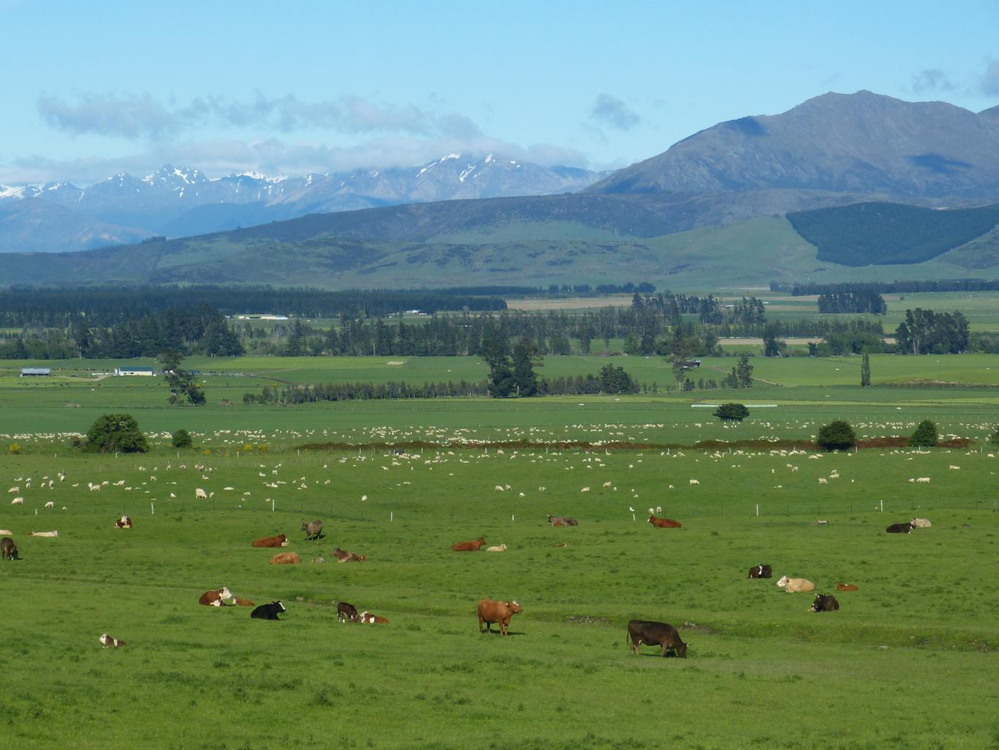
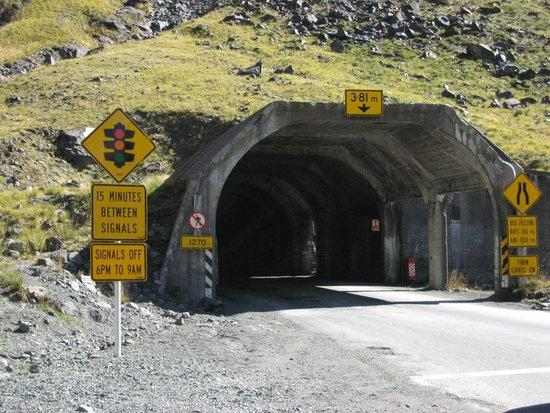
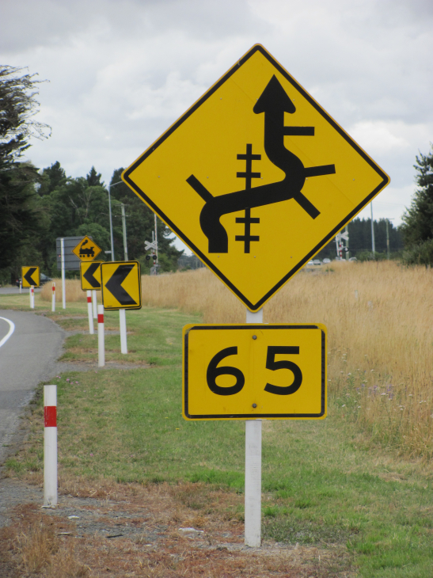
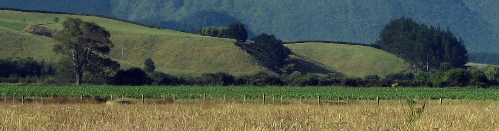
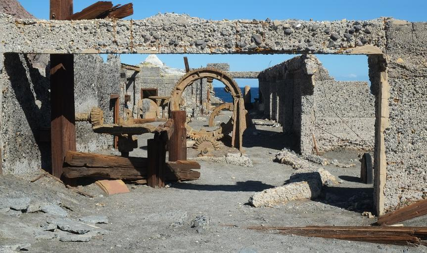

    <h2 class="section-title">{}</h2>
    <ul class="rule-list">
        <li>Los vehículos circulan por el lado izquierdo.</li>
        <li>El dominio es .nz.</li>
        <li>Los reflectores de los bolardos son de color rojo. El color está pintado en ambos lados de los bolardos, pero los de Australia solo tienen reflectores en un lado o tienen una forma redonda, lo que permite diferenciarlos {}.</li>
        <li>Si el texto GIVE WAY está escrito en negro, es Australia; si está en rojo, es Nueva Zelanda{}.</li>
        <li>Algo plateado está enrollado en la parte superior de los postes eléctricos.</li>
    </ul>
    {}

{}
{}

{}
Los bolardos están pintados de rojo{}.
{}

{}
Algo está enrollado en la parte superior de los postes eléctricos{}. También hay postes con agujeros{}.
{}

{}
En Australia, las señales de límite de velocidad suelen estar en placas blancas alargadas. En la imagen, la izquierda es Australia y la derecha es Nueva Zelanda{}.
{}

    
    

{}
Los números de carreteras tienen forma de escudo rojo{}.
{}

{}
Si el texto GIVE WAY está escrito en negro, es Australia; si está en rojo, es Nueva Zelanda{}.
{}

    
    

{}
Más del 40% del territorio de Nueva Zelanda es pastizal{}. Gracias a lluvias regulares durante todo el año, los pastos crecen fácilmente, lo que reduce los costos de producción para los agricultores. Por esto, los productos lácteos de Nueva Zelanda son competitivos a nivel mundial{}.
{}

{}
Hay señales de advertencia amarillas{}.
{}

{}
Las señales y los chevrones están montados en postes blancos de madera{}.
{}

{}
{}
{}
Esto no es un número de carretera, sino una señal de límite de velocidad.
{}

<iframe src="https://www.google.com/maps/embed?pb=!4v1681336992111!6m8!1m7!1sUDS3uTPqeYFbc5jlX39FeQ!2m2!1d-35.71123567515837!2d174.0285549148809!3f101.16967205607813!4f-5.333791598150327!5f3.325193203789971" width="295" height="295" style="border:0;" allowfullscreen="" loading="lazy" referrerpolicy="no-referrer-when-downgrade"></iframe>
<iframe src="https://www.google.com/maps/embed?pb=!4v1681496577756!6m8!1m7!1sTzInEJJGSyqyjvPmfyh4Bw!2m2!1d-45.77715803468315!2d169.4695050065341!3f333.91023963231385!4f-12.315495909494459!5f1.8043896357060172" width="295" height="295" style="border:0;" allowfullscreen="" loading="lazy" referrerpolicy="no-referrer-when-downgrade"></iframe>

{}
Ejemplo de postes eléctricos.
{}

<iframe src="https://www.google.com/maps/embed?pb=!4v1681076154035!6m8!1m7!1snNchDURtOF2Pi8TyFhatdQ!2m2!1d-46.29904350653622!2d168.1016630448194!3f113.5594550555082!4f2.44097960226469!5f3.325193203789971" width="295" height="295" style="border:0;" allowfullscreen="" loading="lazy" referrerpolicy="no-referrer-when-downgrade"></iframe>
<iframe src="https://www.google.com/maps/embed?pb=!4v1681337054675!6m8!1m7!1s5ewSfp9w1hC22QQoXdLfPA!2m2!1d-35.71074414713877!2d174.0279954001939!3f92.99296012164498!4f5.460043835513218!5f3.325193203789971" width="295" height="295" style="border:0;" allowfullscreen="" loading="lazy" referrerpolicy="no-referrer-when-downgrade"></iframe>

{}
{}

    <h2 class="section-title">{}</h2>
    <ul class="rule-list">
        <li>Analizar si el terreno es plano, si se ven montañas nevadas o la densidad de los árboles {}.
            <ul>
                <li>Si la calidad de imagen es mala y hay muchos caminos de grava, considerar el norte de Auckland.</li>
                <li>Si se ven montañas nevadas o postes de madera, considerar la Isla Sur.</li>
            </ul>
        </li>
        <li>Los prefijos telefónicos se vuelven más pequeños de norte a sur:
            <ul>
                <li>09: Zona más al norte (cerca de Auckland y al norte de esta).</li>
                <li>07: Mitad superior de la Isla Norte hasta Auckland.</li>
                <li>06: Mitad inferior de la Isla Norte excepto Wellington.</li>
                <li>04: Zona sur de la Isla Norte cerca de Wellington.</li>
                <li>03: Toda la Isla Sur {}.</li>
            </ul>
        </li>
        <li>En la zona más al sur hay muchas ovejas, pero no es un factor definitivo {}.</li>
    </ul>

{}
{}

<iframe width="560" height="315" src="https://www.youtube.com/embed/ySbsJVexhGs" title="Reproductor de video de YouTube" frameborder="0" allow="accelerometer; autoplay; clipboard-write; encrypted-media; gyroscope; picture-in-picture; web-share" allowfullscreen></iframe>

{}
{}
{}
Si ves postes con agujeros y solo ovejas, vale la pena considerar la zona más al sur de la Isla Sur {}.
{}

<iframe src="https://www.google.com/maps/embed?pb=!4v1719146306598!6m8!1m7!1spWKkJDPD4CTBs85CfGNtAQ!2m2!1d-45.7005414337047!2d168.1103578359879!3f156.90501902332485!4f5.394398567451731!5f0.7820865974627469" width="600" height="450" style="border:0;" allowfullscreen="" loading="lazy" referrerpolicy="no-referrer-when-downgrade"></iframe>

{}
{}

    <h2 class="section-title">Vegetación</h2>
    <ul class="rule-list">
        <li>En la llanura de Canterbury en la Isla Sur, hay cortavientos y se practica la agricultura de riego {}.</li>
        <li>En la región de Bay of Plenty en la Isla Norte también hay cortavientos y es una zona destacada en la producción de kiwi {}.</li>
        <li>El carrizo crece en las costas de la Isla Norte, especialmente alrededor de Auckland {}.</li>
    </ul>

{}
{}
{}
La zona alrededor de Christchurch es plana y tiene muchos cortavientos altos {}.
{}

{}

{}
{}
Hay cortavientos para proteger los cultivos del viento del océano, pero no tantos como en la llanura de Canterbury {}.
{}

{}

{}
{}
Esta planta, común en la región mediterránea, crece a lo largo de las costas de la Isla Norte, especialmente cerca de Auckland {}{}. En el extremo sur, también se encuentra en la costa cerca de Christchurch.
{}

{}
{}

    <h2 class="section-title">{}</h2>
    <ul class="rule-list">
        <li>Si ves una montaña similar al Monte Fuji, probablemente estés cerca del parque nacional en la esquina suroeste de la Isla Norte {}{{% ref "https://ja.wikipedia.org/wiki/%E3%82%BF%E3%83%A9%E3%83%8A%E3%82%AD%E5%B1%B1" "Monte Taranaki" %}}.</li>
        <li>En la Isla Sur, se encuentra el Otago Central Rail Trail, un sendero de ciclismo y caminata de aproximadamente 150 kilómetros {}. Es común ver algo rojo en la zona.</li>
    </ul>

{}
{}

{}
Si ves una montaña similar al Monte Fuji, probablemente estés cerca del parque nacional en la esquina suroeste de la Isla Norte {}{{% ref "https://ja.wikipedia.org/wiki/%E3%82%BF%E3%83%A9%E3%83%8A%E3%82%AD%E5%B1%B1" "Monte Taranaki" %}}.
{}

{}

{}

{}
Un sendero de ciclismo muy largo. A menudo se pueden ver objetos rojos {}.
{}

{}
{}

    <h4 class="section-title">Islas</h4>
    <ul class="rule-list">
        <li>La isla Stewart es la más austral de las islas habitadas. Tiene caletas rodeadas de bosques {}{{% ref "https://ja.wikipedia.org/wiki/%E3%82%B9%E3%83%81%E3%83%A5%E3%82%A2%E3%83%BC%E3%83%88%E5%B3%B6" "Isla Stewart" %}}.</li>
        <li>La isla White es una isla al norte de la Isla Norte {}.</li>
        <li>Las islas Antípodas albergan colonias de pingüinos y focas {}.</li>
    </ul>

{}
{}

{}
Tiene playas de arena oscura. Al igual que en el extremo sur de la Isla Sur, los postes eléctricos tienen agujeros {}.
{}

Por Annette Teng, <a href="https://creativecommons.org/licenses/by/3.0" title="Creative Commons Attribution 3.0">CC BY 3.0</a>, <a href="https://commons.wikimedia.org/w/index.php?curid=55942156">Enlace</a>

{}

{}

{}
Antiguo sitio de producción de azufre, abandonado debido a desastres volcánicos {{% ref "https://ja.wikipedia.org/wiki/%E3%83%9B%E3%83%AF%E3%82%A4%E3%83%88%E5%B3%B6" "Isla White" %}}. Actualmente, parece que no se puede visitar.
{}

{}

{}

{}
Patrimonio de la humanidad que alberga colonias de pingüinos. Es un área restringida para el público.
{}

{}
{}
