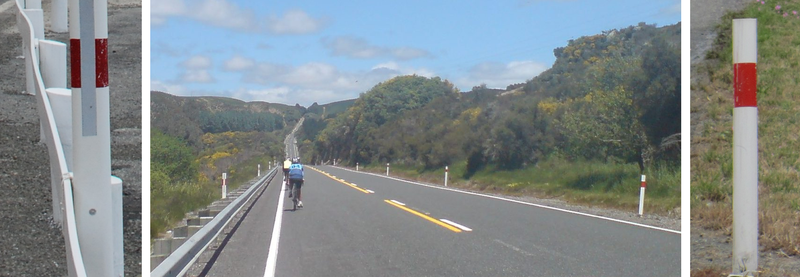
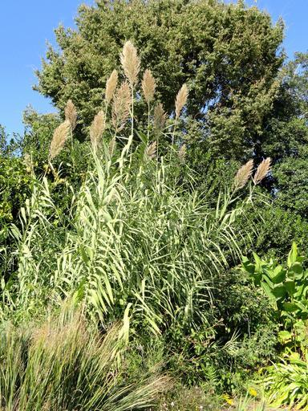
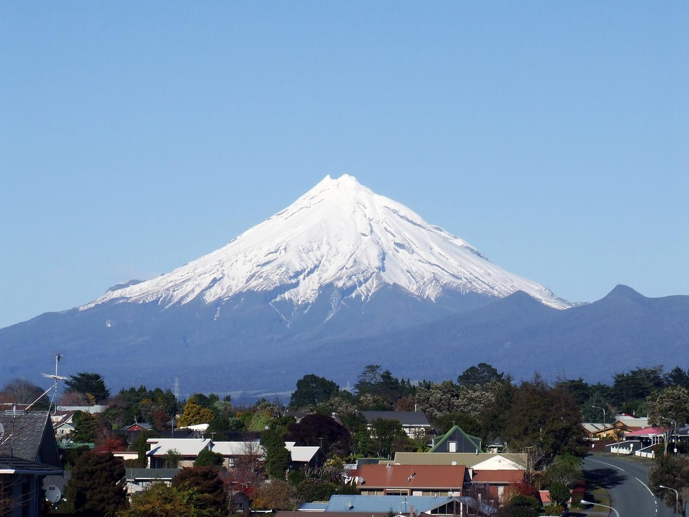
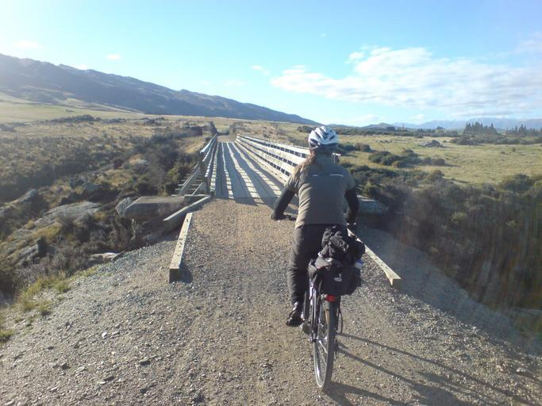
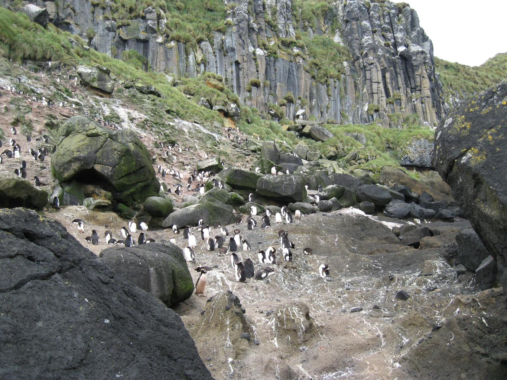

    <h2 class="section-title">{}</h2>
    <ul class="rule-list">
        <li>Mobil melaju di sebelah kiri.</li>
        <li>Domainnya adalah .nz.</li>
        <li>Reflektor pada bollard berwarna merah. Warna ini dicat di dua sisi bollard, sementara bollard di Australia hanya memiliki reflektor di salah satu sisi atau berbentuk bulat, sehingga bisa dibedakan{}.</li>
        <li>Jika tulisan GIVE WAY menggunakan huruf hitam, maka itu adalah Australia, sedangkan jika hurufnya merah, itu adalah Selandia Baru{}.</li>
        <li>Terdapat sesuatu berwarna perak yang dililitkan di bagian atas tiang listrik.</li>
    </ul>
    {}

{}
{}

{}
Bollard dicat dengan warna merah{}.
{}

{}
Bagian atas tiang listrik dililit sesuatu{}. Beberapa tiang listrik juga memiliki lubang{}.
{}

{}
Jika di Australia, tanda kecepatan terkadang ditulis di pelat putih yang panjang dan tipis. Gambar di bawah: kiri adalah Australia, kanan adalah Selandia Baru{}.
{}

    
    

{}
Tanda jalan berbentuk perisai merah bisa ditemukan{}.
{}

{}
Jika tulisan GIVE WAY menggunakan huruf hitam, maka itu adalah Australia, sedangkan jika hurufnya merah, itu adalah Selandia Baru{}.
{}

    
    

{}
Lebih dari 40% wilayah Selandia Baru adalah padang rumput{}. Curah hujan sepanjang tahun yang cukup membuat rumput tumbuh dengan baik. Hal ini memungkinkan peternak menjaga biaya produksi tetap rendah, membuat produk susu Selandia Baru kompetitif di pasar global{}.
{}

{}
Tanda peringatan berwarna kuning bisa ditemukan{}.
{}

{}
Tanda atau chevron dipasang pada tiang putih persegi{}.
{}

{}
{}
{}
Ini bukan nomor jalan melainkan tanda kecepatan.
{}

<iframe src="https://www.google.com/maps/embed?pb=!4v1681336992111!6m8!1m7!1sUDS3uTPqeYFbc5jlX39FeQ!2m2!1d-35.71123567515837!2d174.0285549148809!3f101.16967205607813!4f-5.333791598150327!5f3.325193203789971" width="295" height="295" style="border:0;" allowfullscreen="" loading="lazy" referrerpolicy="no-referrer-when-downgrade"></iframe>
<iframe src="https://www.google.com/maps/embed?pb=!4v1681496577756!6m8!1m7!1sTzInEJJGSyqyjvPmfyh4Bw!2m2!1d-45.77715803468315!2d169.4695050065341!3f333.91023963231385!4f-12.315495909494459!5f1.8043896357060172" width="295" height="295" style="border:0;" allowfullscreen="" loading="lazy" referrerpolicy="no-referrer-when-downgrade"></iframe>

{}
Contoh tiang listrik.
{}

<iframe src="https://www.google.com/maps/embed?pb=!4v1681076154035!6m8!1m7!1snNchDURtOF2Pi8TyFhatdQ!2m2!1d-46.29904350653622!2d168.1016630448194!3f113.5594550555082!4f2.44097960226469!5f3.325193203789971" width="295" height="295" style="border:0;" allowfullscreen="" loading="lazy" referrerpolicy="no-referrer-when-downgrade"></iframe>
<iframe src="https://www.google.com/maps/embed?pb=!4v1681337054675!6m8!1m7!1s5ewSfp9w1hC22QQoXdLfPA!2m2!1d-35.71074414713877!2d174.0279954001939!3f92.99296012164498!4f5.460043835513218!5f3.325193203789971" width="295" height="295" style="border:0;" allowfullscreen="" loading="lazy" referrerpolicy="no-referrer-when-downgrade"></iframe>

{}
{}

    <h2 class="section-title">{}</h2>
    <ul class="rule-list">
        <li>Lihat apakah perbukitan datar, apakah terlihat gunung bersalju, dan kerapatan pepohonan{}.
            <ul>
                <li>Jika kualitas gambar buruk dan banyak jalan kerikil, coba lihat utara Auckland.</li>
                <li>Jika terdapat gunung bersalju atau banyak tiang listrik dari kayu, pertimbangkan Pulau Selatan.</li>
            </ul>
        </li>
        <li>Kode area telepon semakin kecil dari utara ke selatan.
            <ul>
                <li>09: Area paling utara (sekitar Auckland dan lebih utara).</li>
                <li>07: Bagian utara Pulau Utara hingga Auckland.</li>
                <li>06: Bagian selatan Pulau Utara kecuali Wellington.</li>
                <li>04: Wilayah paling selatan Pulau Utara sekitar Wellington.</li>
                <li>03: Seluruh Pulau Selatan{}.</li>
            </ul>
        </li>
        <li>Area paling selatan memiliki banyak domba, namun hal ini saja tidak cukup untuk memastikan{}.</li>
    </ul>

{}
{}

<iframe width="560" height="315" src="https://www.youtube.com/embed/ySbsJVexhGs" title="YouTube video player" frameborder="0" allow="accelerometer; autoplay; clipboard-write; encrypted-media; gyroscope; picture-in-picture; web-share" allowfullscreen></iframe>

{}
{}
{}
Jika terdapat tiang listrik berlubang dan hanya terlihat domba, ada kemungkinan besar area tersebut adalah bagian selatan Pulau Selatan{}.
{}

<iframe src="https://www.google.com/maps/embed?pb=!4v1719146306598!6m8!1m7!1spWKkJDPD4CTBs85CfGNtAQ!2m2!1d-45.7005414337047!2d168.1103578359879!3f156.90501902332485!4f5.394398567451731!5f0.7820865974627469" width="600" height="450" style="border:0;" allowfullscreen="" loading="lazy" referrerpolicy="no-referrer-when-downgrade"></iframe>

{}
{}

    <h2 class="section-title">Vegetasi</h2>
    <ul class="rule-list">
        <li>Dataran Canterbury di Pulau Selatan memiliki banyak sabuk pelindung angin dan praktik pertanian irigasi{}.</li>
        <li>Wilayah Bay of Plenty di Pulau Utara juga memiliki sabuk pelindung angin, dengan produksi buah kiwi yang melimpah{}.</li>
        <li>Arundo donax (rumput raksasa) banyak tumbuh di pesisir Pulau Utara, terutama di sekitar Auckland{}.</li>
    </ul>

{}
{}

{}
Wilayah di sekitar Christchurch cenderung datar dan memiliki banyak sabuk pelindung angin tinggi{}.
{}

{}
{}

{}
Untuk melindungi tanaman dari angin laut, terdapat beberapa sabuk pelindung angin, meskipun tidak sebanyak di Dataran Canterbury{}.
{}

{}
{}

{}
Tanaman yang umum di sekitar Laut Mediterania ini banyak tumbuh di pesisir Pulau Utara, terutama sekitar Auckland{}{}. Tumbuhan ini juga ditemukan di pesisir Christchurch.
{}

{}
{}

    <h2 class="section-title">{}</h2>
    <ul class="rule-list">
        <li>Jika terlihat gunung yang menyerupai Gunung Fuji, kemungkinan berada di sekitar taman nasional di sudut barat daya Pulau Utara{}{{% ref "https://ja.wikipedia.org/wiki/%E3%82%BF%E3%83%A9%E3%83%8A%E3%82%AD%E5%B1%B1" "Gunung Taranaki" %}}.</li>
        <li>Pulau Selatan memiliki Otago Central Rail Trail, jalur bersepeda dan berjalan sepanjang sekitar 150 kilometer{}. Terkadang terlihat sesuatu seperti tas merah.</li>
    </ul>

{}
{}

{}
Jika terlihat gunung menyerupai Gunung Fuji, kemungkinan berada di sekitar taman nasional di sudut barat daya Pulau Utara{}{{% ref "https://ja.wikipedia.org/wiki/%E3%82%BF%E3%83%A9%E3%83%8A%E3%82%AD%E5%B1%B1" "Gunung Taranaki" %}}.
{}

{}
{}

{}
Jalur bersepeda yang sangat panjang. Terkadang terlihat sesuatu berwarna merah{}.
{}

{}
{}

    <h4 class="section-title">Pulau-Pulau Terpisah</h4>
    <ul class="rule-list">
        <li>Pulau Stewart adalah pulau berpenghuni paling selatan. Memiliki teluk-teluk kecil yang dikelilingi hutan{}{{% ref "https://ja.wikipedia.org/wiki/%E3%82%B9%E3%83%81%E3%83%A5%E3%82%A2%E3%83%BC%E3%83%88%E5%B3%B6" "Pulau Stewart" %}}.</li>
        <li>Pulau White adalah sebuah pulau di utara Pulau Utara{}.</li>
        <li>Kepulauan Antipodes dihuni oleh koloni penguin dan anjing laut{}.</li>
    </ul>

{}
{}

{}
Pantai dengan pasir kehitaman. Pulau Stewart, seperti ujung selatan Pulau Selatan, memiliki banyak tiang listrik berlubang{}.
{}

By Annette Teng, <a href="https://creativecommons.org/licenses/by/3.0" title="Creative Commons Attribution 3.0">CC BY 3.0</a>, <a href="https://commons.wikimedia.org/w/index.php?curid=55942156">Link</a>

{}
{}

{}
Bekas tempat produksi belerang yang ditinggalkan akibat bencana vulkanik{{% ref "https://ja.wikipedia.org/wiki/%E3%83%9B%E3%83%AF%E3%82%A4%E3%83%88%E5%B3%B6" "Pulau White" %}}. Saat ini sepertinya tidak dapat diakses.
{}

{}
{}

{}
Merupakan Situs Warisan Dunia dengan koloni penguin. Area ini tidak terbuka untuk umum.
{}

{}
{}
