

    <h2 class="section-title">{}</h2>
    <ul class="rule-list">
        <li>車は左側通行</li>
        <li>ドメインは.nz</li>
        <li>ボラードの反射板が赤色。色がボラードの表裏に塗られているがオーストラリアのものは反射板が片方だけだったり丸い形だったりするので区別がつく{}。</li>
        <li>GIVE WAYが黒い文字で書かれているならばオーストラリア、赤い文字ならばニュージーランド{}。</li>
        <li>電柱の上のほうにシルバーの何かが巻かれている。</li>
    </ul>
    {}

{}
{}

{}
ボラードが赤色で塗られている{}
{}

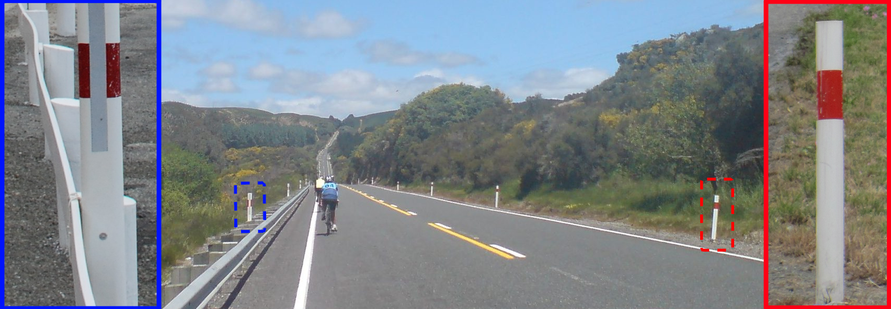

{}
電柱の上のほうに何かが巻かれている{}。穴が空いた電柱もある{}。
{}

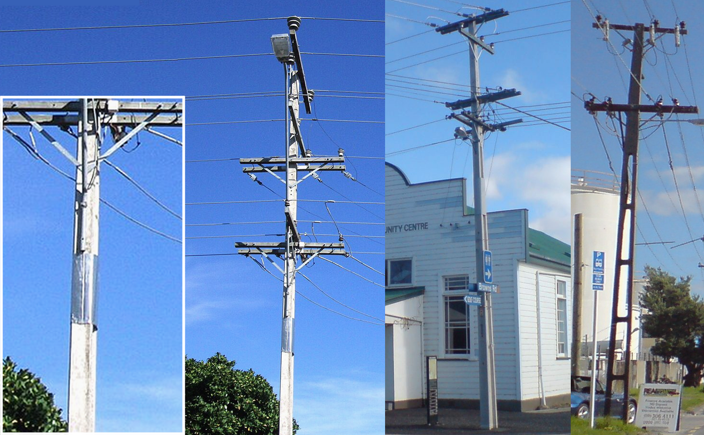

{}
オーストラリアならば速度表記が細長い白いプレートに書かれていることがある。下の図の左がオーストラリア、右がニュージーランド{}。
{}

    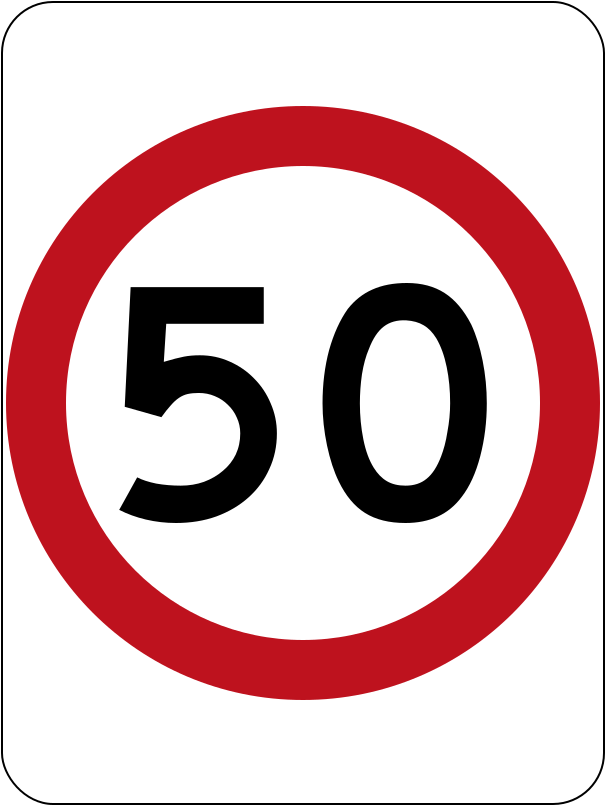
    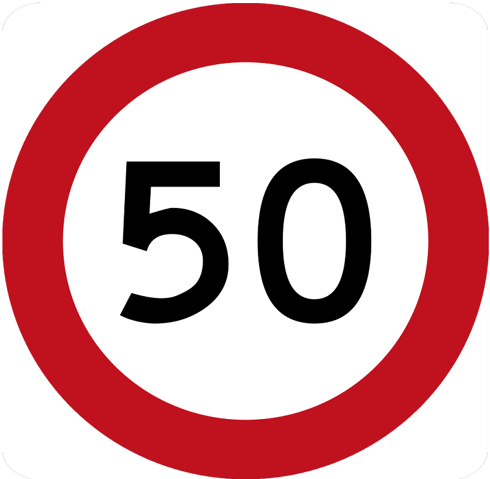

{}
赤い盾の形の道路番号が見つかる{}
{}

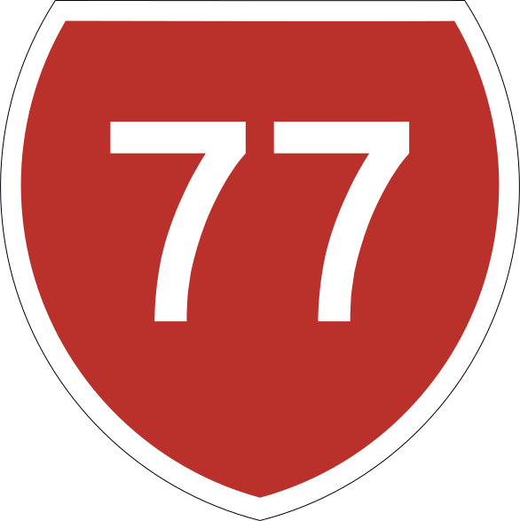

{}
GIVE WAYが黒い文字で書かれているならばオーストラリア、赤い文字ならばニュージーランド{}
{}

    
    

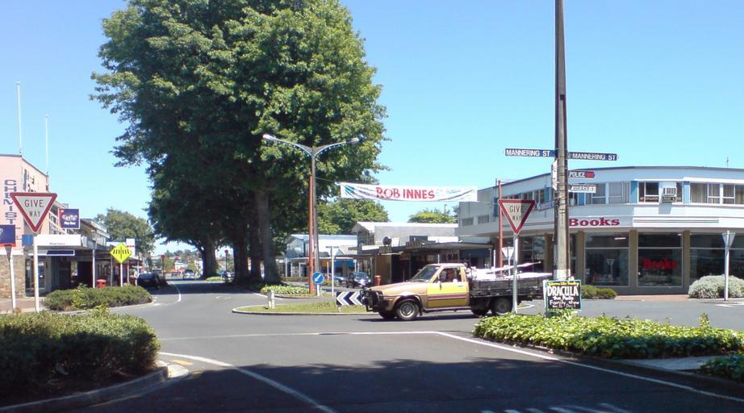

{}
ニュージーランドは国土の40%以上が牧草地{}。雨が年中適度に降るため牧草が育ちやすい。そのため酪農家の生産コストが低く抑えられ、ニュージーランドの乳製品は世界的に競争力がある{}。
{}

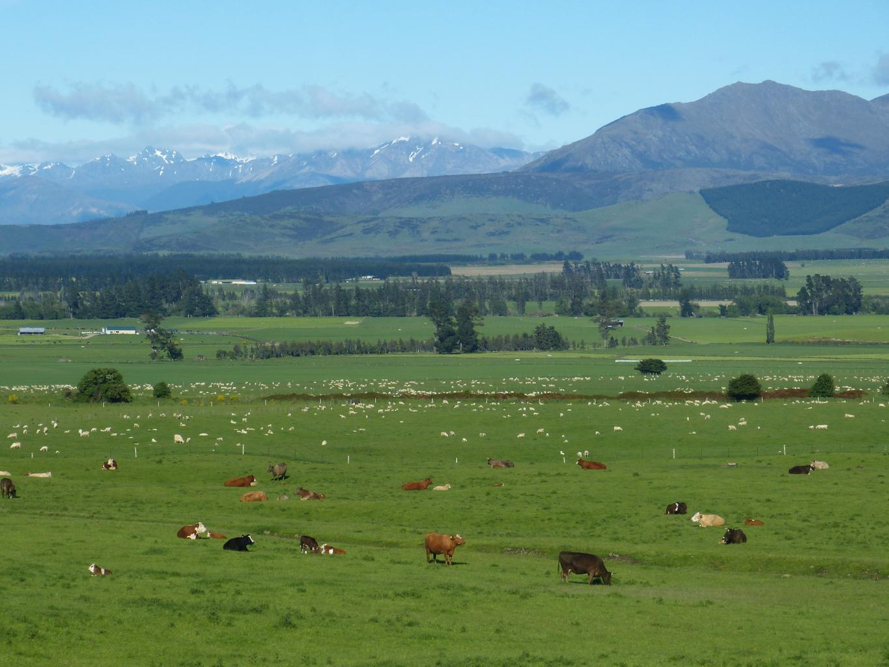

{}
黄色の規制標識がある{}
{}

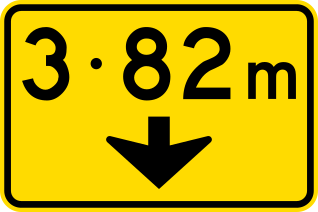
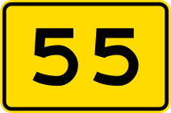

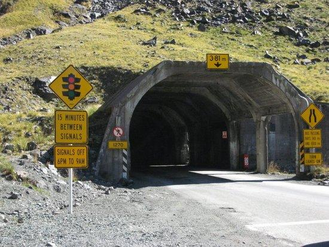

{}
標識やシェブロンは白い角材に付けられている{}
{}

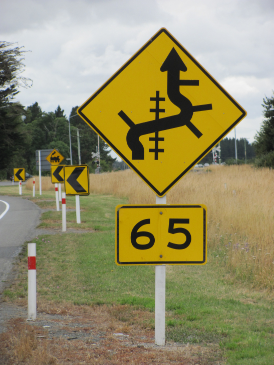

{}
{}
{}
これは道路番号ではなく速度表記
{}

<iframe src="https://www.google.com/maps/embed?pb=!4v1681336992111!6m8!1m7!1sUDS3uTPqeYFbc5jlX39FeQ!2m2!1d-35.71123567515837!2d174.0285549148809!3f101.16967205607813!4f-5.333791598150327!5f3.325193203789971" width="295" height="295" style="border:0;" allowfullscreen="" loading="lazy" referrerpolicy="no-referrer-when-downgrade"></iframe>
<iframe src="https://www.google.com/maps/embed?pb=!4v1681496577756!6m8!1m7!1sTzInEJJGSyqyjvPmfyh4Bw!2m2!1d-45.77715803468315!2d169.4695050065341!3f333.91023963231385!4f-12.315495909494459!5f1.8043896357060172" width="295" height="295" style="border:0;" allowfullscreen="" loading="lazy" referrerpolicy="no-referrer-when-downgrade"></iframe>

{}
電柱の例
{}

<iframe src="https://www.google.com/maps/embed?pb=!4v1681076154035!6m8!1m7!1snNchDURtOF2Pi8TyFhatdQ!2m2!1d-46.29904350653622!2d168.1016630448194!3f113.5594550555082!4f2.44097960226469!5f3.325193203789971" width="295" height="295" style="border:0;" allowfullscreen="" loading="lazy" referrerpolicy="no-referrer-when-downgrade"></iframe>
<iframe src="https://www.google.com/maps/embed?pb=!4v1681337054675!6m8!1m7!1s5ewSfp9w1hC22QQoXdLfPA!2m2!1d-35.71074414713877!2d174.0279954001939!3f92.99296012164498!4f5.460043835513218!5f3.325193203789971" width="295" height="295" style="border:0;" allowfullscreen="" loading="lazy" referrerpolicy="no-referrer-when-downgrade"></iframe>

{}
{}

    <h2 class="section-title">{}</h2>
    <ul class="rule-list">
        <li>南島のカンタベリー平野ではかなり大きな潅水装置や大規模な防風林があり灌漑農業をしている{}</li>
        <li>北島のベイ・オブ・プレンティ地方も防風林がありキウイの生産が盛ん{}</li>
        <li>丘が平坦かどうか・雪の被った山が見えるかどうか・木の密度を見る{}
            <ul>
                <li>画質が悪く砂利の道が多い場合はオークランドの北に行ってみる</li>
                <li>雪山や木の電柱が多い場合は南の島を考えてみる</li>
            </ul>
        </li>
        <li>市外局番が北から南へと小さくなっていく
            <ul>
                <li>09：最北のエリア（オークランド付近とそれより北）</li>
                <li>07：北島の上半分～オークランド</li>
                <li>06：北島の下半分～ウェリントン以外</li>
                <li>04：北島の最南端のウェリントン付近</li>
                <li>03：南島全域{}</li>
            </ul>
        </li>
        <li>一番南のエリアは羊が多いが、これだけで確定することはできない{}</li>
    </ul>

{}
{}

<iframe width="560" height="315" src="https://www.youtube.com/embed/ySbsJVexhGs" title="YouTube video player" frameborder="0" allow="accelerometer; autoplay; clipboard-write; encrypted-media; gyroscope; picture-in-picture; web-share" allowfullscreen></iframe>

{}
{}
{}
穴あき電柱がある＋羊しか見えないならば南島の一番南に押す価値あり（だと思う）{}。
{}

<iframe src="https://www.google.com/maps/embed?pb=!4v1719146306598!6m8!1m7!1spWKkJDPD4CTBs85CfGNtAQ!2m2!1d-45.7005414337047!2d168.1103578359879!3f156.90501902332485!4f5.394398567451731!5f0.7820865974627469" width="600" height="450" style="border:0;" allowfullscreen="" loading="lazy" referrerpolicy="no-referrer-when-downgrade"></iframe>

{}
{}

    <h2 class="section-title">植生</h2>
    <ul class="rule-list">
        <li>南島のカンタベリー平野では防風林があり灌漑農業をしている{}</li>
        <li>北島のベイ・オブ・プレンティ地方も防風林がありキウイの生産が盛ん{}</li>
        <li>ダンチクは北島の海沿い、特にオークランド周辺に生えている{}</li>
    </ul>

{}
{}

{}
クライストチャーチを中心として全体的に平坦で高い防風林が多い{}。
{}

{}
{}

{}
海からの風から農作物を守るために防風林が散見されるがカンタベリー平野ほど多くの防風林はない{}。
{}

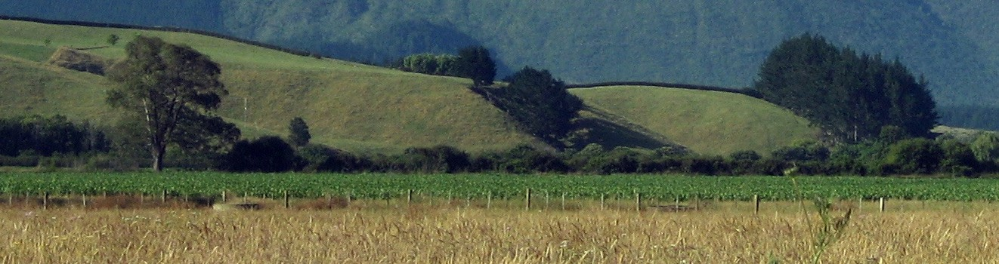

{}
{}

{}
地中海周りに多い植物であり、北島の海沿いに生えていることが多い{}{}。最南でクライストチャーチの海沿いに生えている。
{}

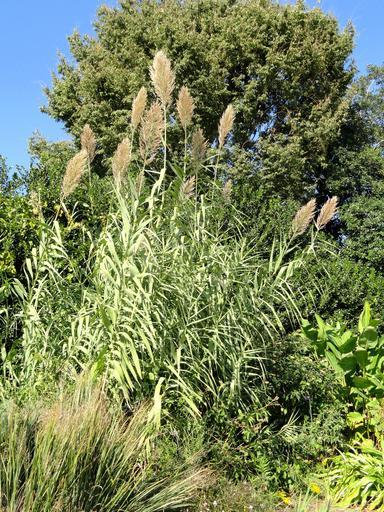

{}
{}

    <h2 class="section-title">{}</h2>
    <ul class="rule-list">
        <li>富士山みたいな山が見えたら北島の南西の角にある国立公園周辺にいる{}{{% ref "https://ja.wikipedia.org/wiki/%E3%82%BF%E3%83%A9%E3%83%8A%E3%82%AD%E5%B1%B1" "タラナキ山" %}}</li>
        <li>南島にOtago Central Rail Trailと呼ばれる約150キロメートルのウォーキング・サイクリングロードがある{}。赤いバッグのようなものが見える。</li>
    </ul>

{}
{}

{}
富士山みたいな山が見えたら北島の南西の角にある国立公園周辺にいる{}{{% ref "https://ja.wikipedia.org/wiki/%E3%82%BF%E3%83%A9%E3%83%8A%E3%82%AD%E5%B1%B1" "タラナキ山" %}}。
{}

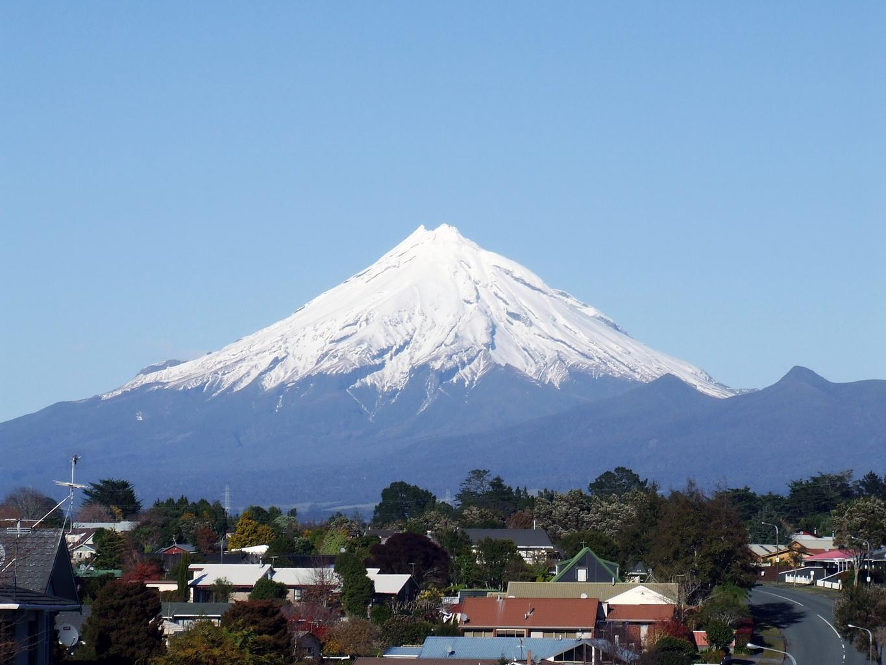

{}
{}

{}
とても長いサイクリングロード。赤い何かが見えることが多い{}。
{}

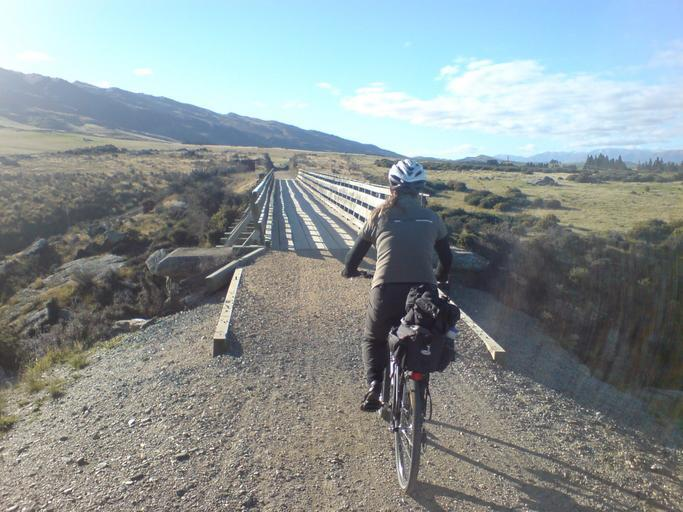

{}
{}

    <h4 class="section-title">離島</h4>
    <ul class="rule-list">
        <li>スチュアート島は人が住んでいる島の中では最も南。森に囲まれた入江がある{}{{% ref "https://ja.wikipedia.org/wiki/%E3%82%B9%E3%83%81%E3%83%A5%E3%82%A2%E3%83%BC%E3%83%88%E5%B3%B6" "スチュアート島" %}}。</li>
        <li>ホワイト島という離島が北島の上にある{}</li>
        <li>アンティポディーズ諸島にはペンギンやオットセイがいる{}</li>
    </ul>

{}
{}

{}
黒っぽい砂浜がある。スチュアート島は南島の最南端と同じく穴の開いた電柱が多い{}。
{}

By Annette Teng, <a href="https://creativecommons.org/licenses/by/3.0" title="Creative Commons Attribution 3.0">CC BY 3.0</a>, <a href="https://commons.wikimedia.org/w/index.php?curid=55942156">Link</a>

{}
{}

{}
硫黄生産跡地があるが火山による災害により放棄された{{% ref "https://ja.wikipedia.org/wiki/%E3%83%9B%E3%83%AF%E3%82%A4%E3%83%88%E5%B3%B6" "ホワイト島" %}}。現在は入ることができないらしい。
{}

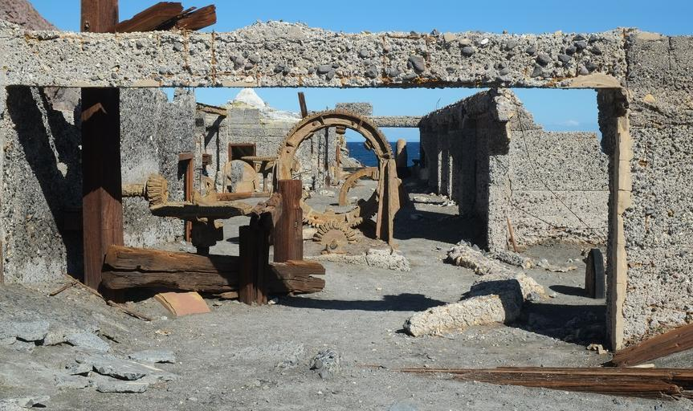

{}
{}

{}
ペンギンのコロニーがある世界遺産。一般人は入ることができないエリア。
{}

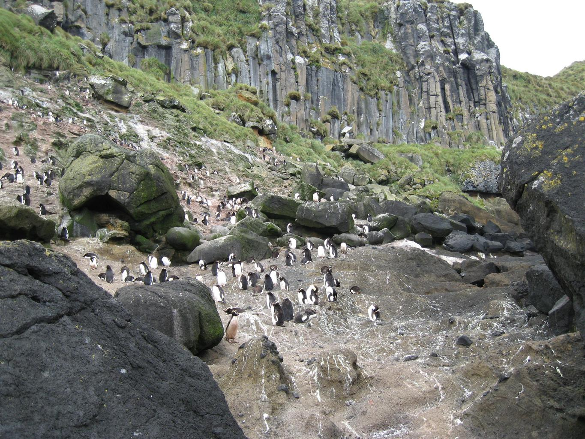

{}
{}
