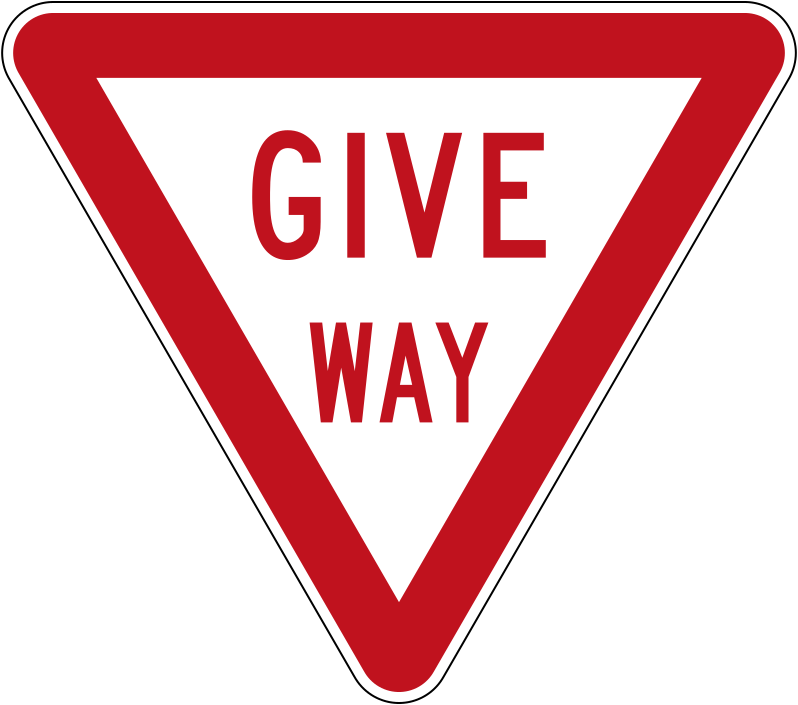

    <h2 class="section-title">{}</h2>
    <ul class="rule-list">
        <li>車は左側通行</li>
        <li>ドメインは.nz</li>
        <li>ボラードの反射板が赤色。色がボラードの表裏に塗られているがオーストラリアのものは反射板が片方だけだったり丸い形だったりするので区別がつく{}。</li>
        <li>GIVE WAYが黒い文字で書かれているならばオーストラリア、赤い文字ならばニュージーランド{}。</li>
        <li>電柱の上のほうにシルバーの何かが巻かれている。</li>
    </ul>
    {}

{}
{}
{}
ボラードが赤色で塗られている
{}

<iframe src="https://www.google.com/maps/embed?pb=!4v1681502031975!6m8!1m7!1sYOKgISqcrXEMRhe-mijsIQ!2m2!1d-35.7113153978181!2d174.0286454241244!3f162.44117437861425!4f-16.704223171344054!5f3.325193203789971" width="295" height="295" style="border:0;" allowfullscreen="" loading="lazy" referrerpolicy="no-referrer-when-downgrade"></iframe>
<iframe src="https://www.google.com/maps/embed?pb=!4v1681502073858!6m8!1m7!1sOXkmp_2TGUB7kwVWEuD9Uw!2m2!1d-35.71192710811605!2d174.0293495685181!3f104.94755113407975!4f-9.551590050925654!5f3.325193203789971" width="295" height="295" style="border:0;" allowfullscreen="" loading="lazy" referrerpolicy="no-referrer-when-downgrade"></iframe>

{}
ニュージーランドは国土の40%以上が牧草地。雨が年中適度に降るため牧草が育ちやすい。そのため酪農家の生産コストが低く抑えられ、ニュージーランドの乳製品は世界的に競争力がある。{}
{}

<iframe src="https://www.google.com/maps/embed?pb=!4v1681496656303!6m8!1m7!1sMvrvIoDgf11CwsP2DaMU2Q!2m2!1d-46.09596398009934!2d169.0981582589376!3f313.4346910719182!4f-2.991900285962771!5f2.693329635910985" width="295" height="295" style="border:0;" allowfullscreen="" loading="lazy" referrerpolicy="no-referrer-when-downgrade"></iframe>
<iframe src="https://www.google.com/maps/embed?pb=!4v1681496740065!6m8!1m7!1szzBYVepmSyiWNjZxtaCA9Q!2m2!1d-44.80105926156972!2d170.8992445413041!3f220.44996479091063!4f4.697819777856196!5f1.878281294742738" width="295" height="295" style="border:0;" allowfullscreen="" loading="lazy" referrerpolicy="no-referrer-when-downgrade"></iframe>

{}
電柱の上のほうにシルバーの何かが巻かれている。色が異なる時もある。
{}

{}
GIVE WAYが黒い文字で書かれているならばオーストラリア、赤い文字ならばニュージーランド。また、オーストラリアならば速度表記が細長い白いプレートに書かれていることがある。下の図の左がオーストラリア、右がニュージーランド。
{}

    
    
    
    
    

{}
{}
{}
これは道路番号ではなく速度表記
{}

<iframe src="https://www.google.com/maps/embed?pb=!4v1681336992111!6m8!1m7!1sUDS3uTPqeYFbc5jlX39FeQ!2m2!1d-35.71123567515837!2d174.0285549148809!3f101.16967205607813!4f-5.333791598150327!5f3.325193203789971" width="295" height="295" style="border:0;" allowfullscreen="" loading="lazy" referrerpolicy="no-referrer-when-downgrade"></iframe>
<iframe src="https://www.google.com/maps/embed?pb=!4v1681496577756!6m8!1m7!1sTzInEJJGSyqyjvPmfyh4Bw!2m2!1d-45.77715803468315!2d169.4695050065341!3f333.91023963231385!4f-12.315495909494459!5f1.8043896357060172" width="295" height="295" style="border:0;" allowfullscreen="" loading="lazy" referrerpolicy="no-referrer-when-downgrade"></iframe>

{}
電柱の例
{}

<iframe src="https://www.google.com/maps/embed?pb=!4v1681076154035!6m8!1m7!1snNchDURtOF2Pi8TyFhatdQ!2m2!1d-46.29904350653622!2d168.1016630448194!3f113.5594550555082!4f2.44097960226469!5f3.325193203789971" width="295" height="295" style="border:0;" allowfullscreen="" loading="lazy" referrerpolicy="no-referrer-when-downgrade"></iframe>
<iframe src="https://www.google.com/maps/embed?pb=!4v1681337054675!6m8!1m7!1s5ewSfp9w1hC22QQoXdLfPA!2m2!1d-35.71074414713877!2d174.0279954001939!3f92.99296012164498!4f5.460043835513218!5f3.325193203789971" width="295" height="295" style="border:0;" allowfullscreen="" loading="lazy" referrerpolicy="no-referrer-when-downgrade"></iframe>

{}
{}

    <h2 class="section-title">{}</h2>
    <ul class="rule-list">
        <li>かなり大きな潅水装置や大規模な防風林など灌漑農業をしている雰囲気があるならばカンタベリー平野{}</li>
        <li>丘が平坦かどうか・雪の被った山が見えるかどうか・木の密度を見る{}
            <ul>
                <li>画質が悪く砂利の道が多い場合はオークランドの北に行ってみる</li>
                <li>雪山や木の電柱が多い場合は南の島を考えてみる</li>
            </ul>
        </li>
        <li>市外局番が北から南へと小さくなっていく
            <ul>
                <li>09：最北のエリア（オークランド付近とそれより北）</li>
                <li>07：北島の上半分～オークランド</li>
                <li>06：北島の下半分～ウェリントン以外</li>
                <li>04：北島の最南端のウェリントン付近</li>
                <li>03：南島全域{}</li>
            </ul>
        </li>
        <li>本島からかなり離れた場所にアンティポディーズ諸島があってペンギンやオットセイがいる</li>
    </ul>

{}
{}

{}
クライストチャーチを中心として全体的に平坦で高い防風林が多い{}。
{}

{}
{}

<iframe width="560" height="315" src="https://www.youtube.com/embed/ySbsJVexhGs" title="YouTube video player" frameborder="0" allow="accelerometer; autoplay; clipboard-write; encrypted-media; gyroscope; picture-in-picture; web-share" allowfullscreen></iframe>

{}
{}

<iframe src="https://www.google.com/maps/embed?pb=!4v1686016237001!6m8!1m7!1sjFIqn_wpN6TeaSed4rWP1Q!2m2!1d-49.66705117502639!2d178.8068568545037!3f235.9588452113889!4f12.306707860320401!5f1.3125468221226764" width="295" height="295" style="border:0;" allowfullscreen="" loading="lazy" referrerpolicy="no-referrer-when-downgrade"></iframe>
<iframe src="https://www.google.com/maps/embed?pb=!4v1686016324028!6m8!1m7!1sOPqVxyV5i8eq61cGe6hH-A!2m2!1d-49.66764652722949!2d178.8095245679632!3f249.3772578266898!4f-16.00629238161912!5f2.9901147302254083" width="295" height="295" style="border:0;" allowfullscreen="" loading="lazy" referrerpolicy="no-referrer-when-downgrade"></iframe>

{}
{}